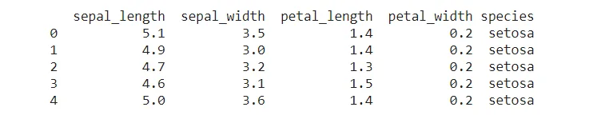
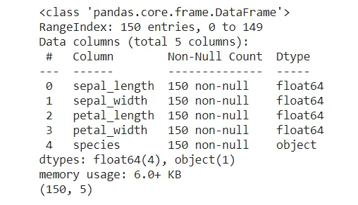
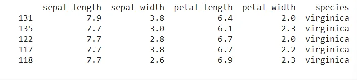
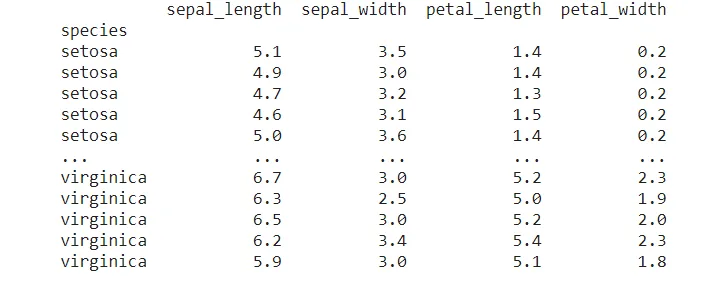
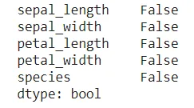
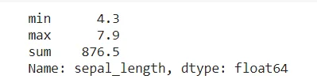
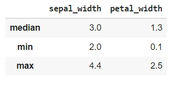
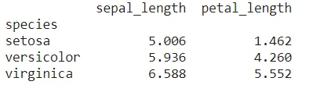
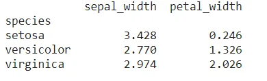

There are several libraries in python, however we will focus on one of the most powerful which is Pandas. This article, will introduce you to some useful techniques in pandas with examples.

""" We use dataset from ['https://raw.githubusercontent.com/mwaskom/seaborn-data/master/iris.csv'.](https://raw.githubusercontent.com/mwaskom/seaborn-data/master/iris.csv)

Dataset description: the data describes the length and width of two stages (setal and petal) of different species of flowers)."""

First of all, import pandas package

```python
# Import Pandas package
import pandas as pd
```

## 1- Load DataFrame
We will import our DataFrame with the pd. read_csv() by giving it the path and print the first few rows. The code below shows the synthesis.

```python
# Read the DataFrame by using pd.read_csv(): iris
iris=pd.read_csv('https://raw.githubusercontent.com/mwaskom/seaborn-data/master/iris.csv')

# Print the first few rows of iris file
print(iris.head())
```

Output 1:



## 2- Overview on the data
It is important to have an overview of the content of our data before proceeding with any analysis. So, we will proceed with the info() and shape function.

```python
# Overview of our DataFrame iris
iris.info()
iris.shape
```

Output2:



## 3- Sorting and setting DataFrame
### a- sorting
Sorting a DataFrame is done with the sort () function. In this example with the dataframe named iris, we will sort the column petal_length in Descending (ascending = False) order. The function ascending = True or False make values in ascending or descending order. Let's have a look:

```python
# sort iris by descending sepal_lenght
iris_sort = iris.sort_values("sepal_length",ascending = False)
print(iris_sort.head(5))
```

Output 3a:



### b- setting index
Setting a column as an index is done with set_index(). In our case we are interested in changing the index column with the Species column.

```python
# setting species colomn as the index
iris_ind = iris.set_index("species")
print(iris_ind)
```

Output 3b:



## 4- Missing Values
To check if there is any missing data in our table or not, we have to proceed with the function isna().any(). The example below illustrates this:

Output 4:



The results show that there are not missing values.

## 5- Aggregate
Aggregation with the agg() function allows to perform basic operations (min, max, sum, etc ) quickly. This method can be done on one or more columns. The example below will show us how to proceed.

Example 1:

```python
# Aggregate over sepal_length column
sepal_length_agg = iris["sepal_length"].agg(['min','max','sum'])
print(sepal_length_agg)
```

Output 5a:



Example 2:

```python
# Aggregate over sepal_length per sepal_width and petal_width columns
iris.agg({'sepal_width' : ['median', 'min','max'], 'petal_width' : ['median','min', 'max']})
```

Output 5b:



## 6- Grouped summary statistics
It happens to group the data according to our analysis needs. The groupby() method allows to perform this task and to manipulate large data sets. groupby() takes a DataFrame as input and divides the DataFrame into groups based on given criteria. In this example, the average will be used

Example 1:

```python
 # groupe by species, calculate mean sepal_length,petal_length
length_group = iris_ind_sort.groupby("species")[["sepal_length","petal_length"]].mean()
print(length_group)
```

Output 6 a:



Example 2:

```python
# groupe by species, calculate mean sepal_width,petal_width
width_group = iris_ind_sort.groupby("species")[["sepal_width","petal_width"]].mean()
print(width_group)
```

Output 6b:



That's all, I hope you will find these techniques useful. It's your turn to practice.

Please find here my link GitHub : <https://github.com/Dorlote/Data_insight_programme_2021/blob/main/Useful_Pandas_Techniques.ipynb>
