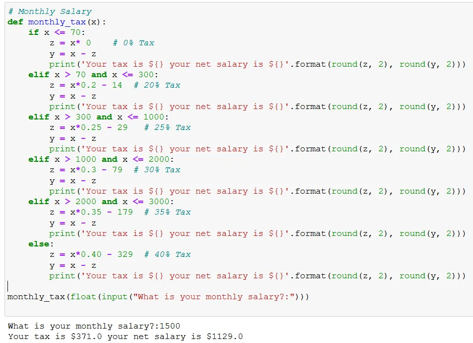

Most of the times the calculation of tax is left to the accounts offices. To some the calculation is difficult and confusing. We have seen an increase number of tax evasions around the globe and across professions. Businesses, sports and even religious fraternities alike are found in this dilemma. Today I will show you how to calculate tax in Zimbabwe using Python.

To do so, we will use functions. A function in python has the following syntax, where you define a function name and apply an execution code below the function name. **Notice the colon and indenting of the code.**

```python
# Function syntax
def functionName(__):

    ..............
```

Let us start from from simple function calculations. Consider the following addition example. The function takes in 2 numbers and adds the 2 numbers.

```python
# Addition
def add(a, b):
    return a + b

add(3, 4)
```

As expected the code returns a sum of 7:

Functions can be extended to do area, volume, bmi and distance etc. calculations. For example when calculating the area of a circle. The following code takes in the radius. We use ***pi*** from the math package as:

```python
# Area
import math
def circle_area(x):
    return math.pi * (x**2)

circle_area(3)
```

The math package has many functions within it that assist in calculating the factorial of a number, the greatest common denominator, the greatest integer smaller than a certain value (floor), conversely it can also execute a ceiling function.

For a circle with a radius of 3 we obtain the area of 28.27 :

**The Problem**

Now to the Zimbabwe Tax problem. We will use if statements to accommodate all tax brackets. The if Statements will require the gross salary of the user, apply the appropriate tax equation and will give the tax and the net salary. We could also add other concepts such as for loops, that is say we have a list of names, we could loop over names, get also their salaries and calculate the tax. This is understood nicely, when having a data frame or a list.

Let us look at a monthly example:

```python
# Monthly Salary
def monthly_tax(x):
    if x <= 70:
        z = x* 0    # 0% Tax
        y = x - z
        print('Your tax is ${} your net salary is ${}'.format(round(z, 2), round(y, 2)))
    elif x > 70 and x <= 300:
        z = x*0.2 - 14  # 20% Tax
        y = x - z
        print('Your tax is ${} your net salary is ${}'.format(round(z, 2), round(y, 2)))
    elif x > 300 and x <= 1000:
        z = x*0.25 - 29   # 25% Tax
        y = x - z
        print('Your tax is ${} your net salary is ${}'.format(round(z, 2), round(y, 2)))
    elif x > 1000 and x <= 2000:
        z = x*0.3 - 79  # 30% Tax
        y = x - z
        print('Your tax is ${} your net salary is ${}'.format(round(z, 2), round(y, 2)))
    elif x > 2000 and x <= 3000:
        z = x*0.35 - 179  # 35% Tax
        y = x - z
        print('Your tax is ${} your net salary is ${}'.format(round(z, 2), round(y, 2)))
    else:
        z = x*0.40 - 329  # 40% Tax
        y = x - z
        print('Your tax is ${} your net salary is ${}'.format(round(z, 2), round(y, 2)))

monthly_tax(float(input("What is your monthly salary?:")))
```

There are deductions for each tax bracket and tax percentages accordingly. Salaries can be lower than $70 per month for some while for some higher than $4000. The tax percentages increase with each successive bracket.

Now say for someone earning US $1 500.00, the tax is US $371.00 and the net salary US $1 129.00 which is not that bad considering its about the same tax in South Africa.



For other wage revenue frequencies (i.e. week fortnight and annual) consider this [Github.](https://github.com/Matshisela/Zim-Tax-Functions) You can also link up with me [here.](https://www.linkedin.com/in/ntandoyenkosi-matshisela-8507876a/)
