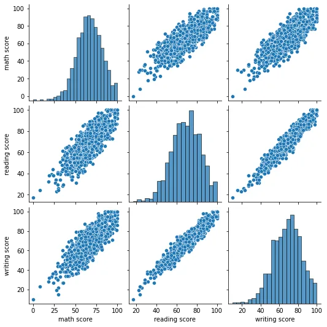

## Visualizing Data in Python with Seaborn

Data visualization is a very important part of data analysis.After data is collected, processed, and modeled, the relationships need to be visualized for the conclusions.We use data visualization as a technique to communicate insights from data through visual representation.Our main goal is to distill large datasets into visual graphics to allow for a straightforward understanding of complex relationships within the data. So now, we know data visualization can provide insight that traditional descriptive statistics cannot. Our big question is how to choose the right chart for the data?

### Basic Visualization Rules
Before we look at some kinds of plots, we’ll introduce some basic rules. Those rules help us make nice and informative plots instead of confusing ones.

- The first step is to **choose the appropriate plot type**. If there are various options, we can try to compare them, and choose the one that fits our model the best.
- Second, when we choose your type of plot, one of the most important things is to **label your axis**. If we don’t do this, the plot is not informative enough.
- Third, we can **add a title** to make our plot more informative.
- Fourth, **add labels for different categories** when needed.
- Five, optionally we can add a text or an arrow at interesting data points.
- Six, in some cases we can **use some sizes and colors** of the data to make the plot more informative.

In this article, we will cover the usage of **Matplotlib**. Within Seaborn, we will be covering a few of the most commonly used plots in the data science world for easy visualization.

#### Seaborn
Seaborn is a dataset-oriented library for making statistical representations in Python. It is developed atop matplotlib and to create different visualizations. It is integrated with pandas data structures. The library internally performs the required mapping and aggregation to create informative visuals It is recommended to use a Jupyter/IPython interface in matplotlib mode.

All the graphs mentioned can easily be plotted in Python with the **Seaborn**. library. We must first import matplotlib.pyplot subpackage of **Matplotlib** library as **plt** and **Seaborn** library as **sns**.

Then we must start by loading our data into Python as a dataframe. So, we import **pandas** library as pd. Here, I am loading it from a csv file in the same directory. In this Blog, I will mainly explain with **Students Performance in Exams** dataset from **kaggle** in [here](https://www.kaggle.com/spscientist/students-performance-in-exams).

#### Bar Chart
A bar chart is used when we want to compare metric values across different subgroups of the data. If we have a greater number of groups, a bar chart is preferred over a column chart.

**Column chart**
Column charts are mostly used when we need to compare a single category of data between individual sub-items, for example, when comparing revenue between regions.

**Grouped Bar Charts**
If we have two categorical variables, we will proceed with a grouped bar chart. This is grouped as in it is grouped by that second categorical variable, usually, the one that has fewer categories.

**Histogram**
Histograms are great for visualizing a quantitative variable. Here, we want to make sure we choose an appropriate number of bins to best represent the data. This number is easily selected based on past experience, playing around with the number of bins, or using an objective bin-selection formula such as Sturges Rule.

**Line histogram**
Line histograms are used to observe the distribution for a single variable with many data points.

**Side-by-side Boxplots**
When we have one quantitative and one qualitative variable, we will use a side-by-side boxplot to best showcase the data.

**Grouped Boxplots**
Grouped boxplots are used when we have two categorical variables and a single quantitative one. Let the grouping be done on the categorical variable with the fewer groups.

**Scatterplot**
Scatterplots are needed to visualize one quantitative variable against another. This is quite common to evaluate the type of relationship that exists between a quantitative feature variable / explanatory variable and a quantitative response variable, where the y-axis always holds the response variable.

**Scatterplot by Group**
If we are trying to visualize two quantitative variables and one categorical one, we will use a scatterplot with its points grouped by the categorical variable.

**Marginal plots**
Marginal plots are used to assess the relationship between two variables and examine their distributions. Such plots scatter plots that have histograms, box plots, or dot plots in the margins of respective x and y axes.

**Pair plots**
Seaborn lets us plot multiple scatter plots. It’s a good option when you want to get a quick overview of your data.

Here is my Github Repos Code [Click Me](https://github.com/DoublePK/DataScientistProgramAssignments/blob/master/Visualization%20Data%20in%20Python.ipynb).
