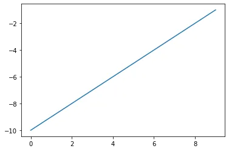
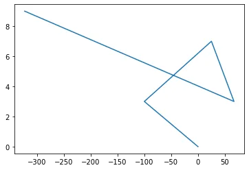
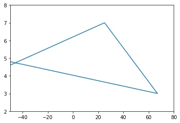
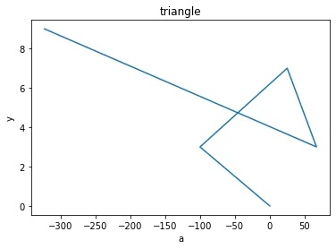
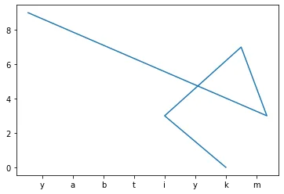
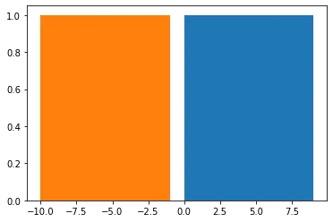

Introduction Visualization is a critical component in exploratory data analysis, as well as presentations and applications. During exploratory data analysis, you are usually working alone or in small groups and need to create plots quickly to help you better understand your data. It can help you identify outliers and missing data, or it can spark other questions of interest that will lead to further analysis and more visualizations. This type of visualization is usually not done with the end user in mind. It is strictly to help you better your current understanding. The plots don't have to be perfect. When preparing visualizations for a report or application, a different approach must be used. Attention to small details must be paid. In addition, you usually will have to narrow down all possible visualizations to only the select few that best represent your data. Good data visualizations have the viewer enjoying the experience of extracting information. Almost like movies that make viewers get lost in, good visualizations will have lots of information that really sparks interest. The primary data visualization library in Python is matplotlib, a project begun in the early 2000s, that was built to mimic the plotting capabilities from Matlab. Matplotlib is enormously capable of plotting most things you can imagine and it gives its users tremendous power to control every aspect of the plotting surface. That said, it isn't quite the friendliest library for beginners to grasp. Thankfully, pandas makes visualizing data very easy for us and usually plots what we want with a single call to the plot method. Pandas actually does no plotting on its own. It internally calls matplotlib functions to create the plots. Pandas also adds its own style that, in my opinion, is a bit nicer than the defaults from matplotlib. Seaborn is also a visualization library that internally calls matplotlib functions and does not do any actual plotting itself. Seaborn makes beautiful plots very easily and allows for the creation of many new types of plots that are not available directly from matplotlib or pandas. Seaborn works with tidy (long) data, while pandas works best with aggregated (wide) data. Seaborn also accepts pandas DataFrame objects in its plotting functions.

```python
'''before to use matplotlib we need to import it'''
import matplotlib.pyplot as plt
'''we do this so we can see the plots in the notebook'''
%matplotlib inline
'''next we will need some data'''
x = list(range(0,10))
y = list(range(-10,0))
'''for plotting simple line plot '''
plt.plot(x,y)
```



```python
'''now let's try with different data '''
a = [0,-100,25,67,-323]
b = [0,3,7,3,9]
```



plt**.**plot(a,b)

```python
'''now i will put when my x an y axis start and end to get zoom on that triangle '''
plt.axis([-50,80,2,8])
plt.plot(a,b)
```



```python
'''now i will set the title and axis labels'''
plt.title('triangle')
plt.xlabel('a')
plt.ylabel('y')
```



plt**.**plot (a,b)

```python
'''now i wanna to replace the xticks'''
plt.xticks((-300,-250,-200,-150,-100,-50,0,50),('y','a','b','t','i','y','k','m'))
plt.plot(a,b)
```



```python
'''we can use histogram '''
plt.hist(x)
plt.hist(y)
```


