## Data Visualization using Python Seaborn library


#### Github repo: [Github repo for Data Visualization project](https://github.com/omarmohamed2011/DataVisualization_Seaborn_Python/blob/main/DataVisualization_Seaborn.ipynb)

### Introduction:

Numbers are everywhere around us, each and every pixel in your computer is a number, each info about you and me can be represented using a number, numbers can indicate almost everything and every info either when put in a table, shown in a figure, or visualized in graph.. Here in that graph we try to visualize our dataset using Python Seaborn library, simply taking a ' Restaurant tips and bills ' dataset and gain any sort of insights that can be gotten, let's start the adventure now, Shall we !

You can see full dataset from this repo; [Dataset repo](https://github.com/mwaskom/seaborn-data/blob/master/tips.csv)

### The Tips Dataset Description:

The *Tips* dataset is available in the seaborn data belonging to Michael Waskom - the creator of the Seaborn python data visualisation package. It is one of the example datasets built into the **seaborn** package and is used in the documentation of the seaborn package and can be easily loaded using the seaborn load_dataset command. The tips csv file is also available at the Rdatasets website which is a large collection of datasets originally distributed alongside the statistical software environment R and some of its add-on packages for teaching and statistical software development purposes maintained by [Vincent Arel-Bundock](http://arelbundock.com/).

Let's start coding and visualizing using the data;

Let's import firstly mat plot library and Sea born;

```python
import seaborn as sns
import matplotlib.pyplot as plt
%matplotlib inline
```

The seaborn library provide us with the dataset so we can load it directly like;

```python
# load dataset of tips given in resteraunts / caffes
df = sns.load_dataset('tips')
```

Here is the data of the tip given and info about the charge and the person receiving the service;

```python
df.head(10)
```

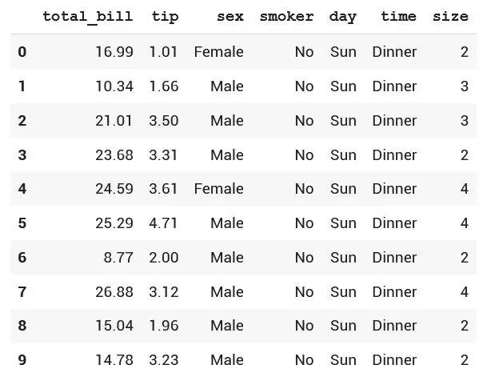

Let's plot the total bills distribution and see it;

```python
## Let's plot firstly the total bills:
sns.set_style()
sns.distplot(df['total_bill'], color ='black', bins = 25)
```

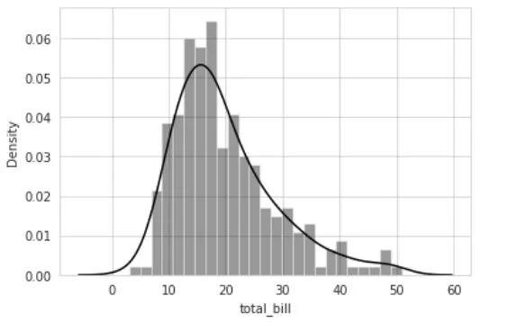

Seeing the distribution of the total bills in the caffe we can see that most people - so is the average bill - is between 10 and 25 pounds and rarely to see people paying more than 40 pounds or less than 5, which seems almost never.

Let's do plot for the tips given:

```python
sns.set_style()
sns.distplot(df['tip'], color ='black', bins = 25)
```

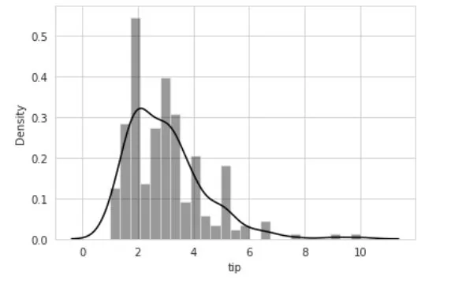

Seeing the distribution of the tips given in the caffe we can see that most people - so is the average tip - is between 2 and 4 pounds and rarely to see people paying more than 8 pounds or giving no tips at all, that also seems like never.

Now, let's check for the distribution of tips for males and females and try to create some insights:

Here we create a sub data frame for sex is male, and another for females and plot the tip for each in order to compare between them

```python
df_male = df[df['sex']=='Male']
df_female = df[df['sex']=='Female']

sns.set_style()
sns.distplot(df_male['tip'], color ='gray', bins = 25) # bins can be 25, 30 or even 40 don't mind it..
sns.distplot(df_female['tip'], color ='red', bins = 25)
```

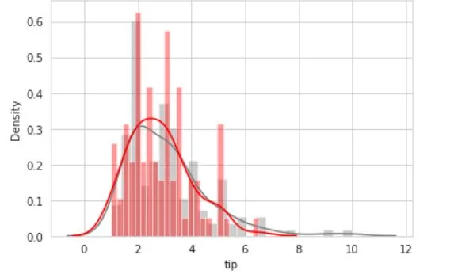

Seeing the distribution of the 'Males' vs 'Females' tips given in the Caffe we can see that most people - so is the average tip- knowing that red color represents females and gray color represents males, and we can notice that above average tips are more likely to be given by females than males in this restaurant / Caffe BUT not yet to be confirmed with this graph as the difference is not much big.

Let's then compare between smokers and non smokers in the tips given;

```python
df_smoker = df[df['smoker']=='Yes']
df_nonsmok= df[df['smoker']=='No']

sns.set_style()
sns.distplot(df_smoker['tip'], color ='gray', bins = 25)
sns.distplot(df_nonsmok['tip'], color ='red', bins = 25)
```

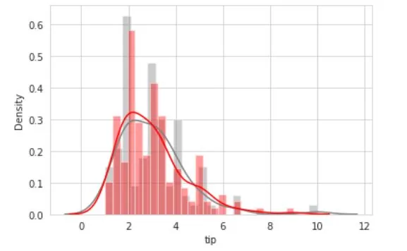

Seeing the distribution of the 'Smokers' vs 'Non Smokers' tips given in the Caffe we can see that most people - so is the average tip - knowing that red color represents Non Smokers and gray color represents Smokers, and we can notice that above average tips are more likely to be given by Non Smokers than Smokers in this caffe as their density of above average is more than the latter.

Let's try also to compare the daytime of the arrival of the recipient with their total bills and their tips respectively; daytime here are Dinner and Lunch.

```python
df_dinner= df[df['time']=='Dinner']
df_lunch = df[df['time']=='Lunch']

sns.set_style()
sns.distplot(df_dinner['total_bill'], color ='blue', bins = 25)
sns.distplot(df_lunch['total_bill'], color ='red', bins = 25)
```

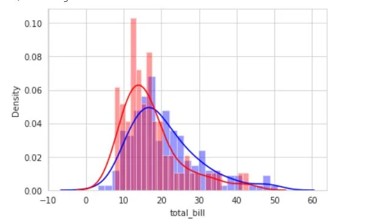

Seeing this distribution we can deduce that the above average total bills are more likely to be bigger in dinner time which is indicated in blue, however the less than average total bills are more likely to be bigger in lunch time which is indicated in red here.

Though, let's try also to compare the time of the arrival of the recipient with their total bills and their tips respectively;

```python
df_dinner= df[df['time']=='Dinner']
df_lunch = df[df['time']=='Lunch']

sns.set_style()
sns.distplot(df_dinner['tip'], color ='blue', bins = 25)
sns.distplot(df_lunch['tip'], color ='red', bins = 25)
```

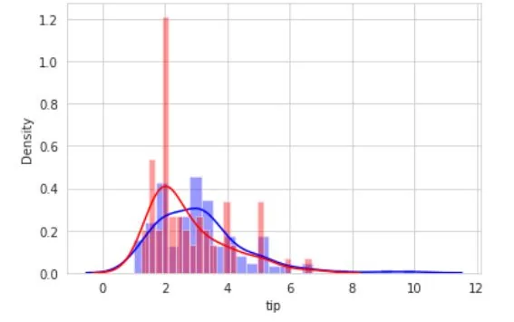

Seeing this distribution we can not deduce any strong preferences above or under average in tips in different day times.

Getting more insights ,now we should try to plot the total bills vs the tip in the regression plot

```python
sns.set_style('whitegrid')
sns.lmplot(x ='total_bill', y ='tip', data = df)
```

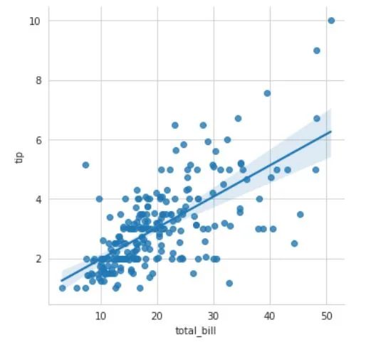

Here it's easy to notice how the two variables are correlated and a high bill will mostly mean a good tip

We should not forget to visualize males and females separately;

```python
sns.set_style('whitegrid')
sns.lmplot(x ='total_bill', y ='tip', data = df,
           hue ='sex', markers =['o', 'v'])
```

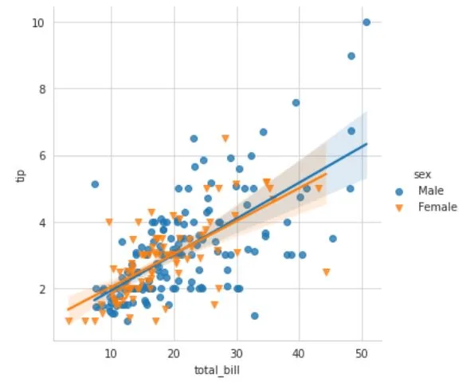

We can add to our insights from this reg-plot that in high total bills - more than 40, males are more likely to give higher tips more than females.

Let's not forget to visualize lunch and dinner time as well;

```python
sns.set_style('whitegrid')
sns.lmplot(x ='total_bill', y ='tip', data = df,
           hue ='time', markers =['o', 'v'])
```

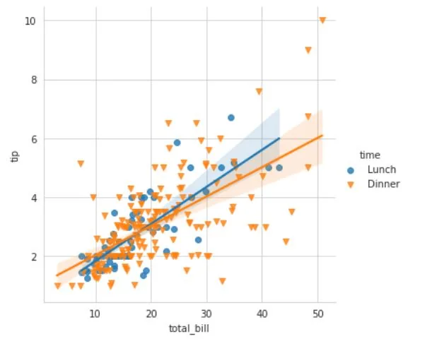

That assures that in most cases lunch time visitors give more tips than dinner timers.

Now we combine those plots together;

```python
## Combining both things
sns.lmplot(x ='total_bill', y ='tip', data = df, col ='sex',
           row ='time', hue ='smoker', aspect = 0.6,
           size = 4, palette ='coolwarm')
```

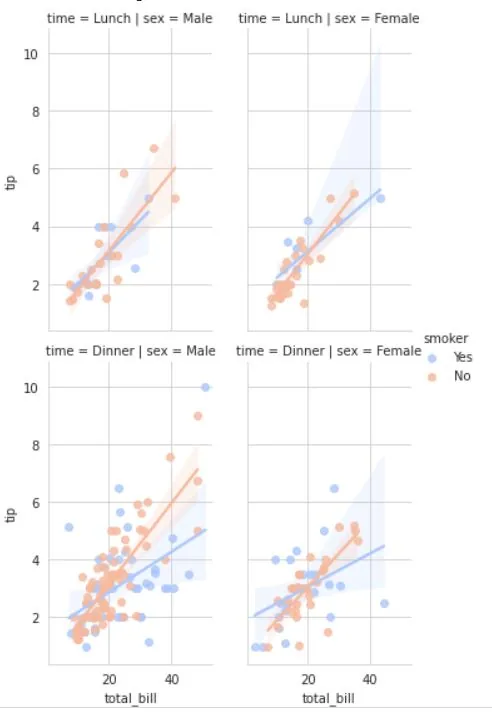

Let's not forget to visualize smokers and non-smokers separately;

```python
sns.set_style('whitegrid')
sns.lmplot(x ='total_bill', y ='tip', data = df,
           hue ='smoker', markers =['o', 'v'])
```

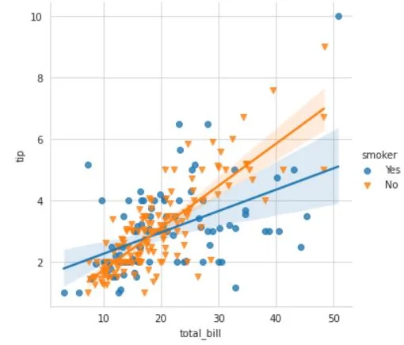

That assures that in most cases non-smokers give more tips than smokers.

Now let's finally multi plot for different sizes;

```python
sns.pairplot(df, hue ='size')
plt.show()
```

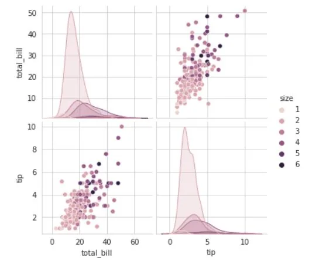

### Final Thought:

Well that's where the article ends but the visualization doesn't end, you can check the github code link above and see more details and getting to understand more about the data, good luck and happy visualizing, thanks for reading my article and hopeful that it might help you in your way to visualize your data, have a nice day.
