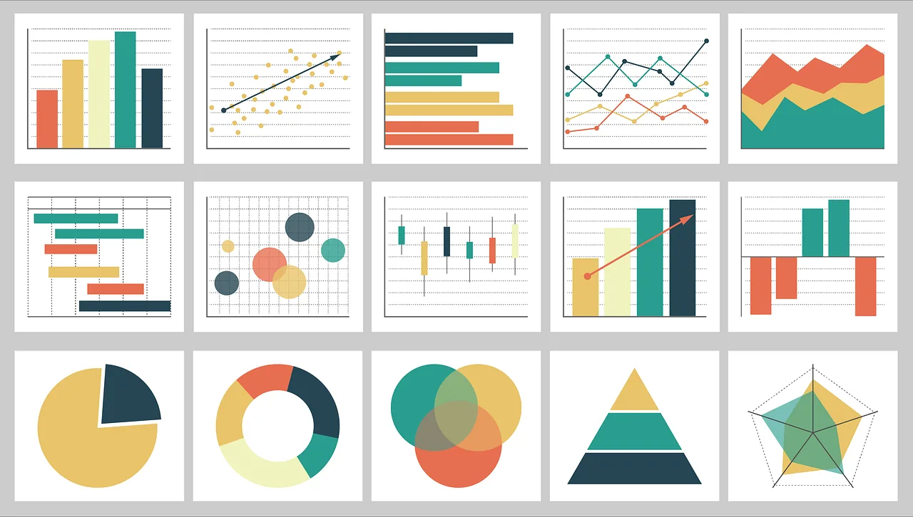
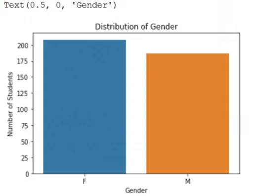
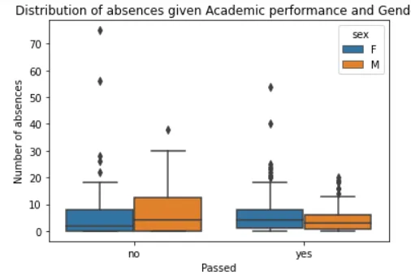
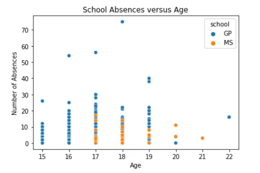
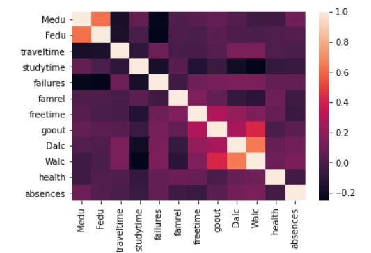
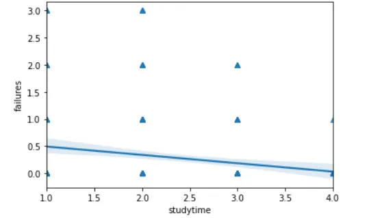
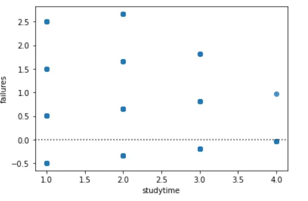
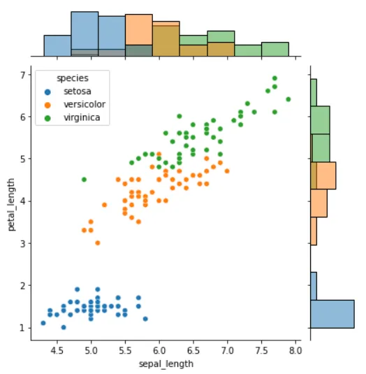
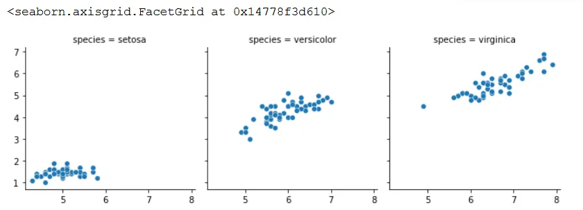

Data comes from many sources. Python has access capabilities to all sources to assist a researcher/ analyst in querying and analysing data. For instance ***Where there are gaps, its the file name, It could be C:/User/XXX/Documents/Sales Data.csv***:

```python
# Data from csv is read on pandas by
data = pd.read_csv("_______.csv")

# Data from excel is read on pandas by:
file=("______.xlsx")
data = pd.ExcelFile(file)
```

Since Excel sheets can have many sheets one can access the data from sheets like:

```python
# Using the sheet name: Sales
data_1 = data.parse("Sales")

or
# Using sheet number: Sheet number 1
data_1 = data.parse(0)
```

Other sources of data could be:

```python
# Importing from SAS:
from sas7bdat import SAS7BDAT
with SAS7BDAT('_______.sas7bdat') as file
data = file.to_data_frame()

# Importing from STATA
data = pd.read_stata('______.dta')
```

These are some of the data sources that Python can access data from. After analysing, one expects to visualise data. This article will show you how this is done. First we import the necessary packages:

```python
#Import packages
import seaborn as sns
import matplotlib as plt
import pandas as pd
```

To adequately accomplish the objective of the article, we will use UCL Machine learning Student performance data and Iris Data. We will access the data from github like:

```python
# Performance data and Iris Data
perf_data = pd.read_csv("https://raw.githubusercontent.com/mohammedAljadd/students-performance-prediction/main/student-data.csv")

iris_data = pd.read_csv("https://gist.githubusercontent.com/curran/a08a1080b88344b0c8a7/raw/0e7a9b0a5d22642a06d3d5b9bcbad9890c8ee534/iris.csv")
```

The simplest graph is the bar plot which is the count of observations in a dataset. The variable could be nominal or ordinal but not continous. To do this we use the following code:

```python
# Bar plot
ax = sns.countplot(x="sex", data= perf_data)
ax.set_title("Distribution of Gender")
ax.set_ylabel("Number of Students")
ax.set_xlabel("Gender")
```

The above command gives the following plot:



Females are more than Males which is generally the case in schools etc. The world Bank statistics shows that females are more than males, which is no surprise here.

We can plot a box plot, one categorical and one continuous, we could further add a third variable to further distinguish.

```python
# Box Plot
ax = sns.boxplot(x="passed", y="absences", hue="sex", data= perf_data)
ax.set_title("Distribution of absences given Academic performance and Gender")
ax.set_ylabel("Number of absences")
ax.set_xlabel("Passed")
```



We can deduce here that among those who passed, females were absent in more days than males. This was not the case among those who failed. Though Females data has outliers, meaning some females absent themselves more days than their male counterparts. What could be the reason?

We can dig deeper and examine a scatter plot which can be drawn as:

```python
# Scatter Plot
ax= sns.scatterplot(x= "age",
               y= "absences",
               hue="school",
               data=perf_data)
ax.set_title("School Absences versus Age")
ax.set_ylabel("Number of Absences")
ax.set_xlabel("Age")
```



The scatter command is a seaborn command as like any other command in this article. This graph shows that school GP has more number of absences than school MS and generally older students are not always in class. School MS has students with ages 17-21, while GP's students range from 15 to 22.

The heat map can also help in seeing how variables are related. The heamap command is given by:

```python
# Heat Map
cont_data = perf_data[["Medu", "Fedu","traveltime", "studytime", "failures", "famrel", "freetime", "goout","Dalc", "Walc", "health","absences"]]
cont= cont_data.corr()
```

```python
sns.heatmap(cont)
```

The yticklabels=False, removes the row numbers on the left side of the plot.



Again, many conclusions can be arrived at given the above figure.

We can quickly add a regression line and also a residual plot given a dependent and independent variables which we would have hypothesized. This is done like:

```python
# Regression Plot
sns.regplot(data=perf_data, x="studytime", y="failures", marker='^')

# Residual Plot
sns.residplot(data=perf_data, x="studytime", y="failures")
```



As a student invests more in studying, the number of failures drop. The residual plot of this is shown below:



The Joint Grid combines graphs in just one graph rather than separating like the Facet Grid, as will be seen. The joint grid can plot histograms, scatter plots, kernel dense graphs to name a few. It can be seen that setosa is shorter in both sepal and petal lengths as compared to the others. It is also a given that Virginica has the longest amongst the Iris species. Here is an example

```python
# Joint Grid
g = sns.JointGrid(data=iris_data, x="sepal_length", y="petal_length", hue="species")
g.plot(sns.scatterplot, sns.histplot)
```



The facet Grid function has the capability of combining graphs vertically or horizontally that is given a third grouping variable. The following code shows this:

```python
# Facet Grid
g = sns.FacetGrid(data=iris_data, col="species")
g.map_dataframe(sns.scatterplot, x="sepal_length", y="petal_length")
g.add_legend()
```



The article sought to show how data is represented using graphs. It used the Seaborn package to accomplish this. I also thank Data Camp for the lessons on the representation on data using different packages.

The code for this article can be found [here](https://github.com/Matshisela/Visualizing-data-in-Python)
