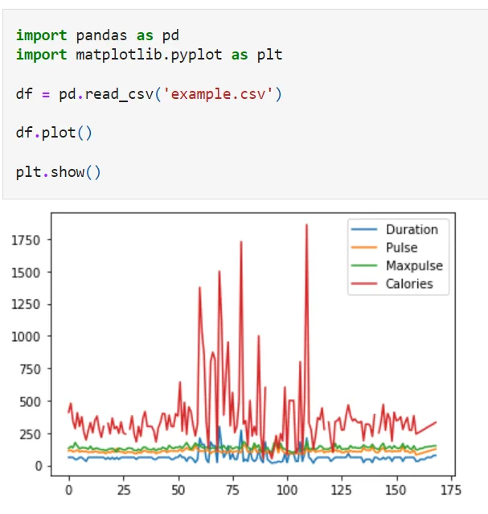
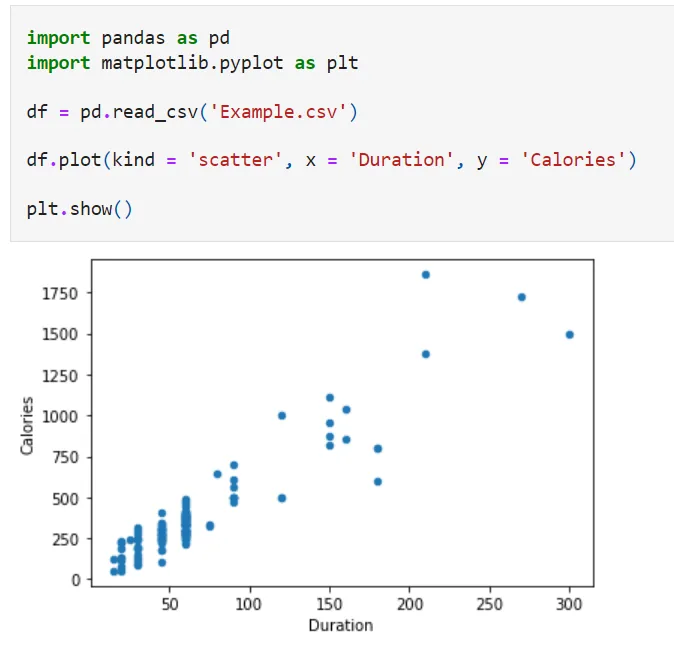
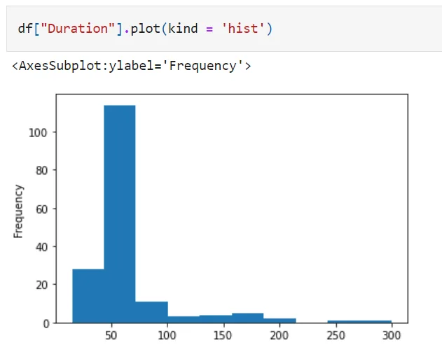

**What is data visualization?**

Data visualization refers to the graphical presentation of data and information. Using visual elements such as charts, graphs, and maps, data visualization tools provide an accessible way to view and understand data trends, extroverts, and patterns.

In the world of big data, data visualization tools and technologies are essential for analyzing huge amounts of data and making data-driven decisions.

**Why is data visualized?**

We can quickly identify circles, from blue to red. Data visualization is another form of visual art that captures our interest and keeps our eyes on the message. When we look at a chart, we see rapid trends and outpouring. It's a story with a purpose. If you've ever seen a huge spreadsheet of data and don't see a trend, you know how effective visualization can be.

**Plotting**

The plot() method uses Pandas to create diagrams.

Example:

**Scatter Plot**

A scatter plot uses dots to represent the values ​​of two different numerical variables. The position of each point on the horizontal and vertical axes indicates the value of an individual data point. Scatter plots are used to observe the relationship between variables.

Example:

**Histogram**

A histogram is a graphical representation of a group of data points in a user-specific range. Like a bar graph, a histogram compresses a data series into an easily interpreted visual with multiple data points and groups them into a logical range or bin.

To find the code click [here](https://github.com/AliMourtaza/Visualization/blob/main/Visualization.ipynb).
