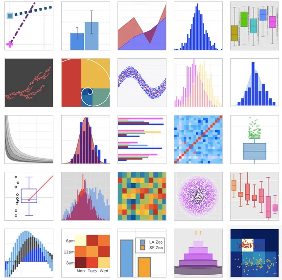
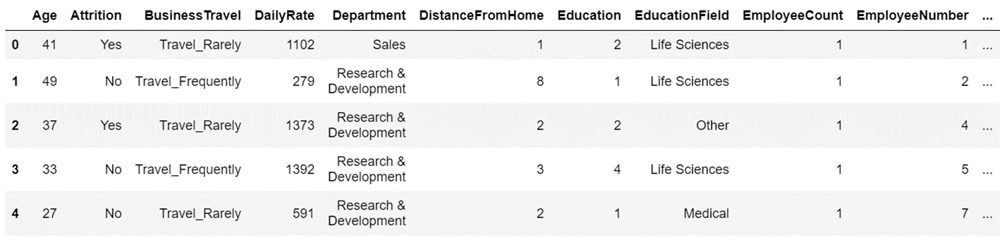
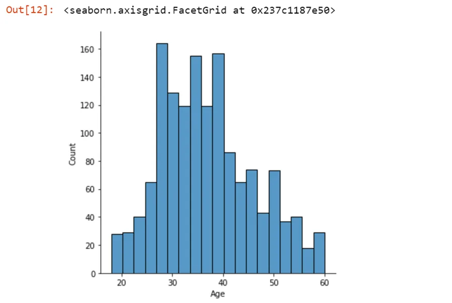
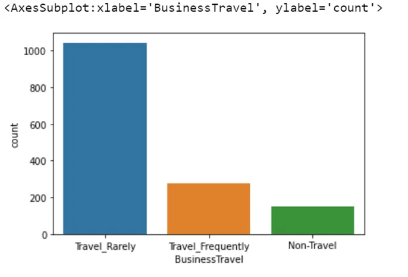
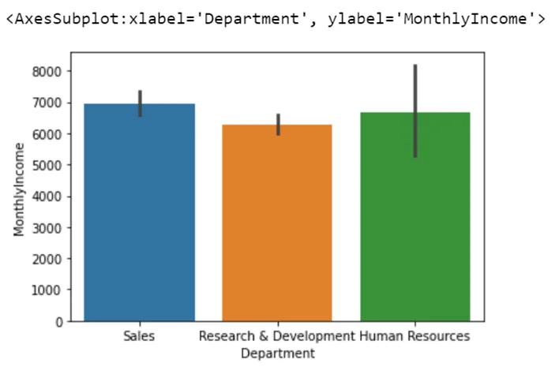
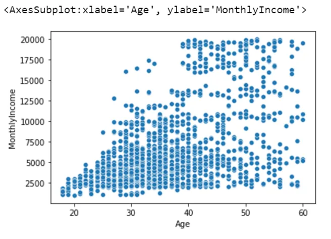
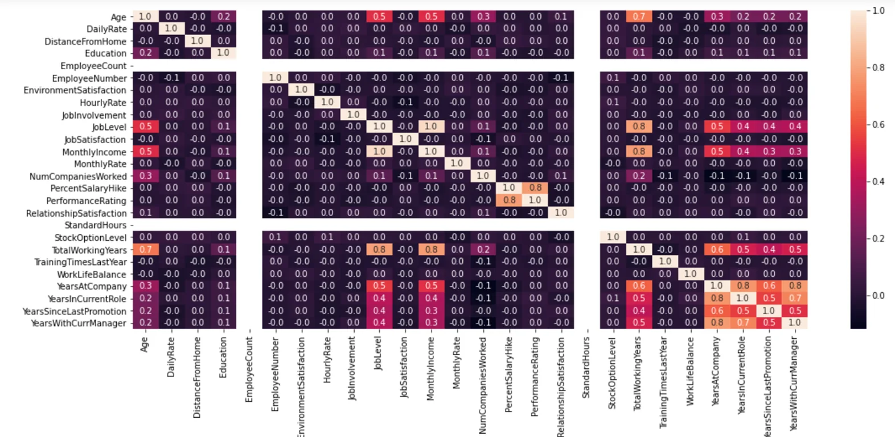
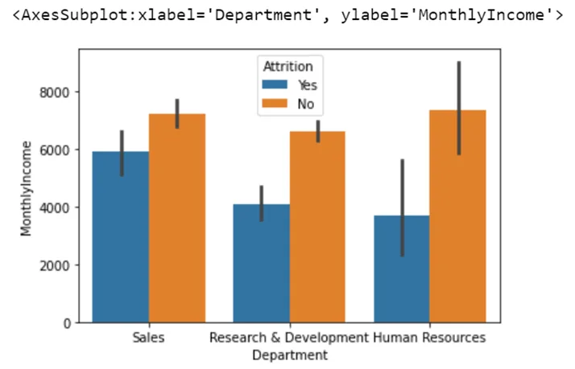

In this blog post, we will be talking about Data Visualization in Python.

Data visualization is a graphical representation of information and data.

By using different visual elements such as charts, graphs, and maps data visualization tools provide us an accessible way to find and understand hidden trends, and patterns in data.

We are going to start with a univariate analysis. Let's first understand what is a univariate analysis and how it can be helpful.

## Univariate Analysis
Univariate analysis is a type of data visualization where we visualize only a single variable at a time. Univariate analysis helps us to analyze the distribution of the variables present in the data so that we can perform further analysis. Now let us see univariate analysis in action using the "employee.csv" dataset.

```python
#Importing the necessary libraries
import pandas as pd
import seaborn as sns
#Reading the dataset
data=pd.read_csv('employee.csv')
```

```python
#Let's check the head of our dataset
data.head()
```

This results,



First, we will perform univariate analysis on the Age column. To do that, we will be using *displot* function of the seaborn library.

```python
#Distributing of age variable
sns.displot(data['Age'])
```



Now, let's also check how to perform univariate analysis on categorical data. Generally, we use *count plot* for that. This time we want to check the distribution for the business travel column.

```python
sns.countplot(x=data['BusinessTravel'])
```

This results,



## Bivariate Analysis
Bivariate Analysis is the simultaneous analysis of two variables. It explores the concepts of the relationship between two variables, whether there exists an association and the strength of this association, or whether there are differences between two variables and the significance of these differences. There are two types of bivariate analysis: **Categorical vs Continuous, Continuous vs Continuous**

Let us look at an example of Categorical vs Continuous bivariate analysis.

We are going to plot the department and the monthly income so that we can understand the average monthly income for all employees working in different departments of the same organization. This can help us perform comparative analysis among different variables present in the data.

```python
sns.barplot(x=data['Department'], y=data['MonthlyIncome'])
```

When we execute we get the following result



We can now easily understand that the employees working in the sales department have a better average salary compared to the other departments, whereas the employees working in the human resources have a big black line indicating that the average salary of the HR department has huge deviation. That means the employees in the HR department have huge differences in their salaries.

Moving on to the next, we have Continuous vs Continuous bivariate analysis. In general, we perform plot two continuous variables using the scatter plot available in the seaborn library. In this case we are going to check the relationship between the age and the monthly income of the employees.

```python
sns.scatterplot(x = data['Age'], y = data['MonthlyIncome'])
```

After executing the code above we see a scatterplot which displays the relation between age and the income of the employees working in the same organization.



Now, one thing that we can notice from this chart is that the employees who have lesser age, such 20-25, get less salary.

## Multivariate Analysis
So whenever you need to add some extra dimensions into your charts, you can opt for multivariate analysis as multivariate analysis means to involve multiple variables at the same time to find correlations between them. In technical terms, multivariate data analysis is a set of statistical models that examine patterns in multidimensional data by considering, at once several data variables.

Now, first of all, we are going to use *heatmap* function available in seaborn library to check the correlation between all the columns present in the dataset. Before using the heatmap, let us understand what is a heatmap and how to understand the output produced by the heatmap. **Heatmap** is a data visualization technique that shows the magnitude of a phenomenon as color in two dimensions. The values of correlation can vary from -1 to 1, where -1 means strong negative relation, and +1 means strong positive relation.

```python
plt.rcParams['figure.figsize']=(19,8)
sns.heatmap(data.corr(), annot=True,fmt='0.1f')
plt.show()
```

Here using the *rcParams* attribute of matplotlib library we increase the size of the plot. In the *heatmap* function we are specifying that *annot=True,* which means that we want to see values of the correlation between two variables. And finally we specify *fmt='0.1f',* which means we want to see the correlation values with only one decimal place. When we execute the code we get:



Now, we can take a closer look at the heatmap and we can see that very few columns are highly correlated to the other columns in the dataset. Some of the columns having high correlation are "MonthlyIncome" and "JobLevel", "PerformanceRating" and "PercentSalaryHike", "TotalWorking Years" and "JobLevel", "TotalWorking Years" and "MonthlyIncome", etc.

Now, let's plot a *barplot* where we will include an extra variable.

```python
sns.barplot(x=data['Department'], y=data['MonthlyIncome'], hue=data['Attrition'])
```

In this case the Department column will be plotted in the x axis, the MonthlyIncome column will be plotted in the y axis, and the Attrition column will be as a third variable in the chart. When we run the above code we get:



It helps us to check the two variables dependency on each with the third variable involved. Now, we can understand that how many employees get attrited and do not get attrited in each of the department. We can see that most of the employees in the HR department are not going to get attrited or not going to leave the organization.

In conclusion, charts and graphs make communicating data findings easier even if you can identify the patterns without them. We need data visualization because a **visual summary of information makes it easier to identify patterns and trends** than looking through thousands of rows on a spreadsheet. It's the way the human brain works.

You can find the jupyter notebook and the dataset at this [link](https://github.com/iamNargiz/Visualizing-Data-in-Python).
