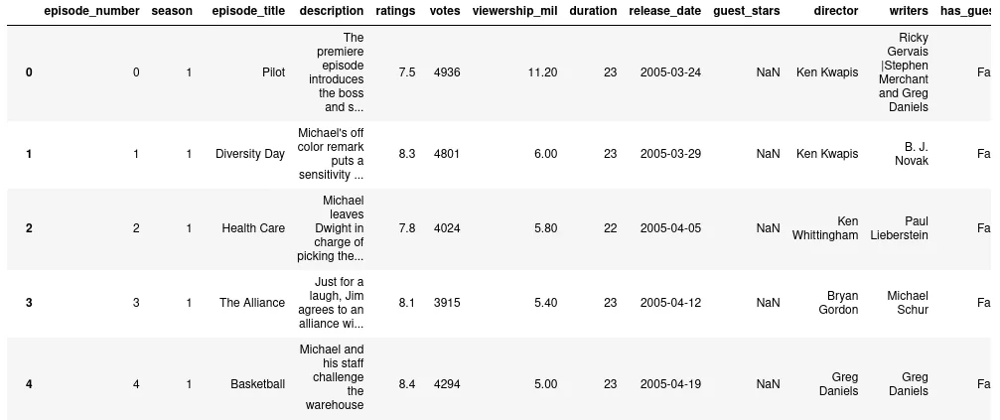
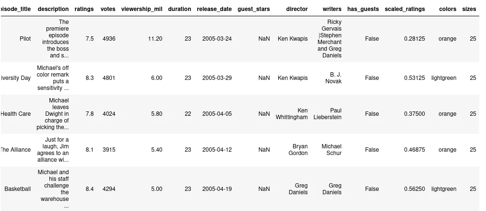
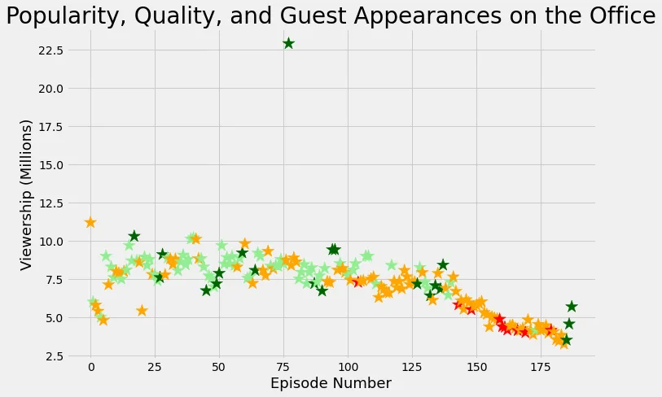

The office is a British mockumentary series consisting 9 seasons with 201 episodes. Here we visualize the information obtained from the dataset downloaded from Kaggle.

At first we imported the necessary library.

```python
import pandas as pd
import matplotlib.pyplot as plt
```

Then we imported the csv into dataframe.

```python
office_df = pd.read_csv('datasets/office_episodes.csv')
```

We just viewed the columns in the dataframe.





Since different color is required for different rating and sizing for guest appearance, we made two empty arrays.

```python
cols = []
sizes = []
```

We classified the row having different range of scaled_ratings to different color as:

```python
for ind, row in office_df.iterrows():
    if row['scaled_ratings'] < 0.25:
        cols.append('red')
    elif row['scaled_ratings'] < 0.50:
        cols.append('orange')
    elif row['scaled_ratings'] < 0.75:
        cols.append('lightgreen')
    else:
        cols.append('darkgreen')
```

Similarly, the rows having guest appearance were assigned size of 250 and 25 for others.

```python
for ind, row in office_df.iterrows():
    if row['has_guests'] == False:
        sizes.append(25)
    else:
        sizes.append(250)
```

We added two columns in the actual dataset for our easeness.

```python
office_df['colors'] = cols
office_df['sizes'] = sizes
```

We splitted the dataframe into guest and non-guest dataframe.

```python
non_guest_df = office_df[office_df['has_guests'] == False]
guest_df = office_df[office_df['has_guests'] == True]
```

For figure plot we assume the figure size as:

```python
# Set the figure size and plot style
plt.rcParams['figure.figsize'] = [11, 7]
plt.style.use('fivethirtyeight')

# Create the figure
fig = plt.figure()
```

We plotted a normal scatter plot for episode number vs. viewership_million with the color and size array in guest and non-guest dataframes.

```python
plt.scatter(x=non_guest_df.episode_number, y=non_guest_df.viewership_mil,c=non_guest_df['colors'], s=25)
```

```python
plt.scatter(x=guest_df.episode_number, y=guest_df.viewership_mil,c=guest_df['colors'], marker='*', s=250)
```

In the plot we added the title, xlabel and ylabel and showed the plot.

```python
plt.title("Popularity, Quality, and Guest Appearances on the Office", fontsize=28)
plt.xlabel("Episode Number", fontsize=18)
plt.ylabel("Viewership (Millions)", fontsize=18)
plt.show()
```



We analyze which episode has the highest viewership and see the guest stars in that episode.

```python
highest_view = max(data_frame["viewership_mil"])

most_watched_dataframe = data_frame.loc[data_frame["viewership_mil"] == highest_view]

top_star = most_watched_dataframe[["guest_stars"]]
```
