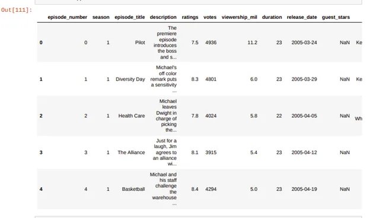
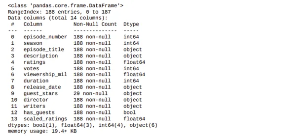
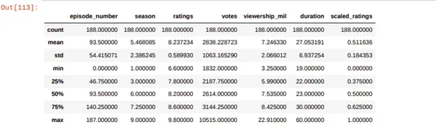
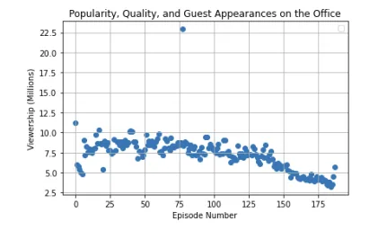
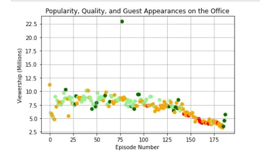
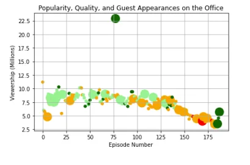
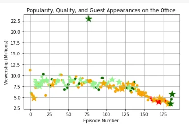
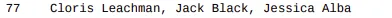

Hello folks,

The OFFICE, huh! An exciting series, right?

However, we are here today to use it in our data science learning journey. But how?

In this blog, accompanied with the notebook down below, we will take a look at a dataset of The Office episodes and try to understand how the **popularity and quality of the series varied over time**. To do so, we will use the following dataset:'*datasets/office_episodes.csv*,' which was downloaded from Kaggle [here](https://www.kaggle.com/nehaprabhavalkar/the-office-dataset).

So now we have a target, and we have a dataset to help us answering our main questions or reaching our target.

So the first thing is to understand our data more. This dataset contains information on a variety of characteristics of each episode. In detail, these are:

1. episode_number: Canonical episode number.
2. season: Season in which the episode appeared.
3. episode_title: Title of the attack.
4. Description: Description of the episode.
5. Ratings: Average IMDB rating.
6. votes: Number of votes.
7. viewership_mil: Number of US viewers in millions.
8. duration: Duration in several minutes.
9. release_date: Airdate.
10. guest_stars: Guest stars in the episode (if any).
11. Director: Director of the episode.
12. writers: Writers of the episode.
13. has_guests: True/False column for whether the episode contained guest stars.
14. scaled_ratings: The ratings scaled from 0 (worst-reviewed) to 1 (best-reviewed).

Here, we will not use any machine learning or inferential statistics. Instead, we will use simple pandas data frames and matplotlib for plotting our desired features. We will inspect by our eyes how the **popularity and quality of the series varied over time**.

Now let us go to the code and do what we said.

## The first thing is importing our desired libraries.

```python
import pandas as pd
import numpy as np
import matplotlib.pyplot as plt
```

## The second thing is loading our data and gaining more insights

We will load our dataset.csv file and save it to our variable, and then we will print the first five lines of it to take a look into our dataset

```python
office = pd.read_csv('datasets/office_episodes.csv')
office.head()
```

The result of this code should be:



Then we will print some more info about our dataset to get to understand its attributes more:

```python
#printing some infor about the dataset
office.info()
```

The result of this code should be:



**So from the above data, the guest_stars has only 29 non-null entries. In other words, out of the 188 episodes, we have 29 only had guest stars in them.**

Then we will be printing some statistics about the dataset.

```python
#Printing some statistics about the dataset
office.describe()
```

The result of this code should be:



**Another** essential **fact from the above data** is **that the minimum rating an episode had was 6.6 while the maximum rating was 9.8. Again there was a relatively high standard deviation between the** episodes'ratings **equaling 0.589, which means that** the rating of the attack **was a bit variant. Additionally, the office series had an average of 7.246 US million views.**

## The Next step is to plot the data.

This scatter plot of the data contains the following attributes: Each episode's episode number is plotted along the x-axis, Each episode's viewership (in millions) is plotted along the y-axis.

```python
fig = plt.figure()
plt.scatter(office['episode_number'],office['viewership_mil'])
plt.title("Popularity, Quality, and Guest Appearances on the Office")
plt.xlabel("Episode Number")
plt.ylabel("Viewership (Millions)")
plt.legend()
plt.grid(True)
plt.show()
```

The result of this code should be



### Now we will color our plot based on the following conditions

● Ratings < 0.25 are colored "red"

● Ratings >= 0.25 and < 0.50 are colored "orange"

● Ratings >= 0.50 and < 0.75 are colored "lightgreen"

● Ratings >= 0.75 are colored "darkgreen"

```python
#Generating the color scheme
color_scheme = []
for ind,row  in office.iterrows():
    if row['scaled_ratings'] < 0.25:
        color_scheme.append("red")
    elif row['scaled_ratings'] >= 0.25 and row['scaled_ratings'] < 0.5:
        color_scheme.append("orange")
    elif row['scaled_ratings'] >= 0.5 and row['scaled_ratings'] < 0.75:
        color_scheme.append("lightgreen")
    elif row['scaled_ratings']>=0.75:
        color_scheme.append("darkgreen")
#Ratings = [0.25,0.5,0.75]
```

```python
fig = plt.figure()
plt.scatter(office['episode_number'],office['viewership_mil'], c=color_scheme)
plt.title("Popularity, Quality, and Guest Appearances on the Office")
plt.xlabel("Episode Number")
plt.ylabel("Viewership (Millions)")
plt.grid(True)
plt.show()
```

**The result of the above code should output the following**.



### The Last Feature we will add to our plot is the Sizing

We will introduce a sizing system to the property such that:

● Episodes with guest appearances have a marker size of 250

● Attacks without are sized 25

```python
#Creating the sizing system
sizing_system = []
for ind,row  in office.iterrows():
    if row['has_guests'] == True:
        sizing_system.append(250)
    elif row['has_guests'] == False:
        sizing_system.append(25)
print(sizing_system)
```

```python
#Applying the sizing sytem on the plot
fig = plt.figure()
plt.scatter(office['episode_number'],office['viewership_mil'],s=sizing_system , c=color_scheme)
plt.title("Popularity, Quality, and Guest Appearances on the Office")
plt.xlabel("Episode Number")
plt.ylabel("Viewership (Millions)")
plt.grid(True)
plt.show()
```

The result of the above code should produce the following graph:



### As a bonus step in this blog, we will be differentiating Guest appearances by size and star! Using the marker attribute

The result of the above code should be



In the above graph, we applied the marking system on the plot by creating two fields, one for episodes without guest stars and that marker will be average o while the other property which will be over it it will be for episodes with guest stars, and those will have a quality of \*

## The final question we are trying to answer is the name of one of the guest stars in the most-watched Office episode.

To answer this question, we will use the following code.

```python
maximum_viewed_episode = office[office['viewership_mil'] == office['viewership_mil'].max()]# print(maximum_viewed_episode)top_stars = maximum_viewed_episode['guest_stars']print(top_stars)
```

The result will be the name of the guest stars in the most-watched episode of the series, and those stars will be our answer.

It should give you an answer like this:



OOOH, NO, this is the end:(

I hope you benefited from this article,

Best,

Youssef M. Hussien

You will find attached the notebook that these scripts are from.

**DISCLAIMER NOTICE**: This blog and notebook have been done as part of the Data Insight one-year Data Science Program and were written based on a project related to the DataCamp Platform.
