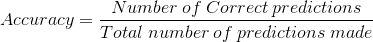
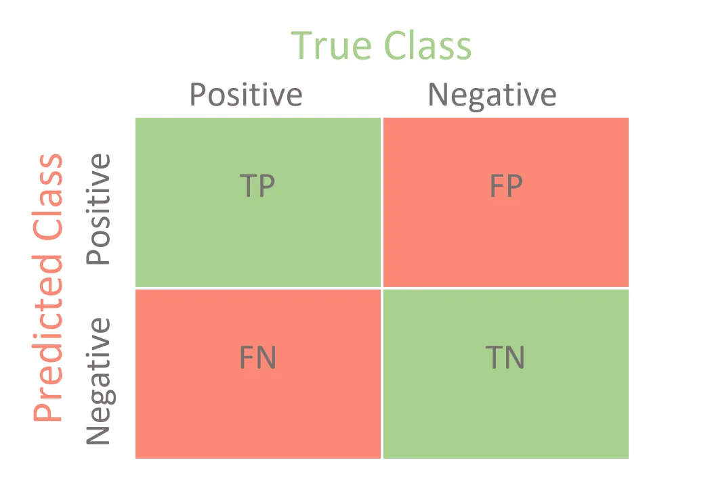
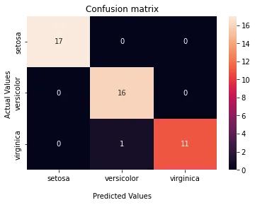
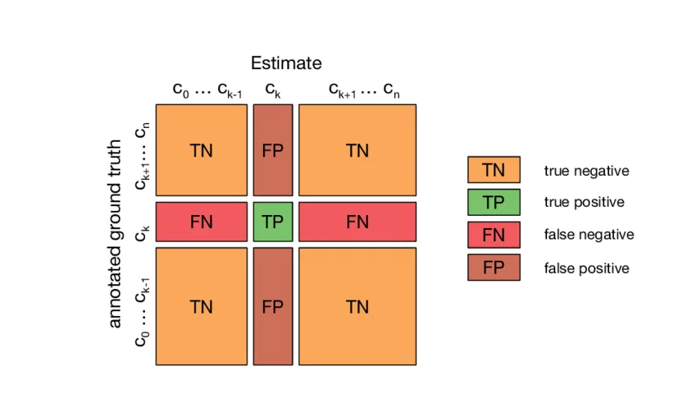
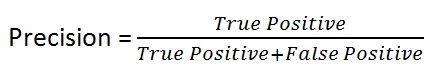
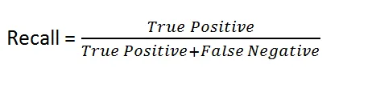
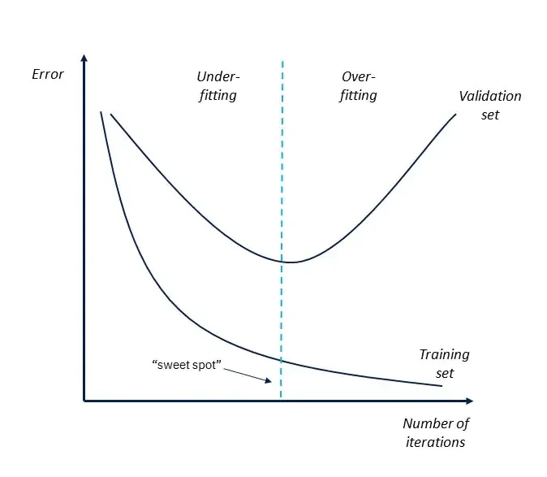

In the last blog posts, we worked a lot on data preprocessing and got to recognize how much of an important task it was.

Remembering the pipeline, We have two important pieces in the puzzle that is Machine learning / Deep learning. The first one is the **data** and the second one is the **Model** itself.

Throughout this post, we'll learn to look at the signs that allow us to figure out if our model is performing **up to standards** or not. One key thing to note is the fact that the threshold for whether a model is well-performing or not is fairly relative to the task. An AI model could have 30% accuracy but still perform the task much better than a human expert as well could have 98% accuracy and be considered worse than an expert. That is why it is important to set your goals and stick to them. And finally, always remember experimentation is always key.

First things first, when it comes to evaluation. The first thing we need is metrics. What are the different metrics we could use to evaluate the performance of the model? How do we calculate them?

#### Classification metrics:

The first one is the "Classification accuracy": This metric is the most known but one could say that it is a double-edged sword. We'll circle back to this point a bit later. For now, let's learn how to calculate this metric.

The formula is as follows: We score the model based on its correct predictions compared to all of the predictions.



This method can be applied to Machine learning models by either using the instruction **model.score(X,y)** which will generate predictions and compare them to the **ground truth.**

Or in case we already have the predictions, we can import the **accuracy_score** function from **sklearn.metrics** and pass it the ground truth and predictions as shown below.

```python
print("The model's accuracy is {:2f}%".format(accuracy_score(y_test,predictions) * 100))
```

This metric works perfectly well when we have a balanced number of samples for the classes' distribution. Let's take the formula above and think what if we had 2 classes with an imbalanced number of samples, let's say a 99:1 ratio. That means for every sample of class A we have 99 samples of class B. Before thinking that this is an extreme case, think about medical diagnoses of rare diseases. If you had to create a dataset which MRI images and their outcomes you'd find yourself in such a situation.

In such a case, having 99% of the samples classified as negative for a certain disease, the model can just label every input as 0 and it would still achieve a 99% accuracy but would end up misdiagnosing anyone who should actually test positive.

For this we need to learn more about the possible outcomes of model predictions:

- **TP:** Stands for **True Positive**, which means the model **correctly** classified a **positive** outcome.
- **TN:** Stands for **True Negative**, which means the model **correctly** classified a **negative** outcome.
- **FP:** Stands for False Positive, which means the model **wrongly** classified a **negative** outcome.
- **FN:** Stands for False Negative, which means the model **wrongly** classified a **positive** outcome.

To better visualize this, we could make use of **Confusion matrices.**



Here's the code, for the iris dataset classifier confusion matrix. Can you guess which values are the TP, FP, FN, and TN?

```python
import seaborn as sns
cf_matrix = confusion_matrix(y_test,predictions)
ax = sns.heatmap(cf_matrix, annot=True)
#Titles
ax.set_title('Confusion matrix');
ax.set_xlabel('\nPredicted Values')
ax.set_ylabel('Actual Values ');
#Set lebels
ax.xaxis.set_ticklabels(['setosa','versicolor','virginica'])
ax.yaxis.set_ticklabels(['setosa','versicolor','virginica'])
plt.show()
```

Result:



In case you didn't, here's a graph that should make it easier,



(Multiple class confusion matrix, [source](https://www.researchgate.net/figure/Confusion-matrix-for-multi-class-classification-The-confusion-matrix-of-a_fig7_314116591))

For this we need to learn more about the possible outcomes of a model prediction:

- **TP:** Stands for **True Positive**, which means the model **correctly** classified a **positive** outcome.
- **TN:** Stands for **True Negative**, which means the model **correctly** classified a **negative** outcome.
- **FP:** Stands for False Positive, which means the model **wrongly** classified a **negative** outcome.
- **FN:** Stands for False Negative, which means the model **wrongly** classified a **positive** outcome.

To better visualize this, we could make use of **Confusion matrices.**


([Source for image](https://www.r-bloggers.com/2020/12/weighting-confusion-matrices-by-outcomes-and-observations-2/))

Here's the code, for the iris dataset classifier confusion matrix. Can you guess which are TP, FP, FN, TN?

```python
import seaborn as sns
cf_matrix = confusion_matrix(y_test,predictions)
ax = sns.heatmap(cf_matrix, annot=True)
#Titles
ax.set_title('Confusion matrix');
ax.set_xlabel('\nPredicted Values')
ax.set_ylabel('Actual Values ');
#Set lebels
ax.xaxis.set_ticklabels(['setosa','versicolor','virginica'])
ax.yaxis.set_ticklabels(['setosa','versicolor','virginica'])
plt.show()
```

Result:


In case you didn't, here's a graph that should make it easier:

(Multiple class confusion matrix, [source](https://www.researchgate.net/figure/Confusion-matrix-for-multi-class-classification-The-confusion-matrix-of-a_fig7_314116591) )

Let's get back to the main issue at hand which is how we estimate the performance for unbalanced classes.

There are two more metrics that allow for better evaluation which are **Precision** and **Recall.**

**"Precision":** Also known as **Positive Predictive Value,** This metric focuses on the rate at which the model **correctly** issues **positive** predictions. It is measured via this formula.



"**Recall"**: Also known as **Sensitivity/Hit Rate.** It measures the model's capability of detecting positive outcomes.



These two metrics allow for better evaluation when it comes to unbalanced datasets since they focus on the interesting outcomes (for example the rare disease being actually detected) and encourages the model to focus properly on detecting the positive samples.

Code-wise, **sklearn** offers both metrics in its **metrics** package with the functions **precision_score** and **recall_score.**

```python
#Precision
print("The model's accuracy is {:2f}%".format(precision_score(y_test,predictions,average='macro') * 100))
#Recall
print("The model's accuracy is {:2f}%".format(recall_score(y_test,predictions,average='macro') * 100))
```

Finally, We can add in the Area Under ROC Curve (AUC). Which is a plot of the precision vs recall function.

The ROC (**Receiver Operating Characteristic curve**) shows the performance of the classification model at different classification thresholds (The threshold which decides the sample output as positive or negative. it could be 0.5 for example). Varying this threshold allows for different outputs i.e FP and FN values and in turn different precision and recall values. The value for AUC ranges from 0 to 1. 1 being the best value which means that the model perfectly distinguishes positive and negative outcomes and 0 being the worst.

The code below shows how to calculate the AUC score.

```python
predictions_proba = classifier.predict_proba(X_test) #Note that we use probabilities here (to varry the threshhold)

print("The model's AUC score is {:2f}%".format(roc_auc_score(y_test, predictions_proba) * 100))
```

#### Overfitting vs Underfitting.

Now that we have metrics to evaluate the models with, **how do we know if these values will hold true in real-life situations?**

To answer this question, we have to know how the model performs on **unseen** samples. This is where the first trick to training models comes into place. We must always keep a **holdout** set. This would be a portion of our dataset that the model will only see at the evaluation step.

One way to do this is via the **train_test_split** method.

```python
X_train,X_test,y_train,y_test = train_test_split(X,y,test_size=0.3) #30% test size
```

This can be taken one step further by creating a **validation set.** Validation sets are good to observer how the model is evolving mid-training and to set good stopping points to avoid **Overfitting or Underfitting.**

One simple way to do it is to train_test_split **twice**.

```python
X_temp,X_test,y_temp,y_test = train_test_split(X,y,test_size=0.3) #Create temp and test sets
X_train,X_val,y_train,y_val = train_test_split(X_temp,y_temp,test_size=0.25) #Create train, val, test sets
```

Back to the issue at hand, what are overfitting and underfitting and how can we recognize these cases?

**Underfitting** means that we trained the model way too little on the presented data and it didn't manage to learn the patterns presented in the data.

**Overfitting** means that over-trained the model on the presented data and it only learned the patterns present there. This can be easily diagnosed by seeing that the validation error curve starts **diverging** from the training error curve.

Both cases, share the gap in model's error/accuracy when comparing between training set and test set.

This can be better modeled by the graph shown below.



[(Image source)](https://www.thetechplatform.com/post/difference-between-overfitting-and-underfitting)

#### Cross-validation:

Cross-validation can be needed if we don't have that much data. The concept is fairly simple. We reiterate the training over the data while holding out a different portion of the dataset (ofc, the model is reinitiated in each training step).

After the training steps, we calculate the average metric across the different models.

After the training steps, we calculate the average metric across the different models.

This can be done via the following method:

```python
scorer = make_scorer(accuracy_score) # create scorer object
cross_score = cross_val_score(estimator=classifier, scoring=scorer,X=X, y=y, cv=5)
print(cross_score.mean())
print(cross_score.std())
```

As usual, I hope reading this post was worth it even a tiny bit. For the code samples and their outputs, feel free to check the [notebook](https://github.com/zqngetsu96/DataInsight_Assignments_and_projects/blob/main/Bi-weekly-blog-codes/Model%20validation.ipynb).
