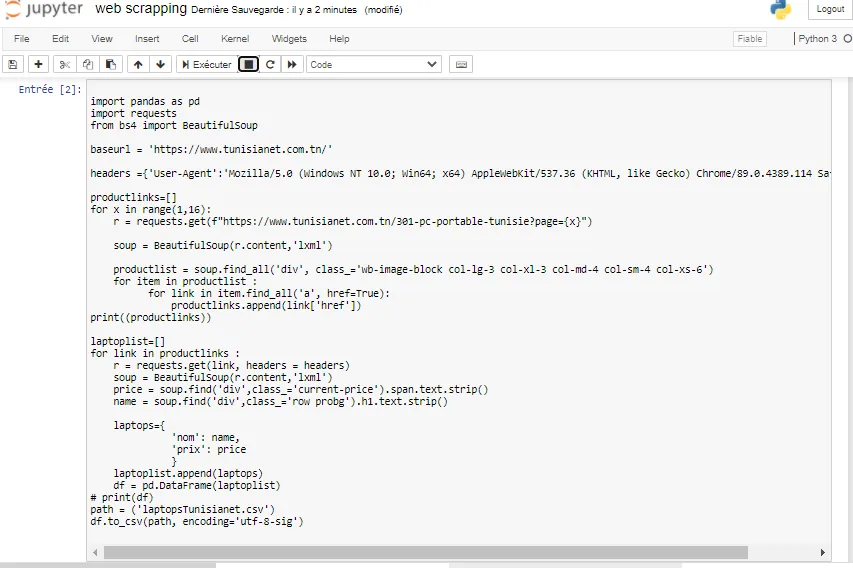
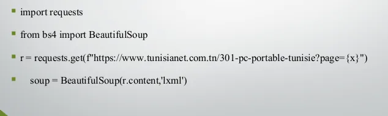
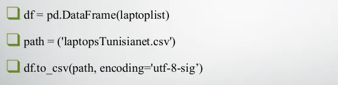

i needed to buy a new laptop so i checked so a tunisian site called https://www.tunisianet.com.tn/ to compare laptop prices and specifications but this was so complicated because i was obliged every time to change pages showing laptops to campare specifications and the i managed to write a python code wich lists all laptops with different specifications and prices in one table .

and this is the code :

Analysing HTML code with BeautifulSoup

and to save result in a csv format i used dataframe from the library of pandas shown as below :

