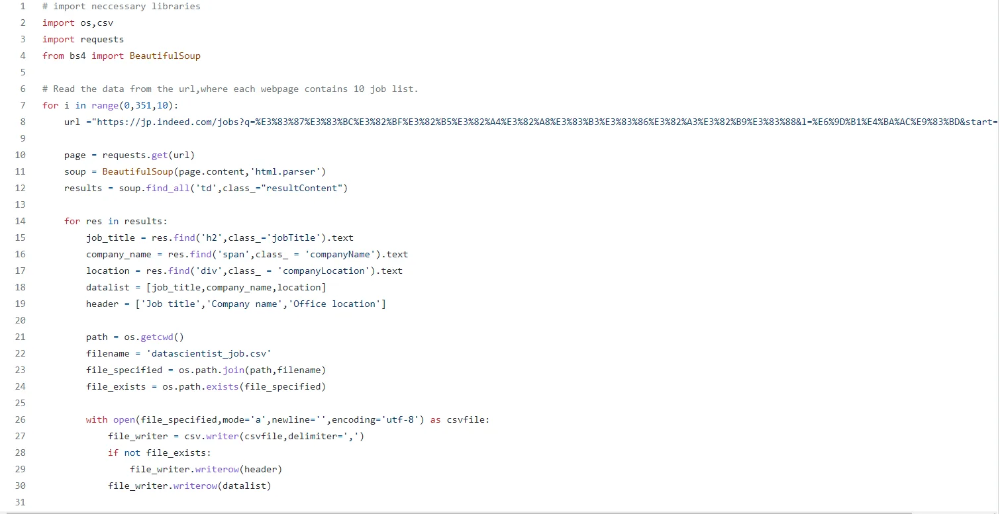

Are you thinking about web scraping? What is it? How to get data from web? Then you have came to good location.Today we are going to read data scientist jobs from indeed job portal for japan using BeautifulSoup.

Before this we are investigation the item of the webpage that we are trying to scrape.First import necessary libraries.

```python
import os,csv
import requests
from bs4 import BeautifulSoup
```

From the investigation, only 10 jobs are listed on one page and we have to loop over 351 page to get data of data scientist job.To loop over the data we have to a base URL so that we can pass page number to the URL after start= .

```python
https://jp.indeed.com/jobs?q=%E3%83%87%E3%83%BC%E3%82%BF%E3%82%B5%E3%82%A4%E3%82%A8%E3%83%B3%E3%83%86%E3%82%A3%E3%82%B9%E3%83%88&l=%E6%9D%B1%E4%BA%AC%E9%83%BD&start=
```

We will collect job title,company name and location of office.First we have to get a top div name so that we can get value of each items inside the card.For our condition, the name of element is 'td' with class name 'resultContent'.

```python
page=requests.get(url)
soup=BeautifulSoup(page.content,'html.parser')
results=soup.find_all('td',class_="resultContent")
```

After get all card data,

1. Select job title with element h2 and classname jobtitle.

2. Select company name with element span and classname companyName.

3. Select location name with element div and classname companyLocation.

```python
job_title=res.find('h2',class_='jobTitle').text
company_name=res.find('span',class_='companyName').text
location=res.find('div',class_='companyLocation').text
```

Then all these collected data should be saved to the file. So that we are making a list of datas and list of header of the columns as follows.

```python
datalist= [job_title,company_name,location]
header= ['Job title','Company name','Office location']
```

Now,try to save collected data to the csv file following below code.

```python
path=os.getcwd()
filename='datascientist_job.csv'
file_specified=os.path.join(path,filename)
file_exists=os.path.exists(file_specified)

with open(file_specified,mode='a',newline='',encoding='utf-8') as csvfile:
    file_writer=csv.writer(csvfile,delimiter=',')
    if not file_exists:
        file_writer.writerow(header)
     file_writer.writerow(datalist)
```

We need to loop through this steps for 351 times with interval of 10.The snippet of this code is added below. This code can be found on my github repo with the [link](https://github.com/awalGaurab/web_scraping/blob/main/indeed_joblist.py).


