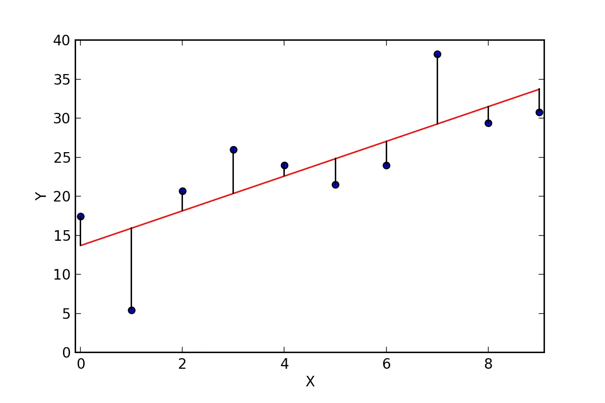
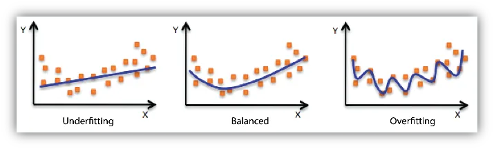
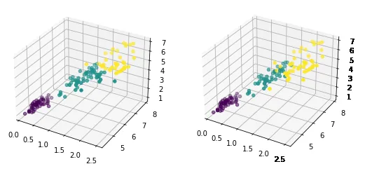

So, we had a lot of fun times together building up our arsenal as data scientists. Specially, we focused a lot on statistics and probabilities and how they work. Although they are very important tools, there are other weapons that can be quite helpful down the road when studying data.

What if I told you, the machine can **actually learn patterns in data**. Data that probably you could spend years making sense of a machine can figure out in days.

Would you take the blue pill and stay in a machine learning-free world where you figure things out manually, or take the red one and discover the possibilities that lie within this field?

Seems like you made the right choice. Back to where we were, every data hold patterns, some are fairly simple, some are really complex that we wouldn't even think exist. Although we can distinguish them through many tools we already have like statistics, machine learning algorithms have evolved to handle this in a much hands-off way which saves us a lot of time and brainpower to focus on other tasks.

One thing I have to mention, don't worry about Machine learning replacing you. Any artificial learning algorithm still needs human guidance and validation.

In this post we'll discover two main concepts:

### Supervised learning:

This consists of 1 simple idea **"This is what you'll see, this is what you should output in response"**. Of course, the "seeing" part refers to the input the machine gets. we call the input a set of **features** and the **response** is the **output** the model generates.
Let's take a second and focus on the task the machine has. It's one of the following two; **"regression"** or **"classification"**.

Before we go any further, the code examples will mainly be using the library Scikit-learn machine learning library as well as datasets provided by them. for the demonstration

**Regression** is the **inference** of a **Value** based on a given input. For example, what's the temperature going to be **tomorrow based on the temperatures of this week**?

Let's see what an example of regression looks like shall we?

In this demo, we'll demonstrate a **simple linear** (of course, in real life it's not always the case) relationship between points X and Y and try out LinearRegression algorithms which will try to learn the slope and intercept of our data points.

```python
x_axis = np.arange(100)
a = 3
b = 2
y_truth = x_axis * a + b

linear_model = LinearRegression() #Model instance
linear_model.fit(x_axis.reshape(-1,1),y_truth) #Fitting the model to the data.

print("True a : {}, Predicted a: {}:".format(a,linear_model.coef_))
print("True b : {}, Predicted b: {}:".format(b,linear_model.intercept_))

##OUTPUT##
True a : 3, Predicted a: [3.]
True b : 2, Predicted b: 1.9999999999999432
```

Let's take notice of a few things in the preceding demo:

- The model learned perfectly the slope and intercept we generated the data. Are our models always this smart? Nope. Sadly enough, as mentioned earlier, patterns/relationships in data are rarely perfect and easy to exploit from the get-go.
- What does fitting do? In simple terms, fittings aim to generate the **F(x) = y** function that **minimizes** the residual errors in relation to the dataset. Check the picture below of a dataset that shows a
  not-so-perfect linear relationship. The fitting aims to achieve an average minimum length of the black lines you see in the plot.



**Classification** is the **inference** of a **Category** based on a given input. For example, **What** is **this digit** based on **this image**? Is this credit card transaction legit?

Let's seen what an example of a classification problem looks like. We've had many looks at the Iris dataset so I won't bore you with another explanation. TLDR: We have three types of flowers, we have measurements of their petals and sepals (lengths and widths). Based on the measurements we have to classify (correctly) the flower at hand.

Let's see what that looks like in code:

```python
iris = datasets.load_iris()
X = iris.data
y = iris.target
X_train,X_test,y_train,y_test = train_test_split(X,y,test_size=0.3) #Split the data into training and testing sets

classifier = RandomForestClassifier() #Notice the default parameters
classifier.fit(X_train,y_train) #Model fitting to the dataset

print("Scores (Accuracy) calculation")
print("Train accuracy: " + str(classifier.score(X_train,y_train) * 100)+ "%")
print("Test accuracy: {:.2f} ".format(classifier.score(X_test,y_test) * 100) + "%")

##OUTPUT##
Scores (Accuracy) calculation
Train accuracy: 100.0%
Test accuracy: 91.11 %
```

Okay let's analyze what we have at hand:

- **Why did we split our data? :** If tests in real consisted mainly of things you've already seen then how is it possible to measure your capability to **generalize** well towards real-world problems? "Generalize" is the main keyword here. We want to know for sure if our model really learned the pattern or just memorized the data. So we hide a test set that it has never seen! Check the accuracy, you'll notice the difference between the accuracy on a set it used for learning and something it never saw.
- As usual, the training phase first takes place, then using the acquired knowledge, our model **infers** the output based on data it didn't see before.
- Of course, the test accuracy ended up being lower but not by a really big difference (This statement **is relative to the situation**, sometimes dropping by 1% is considered a lot!). But at least we know we don't have an **overfitting** problem.

What is overfitting? Can a model be under-fitted? Actually fair questions you have there!
Just like in real life, we seek **balance**! Moderation is key. We need the model to be in a spot where it learns the data enough to represent accurately the relationships in data but without overdoing it! Else, it will have a tough time dealing with new data it didn't see before. Check the graphs below to get a feeling of how a model can behave. The examples show predictions (in blue) of a **Non-linear** regression model (yes, those exist too!).



So by now, you might've already guessed correctly but I'll still give a simple reminder, a model goes through two phases: **Training** (also known as fitting) and **Inference** (Whether in real-life situations or for evaluation purposes).

The **training part** is where we let the **model learns the patterns/relationships present in the dataset**.

The **inference part** is where the model **uses the acquired knowledge** to **generate output for data it didn't see before**.

### Unsupervised learning:
Unsupervised learning refers to the tasks where machine learning models try to show us patterns and relationships present in the data which we do not really know.

So how can we make use of this? Let's go back to the Iris dataset. What if we didn't have the labels? We can still process the data in a way that at least shows up how the data can be grouped up.

One way to achieve this is clustering:

**Clustering** aims to create groups (a fixed number we preset for the model) and associates each entry in the dataset based on its distance from a group's **Centroid.** The idea is, the closer the data point is to a centroid **the more likely** it is that it belongs to its group.

Let's see what that look like in code:

```python
#The data is preloaded from previous example in X and y
model = KMeans(n_clusters = 3)
model.fit(X)
print(model.inertia_)
labels = model.labels_

fig = plt.figure()
ax = fig.add_subplot(projection='3d')
ax.scatter(X[:, 3], X[:, 0], X[:, 2], c=labels.astype(float)) #we color the points based on the Kmeans clustering

fig2 = plt.figure()
ax2 = fig2.add_subplot(projection='3d')
ax2.scatter(X[:, 3], X[:, 0], X[:, 2], c=y.astype(float)) #we color the points based on the actual labels
##OUTPUT##
inertia : 78.85144142614601
```

On the left, we can see the generated groups using KMeans, and on the right the actual groups we have in the dataset.



Even though the model didn't really see any labels, it managed to cluster data quite accurately. We still have a few things to note:
A model's inertia is the distance of the points from their centroids.

In a real-world example, we don't know the number of clusters we need. A good way to figure it out is to plot out the **inertia versus the number of clusters and choose the point where the inertia changes towards a slow decreasing slope**. Remember, the inertia will keep dropping as you add centroids. it's the **degree it drops with** that matters!

Another use of unsupervised learning is to reduce the dimensionality of data. In our Iris dataset, we have 4 features. that means our dataset is 4 dimensional. Last I checked, we can't visualize those! But, what if we could make it 2 dimensional with little to almost no loss in information?

**Dimensionality reduction** is what we would need here. That's what **Principle Component Analysis(PCA)** can achieve. It is a known algorithm that can reduce the data's dimensionalities while minimizing the data loss that occurs from the operations.

Let's how this looks like in code.

```python
pca = decomposition.PCA(n_components=2)

x_r = pca.fit_transform(X)
print(X.shape)
print(x_r.shape)

plt.scatter(x_r[:,0],x_r[:,1],c=y.astype(float))
print(pca.explained_variance_ratio_ * 100)
##OUTPUT##
(150, 4)
(150, 2)
[92.46187232  5.30664831]
```

As we can see below, the dataset is now 2 dimensional and can be easily visualized.


Afew things to note:

- As we can see in the shapes output, the dataset was successfully converted to 2 dimensional instead of 4.
- The output of **pca.explained_variance_ratio_** displays how much of the information's variance is associated with each component (in our case there are only 2). As we can see, we managed to retain ~98% of the information through the conversion. This is really important because there is a **trade-off between the number of components and the information we retain**. The bigger the drop in the number of components the more likely it is that we'll lose information.

I hope this article was fun to read and worth your time.

Feel free to check out the [notebook](https://github.com/zqngetsu96/DataInsight_Assignments_and_projects/blob/main/Bi-weekly-blog-codes/Supervised%20and%20unsupervised%20learning.ipynb) for more information and better outputs.
