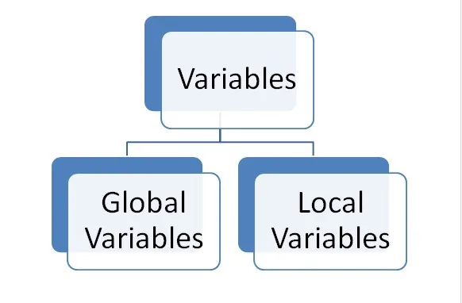

All Python variables which are accessible at some point in code are either in *local scope* or in the *global scope*.

The explanation is that local scope includes all variables defined in the current function and global scope includes variables defined outside of the current function.

```python
foo = 1  # global
def func():
    bar = 2  # local
    print(foo)  # prints variable foo from global scope
    print(bar)  # prints variable bar from local scope
```

One can inspect which variables are in which scope. Built-in functions locals() and globals() return the whole scopes as dictionaries.

```python
foo = 1
def func():
    bar = 2
    print(globals().keys())  # prints all variable names in global scope
    print(locals().keys())  # prints all variable names in local scope
```

**What happens with name clashes?**

```python
foo = 1
def func():
    foo = 2  # creates a new variable foo in local scope, global foo is not affected
    print(foo)  # prints 2
    # global variable foo still exists, unchanged:
    print(globals()['foo'])  # prints 1
    print(locals()['foo'])  # prints 2
```

To modify a global variable, use the keyword global:

```python
foo = 1
def func():
    global foo
    foo = 2  # this modifies the global foo, rather than creating a local variable
```

**The scope is defined for the whole body of the function!**

What it means is that a variable will never be global for half of the function and local afterwards, or vice-versa.

```python
foo = 1
def func():
    # This function has a local variable foo, because it is defined down below.
    # So, foo is local from this point. Global foo is hidden.
    print(foo) # raises UnboundLocalError, because local foo is not yet initialized
    foo = 7
    print(foo)
```

Likewise, the opposite:

```python
foo = 1
def func():
    # In this function, foo is a global variable from the begining
    foo = 7  # global foo is modified
    print(foo)  # 7
    print(globals()['foo'])  # 7
    global foo  # this could be anywhere within the function
    print(foo)  # 7
```

**Functions within functions**

There may be many levels of functions nested within functions, but within any one function, there is only one local scope for that function and the global scope. There are no intermediate scopes.

```python
foo = 1
def f1():
    bar = 1
    def f2():
        baz = 2
        # here, foo is a global variable, baz is a local variable
        # bar is not in either scope
        print(locals().keys())  # ['baz']
        print('bar' in locals())  # False
        print('bar' in globals())  # False
    def f3():
        baz = 3
        print(bar)  # bar from f1 is referenced so it enters local scope of f3 (closure)
        print(locals().keys())  # ['bar', 'baz']
        print('bar' in locals())  # True
        print('bar' in globals())  # False
    def f4():
        bar = 4  # a new local bar which hides bar from local scope of f1
        baz = 4
        print(bar)
        print(locals().keys())  # ['bar', 'baz']
        print('bar' in locals())  # True
        print('bar' in globals())  # False
```

**Global** **vs** **Nonlocal**

Both these keywords are used to gain write access to variables that are not local to the current functions.

The global keyword declares that a name should be treated as a global variable.

```python
foo = 0  # global foo
def f1():
    foo = 1  # a new foo local in f1
    def f2():
        foo = 2  # a new foo local in f2
        def f3():
            foo = 3  # a new foo local in f3
            print(foo)  # 3
            foo = 30  # modifies local foo in f3 only
        def f4():
            global foo
            print(foo)  # 0
            foo = 100  # modifies global foo
```

On the other hand, nonlocal (see [Nonlocal Variables](https://riptutorial.com/python/example/5712/nonlocal-variables)), available in Python 3, take a *local* variable from an enclosing scope into the local scope of the current function.

From the [Python documentation on nonlocal](https://docs.python.org/3/reference/simple_stmts.html#nonlocal):

The nonlocal statement causes the listed identifiers to refer to previously bound variables in the nearest enclosing scope excluding globals.

```python
def f1():
    def f2():
        foo = 2  # a new foo local in f2
        def f3():
            nonlocal foo  # foo from f2, which is the nearest enclosing scope
            print(foo)  # 2
            foo = 20  # modifies foo from f2!
```
