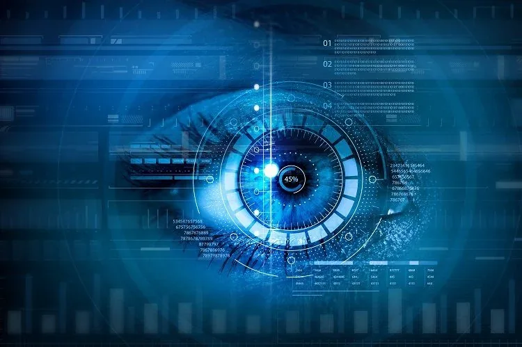
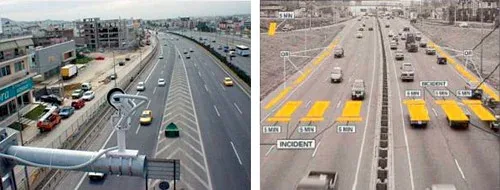
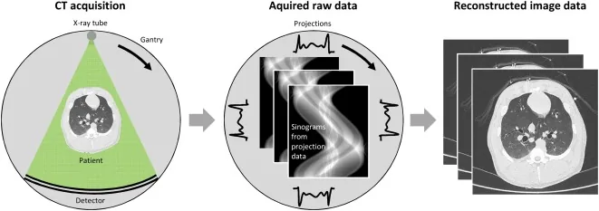
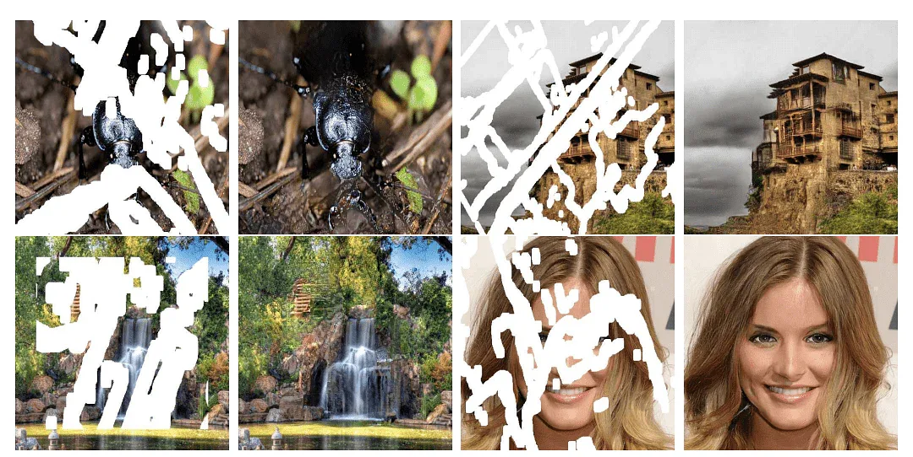
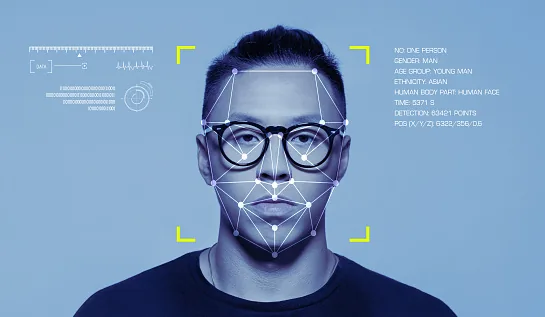

Deep learning has had a tremendous impact on various fields of technology in the last few years. One of the hottest topics buzzing in this industry is computer vision, the ability for computers to understand images and videos on their own. Self-driving cars, biometrics, and facial recognition all rely on computer vision to work. At the core of computer vision is image processing.

## What Is an Image?
Before we dive into image processing, we need to first understand what exactly constitutes an image. An image is represented by its dimensions (height and width) based on the number of pixels. For example, if the dimensions of an image are 400 x 400 (width x height), the total number of pixels in the image is 160000.

This pixel is a point on the image that takes on a specific shade, opacity, or color. It is usually represented in one of the following:

1. **Grayscale -** A pixel is an integer with a value between 0 to 255 (0 is completely black and 255 is completely white).
2. **RGB -** A pixel is made up of 3 integers between 0 to 255 (the integers represent the intensity of red, green, and blue).
3. **RGBA -** It is an extension of RGB with an added alpha field, which represents the opacity of the image.

Image processing requires fixed sequences of operations that are performed at every pixel of an image. The image processor performs the first sequence of operations on the image, pixel by pixel. Once this is fully done, it will begin to perform the second operation for the second pixel, and so on. The output value of these operations can be computed at any pixel of the image.

## What Is Image Processing?
Image processing is the process of transforming an image into a digital form and doing certain operations to get some useful information from it. The image processing system usually treats all images as 2D signals when applying certain predetermined signal processing methods.
There are five main types of image processing:

1. **Visualization -** Find objects that are not visible in the image
2. **Recognition -** Distinguish or detect objects in the image
3. **Sharpening and restoration -** Create an enhanced image from the original image
4. **Pattern recognition -** Measure the various patterns around the objects in the image
5. **Retrieval -** Browse and search images from a large database of digital images that are similar to the original image

## Applications of Image Processing
### Medical Image Retrieval

Image processing has been extensively used in medical research and has enabled more efficient and accurate treatment plans. For example, it can be used for the early detection of breast cancer using a sophisticated nodule detection algorithm in breast scans. Since medical usage calls for highly trained image processors, these applications require significant implementation and evaluation before they can be accepted for use.

### Traffic Sensing Technologies

In the case of traffic sensors, we use a video image processing system or VIPS. This consists of a) an image capturing system b) a telecommunication system and c) an image processing system. When capturing video, a VIPS has several detection zones that output an “on” signal whenever a vehicle enters the zone, and then output an “off” signal whenever the vehicle exits the detection zone. These detection zones can be set up for multiple lanes and can be used to sense the traffic in a particular station.

Left - normal traffic image | Right - a VIPS image with detection zones

Besides this, it can automatically record the license plate of the vehicle, distinguish the kind of vehicle, monitor the speed of the driver on the highway, and much more.

### Image Reconstruction

Image processing can be used to recover and fill in the missing or corrupt parts of an image. This involves using image processing systems that have been trained extensively with existing photo datasets to create newer versions of old and damaged photos.

Reconstructing damaged images using image processing

### Face Detection

One of the most common applications of image processing that we use today is face detection. It follows deep learning algorithms where the machine is first trained with the specific features of human faces, such as the shape of the face, the distance between the eyes, etc. After teaching the machine these human face features, it will start to accept all objects in an image that resemble a human face. Face detection is a vital tool used in security, biometrics, and even filters available on most social media apps these days.

## Benefits of Image Processing
The implementation of image processing techniques has had a massive impact on many tech organizations. Here are some of the most useful benefits of image processing, regardless of the field of operation:

- The digital image can be made available in any desired format (improved image, X-Ray, photo negative, etc)
- It helps to improve images for human interpretation
- Information can be processed and extracted from images for machine interpretation
- The pixels in the image can be manipulated to any desired density and contrast
- Images can be stored and retrieved easily
- It allows for easy electronic transmission of images to third-party providers

That's it, I hope this article was worth reading and helped you acquire new knowledge no matter how small.
