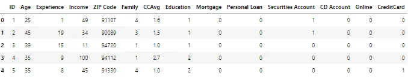
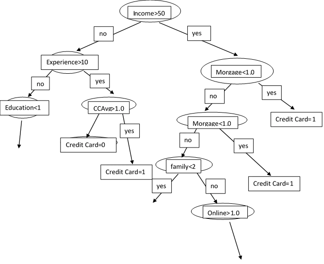

There are different models in machine learning based on several intuition that help come up with a final prediction. Similar to how there cam be various methods to solve mathematical problems and we have to choose the best, especially in numerical methods, we also know that some methods are more suitable (give more accurate results) for certain types of problems, in the same vane, there are several models in machine learning and some are better suited for certain types of data problems and a good machine learning engineer can make an excellent choice without much trial and error.

Classification and regression trees are one of the methods which we would be exploring in this article.

The logic behind a decision tree is that at each node there is a question with only two possible answers (branches) and at the bottom of each decision tree there is a single decision. The nodes contain questions about the features in a given data set. Example considering the dataset below;

this dataset is basically collecting data from different people to predict whether or not they should be given a bank loan. The first thirteen columns are the features while the credit card column is the target column being predicted (o for don't give a loan and 1 for give a loan).

This is a hypothetical idea of how a decision tree works;

Questions are asked at points called nodes, the questions asked are based on features and particular thresholds to reduce the loss functions.

The models ensures that there is maximum information gain at each node which ensure that there is a pure or nearly pure split. (I.e the questions asked and the threshold set should be able to split the dataset into separate classes in each branch).

This is a very high level idea of how decision trees handle classification problems. The process for predicting regression problems is also similar and the end prediction is the mean of the final point.

To choose the best splits to make on regression problems, we use a method called greedy algorithm (it tries a lot of possible splits) to select the split that minimizes the standard deviation in the resulting node.

**Implementing in scikit-learn;**

In this quick demo, I would do an implementation of a classifier and a regressor while skipping the pre-processing steps (pardon me)

Regression

The Tree models have initial parameters we can specify that can help adjust models, they are called hyperparameters. Hyperparameters can be used in pruning trees (i.e. making the tree model predictions a lot better and preventing overfitting).

**Hyperparameters for Classification trees are;**

- criterion**:** This is used to select the kind of cost function to measure the quality of a split, in order to choose the best split. The options are; 'gini', 'entropy' and 'log_loss'. The default is 'gini'.

- splitter: Used to decide how splits are chosen at each node. The options are 'best' and 'random'. The default is 'best'.

- max_depth: The is the specify the maximum number of branches from the root node to any leaf. Default is None, so if any integer isn't specified the tree keeps branching till we can obtain the purest possible leaves.

- min_samples_leaf

- min_weight_fraction_leaf

- max_features

- random_state

- max_leaf_nodes

- max_impurities_decrease

- ccp_alpha

**Hyperparameters for Regression trees are;**

- criterion**:** similar to the classification trees this is a function used to select the best split. The options are 'squared_error', 'friedman_mse', 'absolute_error', 'poisson'. The default is the squared error for the mean squared error, which is equal to variance reduction as feature selection criterion.

- splitter: Used to decide how splits are chosen at each node. The options are 'best' and 'random'. The default is 'best'.

- max_depth: The is the specify the maximum number of branches from the root node to any leaf. Default is None, so if any integer isn't specified the tree keeps branching till we can obtain the purest possible leaves.

- min_samples_leaf

- min_weight_fraction_leaf

- max_features

- random_state

- max_leaf_nodes

- max_impurities_decrease

- ccp_alpha

**References**

[sklearn.tree.DecisionTreeRegressor — scikit-learn 1.1.1 documentation](https://scikit-learn.org/stable/modules/generated/sklearn.tree.DecisionTreeRegressor.html)

[sklearn.tree.DecisionTreeClassifier — scikit-learn 1.1.1 documentation](https://scikit-learn.org/stable/modules/generated/sklearn.tree.DecisionTreeClassifier.html)

[Machine Learning with Tree-Based Models in Python - DataCamp Learn](https://app.datacamp.com/learn/courses/machine-learning-with-tree-based-models-in-python)
