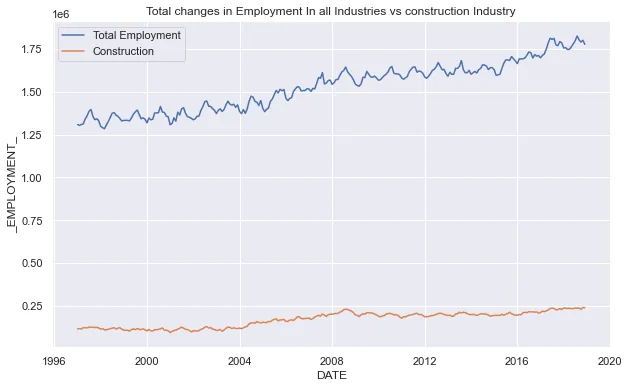
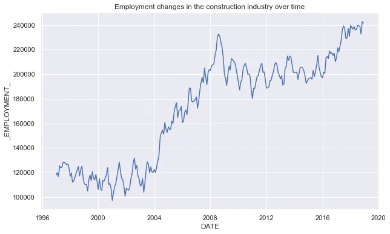
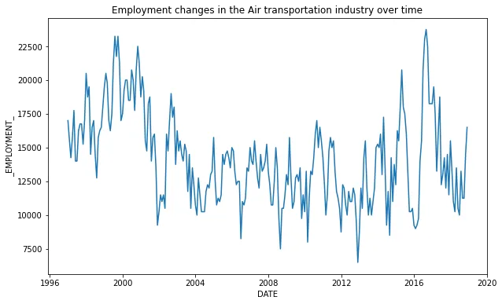
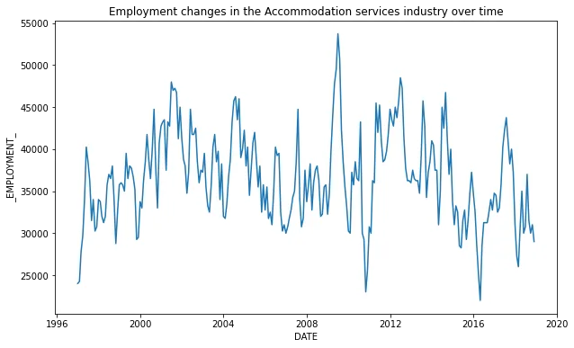
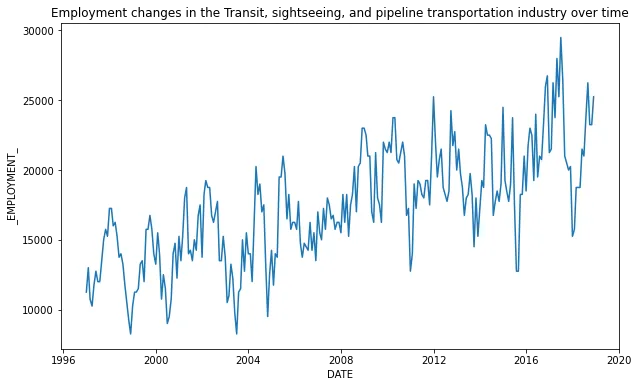
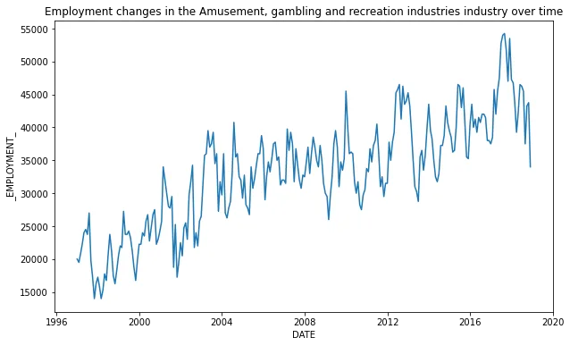
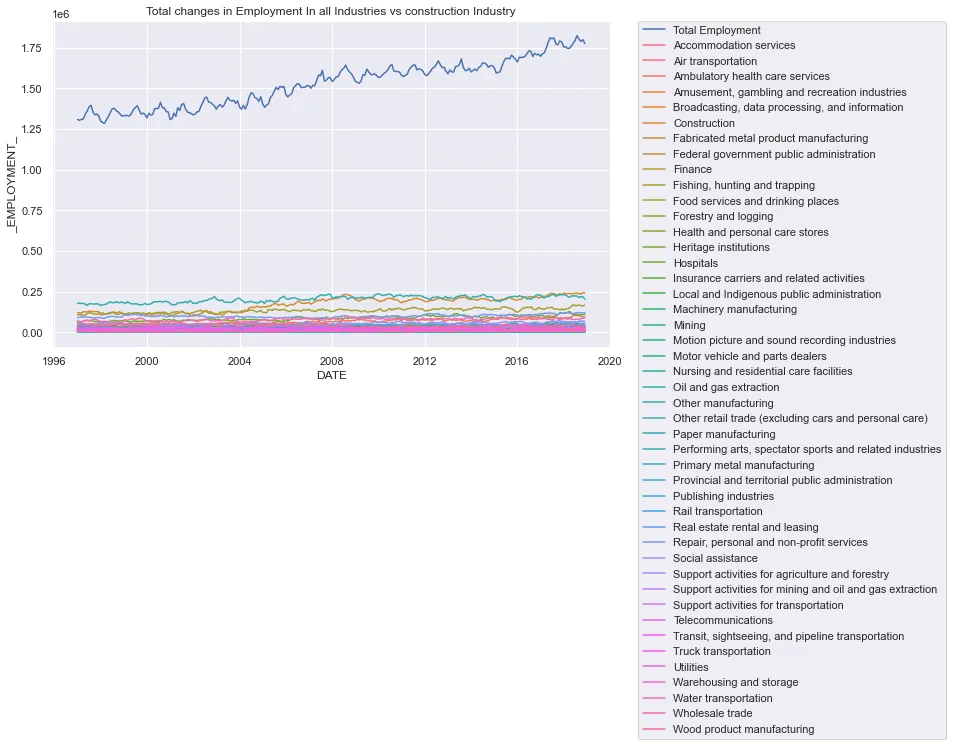

After progressing in several data science courses, I might have overestimated my abilities lol. Let's just say this project gave me some more perspective... Let's get right to it.

The task was to get the data from 17 different files neatly cleaned into one and then to answer some questions about employment in these country with visualizations.

**Background**

The North American Industry Classification System (NAICS) is an industry classification system developed by the statistical agencies of Canada, Mexico, and the United States. NAICS is designed to provide common definitions of the industrial structure of the three countries and a common statistical framework to facilitate the analysis of the three economies.

**DATA**

1. Raw data: 15 CSV files beginning with RTRA. These files contain employment data by industry at different levels of aggregation; 2-digit NAICS, 3-digit NAICS, and 4-digit NAICS. Columns mean as follows:

(i) SYEAR: Survey Year

(ii) SMTH: Survey Month

(iii) NAICS: Industry name and associated NAICS code in the bracket

(iv) _EMPLOYMENT_: Employment

2. LMO Detailed Industries by NAICS: An excel file for mapping the RTRA data to the desired data. The first column of this file has a list of 59 industries that are frequently used. The second column has their NAICS definitions. Using these NAICS definitions and RTRA data, you would create a monthly employment data series from 1997 to 2018 for these 59 industries.

3. Data Output Template: An excel file with an empty column for employment. You should fill the empty column with the data you prepared from your analysis.

**Guideline**

(i) The industry names in the ‘LMO Detailed Industries by NAICS’ match with the industry names in the ‘Data Output Template’. The RTRA data should be used based on the NAICS codes, not by industry names.

(ii) Try to create each series from the highest possible level of aggregation in the raw data files. For example, if an LMO Detailed Industry is defined with a 2-digit NAICS only, do not use a lower level of aggregation (i.e., 3-digit or 4-digit level NAICS files in the RTRA). Similarly, if an LMO Detailed Industry is defined with a 3-digit NAICS only, do not use the 4-digit NAICS files for that industry.

**The process:**

I imported the output and the LMO data

I then used a left join to combine both data on the LMO industry name so I can have the column for the NAICS included in the output file.

I first tried reading in the 15 files normally but I realized I was repeating myself a lot so I wrote a simple function that uses glob to get the urls and returns a clean data frame of each NAICS digit level. I did this for the 2-digit and 3-digit level but I read in the 4-digit level normally as it didn't contain the NAICS code column.

All data has been read in now and we are ready for analysis!

We have 5 data frames, NAICS_2, NAICS_3, NAICS_4, lmo and output

After this I combined all the raw data and created a date column from the year and month already there. Since the question specified that we analyze employment between 1997 and 2018, I also filtered of data for 2019.

After this was done, I noticed the NAICS column had some rows with several NAICS code... This gave me a lot of trouble (still haven't totally figured it out :), I'd like to know what you suggest in the comments ). What I did anyways;

I replaced the ampersand sign I saw in those rows with a comma and then I split them using the comma to get a list of the NAICS codes.

After this, I isolated the rows with multiple NAICS code and then I exploded them to multiple rows so I can compare all of them when trying to merge tables.

I updated my output table so it contains only rows with single NAICS codes then I appended the exploded complex data frame.

I performed some more cleaning on the NAICS column to remove the square brackets of the list and some quotation marks around it.

Now this part got a bit intuitive, I still haven't gotten the best solution but I'd share what I did though it cost some data. We were asked to combine the data to the output on NAICS codes and the lower level digit can belong to the higher level... but the higher levels can't be in lower level. i.e. a 2-digit NAICS code cannot match to a 3-digit NAICS code but it can happen the other way around. For instance, if the output has a NAICS code of 721 it should be able to map to a raw data of 72 but it shouldn't go the other way round,

What I did was to merge the two data on the date so I can compare the two NAICS column effectively. (for now I just matched on exact NAICS and hence lost some data)

After this, I used groupby so I only have one LMO industry value for each month a year. I also dropped columns that weren't needed.

The data I ended up with contained 11652 rows as opposed the output template of 15568. The few data missing was due to poor matching I suppose.

**Deriving Insight**

Now down to answering the important questions as we have gotten our output data.

**How has employment in the construction industry changed over time?**

To do this I simply made a line plot illustrating this change compared to the employment in all industries.

There has been an upward growth in the employments in all the industries over time. Though there are variabilities mostly due to industries with seasonal changes in employments, there has been a very clear in crease in employment among industries in the NAICS. There has also been increase in the construction industry in particular, but that the employment increase has not been as much has what was recorded over all

The employment in the construction industry has seen huge leaps over time, example in 2005, 2009. it has also seen its fair share of downsizing but in general there has been a clear increase over the years!

### How has the Air transportation industry changed over time?

In the air transportation industry we can see no clear increase in employment. If anything there has been a downsizing from 2001-2015 approximately, but this again may be a pattern as there was a surge in 2017 and a reduction followed closely after.

### How has the Accommodation services industry changed over time?

The accommodation services industry is a highly seasonal industry. People go on vacation at particular times and companies like airbnb and others in the industry will have to hire more hands to accomodate the increase in demand. This variability can be seen clearly in the employment trend over time.

### How has the Transit, sightseeing, and pipeline transportation industry changed over time?

There is a clear increase in the employments in this group of industries and the variabilities seen would be due to the need to accumulate changes in demand.

### How has the Amusement, gambling and recreation industries changed over time?

People are clearly been having more fun every year compared to the previous because more people or clearly being employed in the industry.

### Which industry employed the most as at 2018?

The Construction industry had the most employees as of 2018

**Summary**

