COVID-19 outbreak was first time experienced in the Wuhan City of China at the end of December 2019. Which spread rapidly in China and then worldwide in 209 countries of America, Europe, Australia and Asia. There are more than two hundred and fifty thousand plus deaths and 3.7 million plus people have been affected worldwide, while figure keeps on increasing on daily basis rapidly. Different steps have been taken worldwide for the control of COVID-19.

In this article we will draw insight about this virus and its trend. We are trying to answer a few questions.

**1. Corona Virus's Spread Across Globe Over Time.**

**2. Top 10 Countries With**

**a. Highest Number of Confirmed Cases and Fraction they cover for the Global Confirmed Cases.**

**b. Highest Number of Deaths Reported** **and Fraction they cover for the Global Deaths Reported.**

**c. Highest Number Of Pending Cases** **and Fraction they cover for the Global Active Cases.**

**d. Highest Number Of Recovered Cases** **and Fraction they cover for the Global Recovered Cases.**

**e. Highest Recovery Rate For Closed Cases.**

**f. Highest Death Rate For Closed Cases.**

**3. Global Average of Confirmed Cases & Number of Countries Above Global Average.**

**4. Global Average of Active Cases & Number of Countries Above Global Average.**

**5. Global Average of Death & Number of Countries Above Global Average.**

**6. Global Recovery Rate For Closed Cases & Number of Countries Above Global Rate.**

**7. Global Death Rate For Closed Cases & Number of Countries Above Global Rate.**

To answer these questions we will perform analysis on the following [Kaggle Dataset](https://github.com/CSSEGISandData/COVID-19/tree/master/csse_covid_19_data/csse_covid_19_time_series). This dataset is updated on daily basis since 22nd January 2020 till date 7th May 2020.

Importing Datasets From github

```python
df_confirmed = pd.read_csv('https://raw.githubusercontent.com/CSSEGISandData/COVID-19/master/csse_covid_19_data/csse_covid_19_time_series/time_series_covid19_confirmed_global.csv')
df_confirmed = df_confirmed.drop(['Lat', 'Long'],axis=1)
df_confirmed.head(3)

df_covid19 = pd.read_csv("https://raw.githubusercontent.com/CSSEGISandData/COVID-19/web-data/data/cases_country.csv")
df_covid19.head(3)
```

Cleaning Data

```python
df_covid19 = df_covid19.drop(["People_Tested","People_Hospitalized","UID","ISO3","Mortality_Rate", "Lat", "Long_"],axis =1)
df_covid19['Country_Region'].replace(['United Kingdom'], ['UK'], inplace=True)
```

**1. Corona Virus Spread Across Globe Over Time**

```python
case_nums_country = df_confirmed.groupby("Country/Region").sum().apply(lambda x: x[x > 0].count(), axis =0)
d = [datetime.strptime(date,'%m/%d/%y').strftime("%d %b") for date in case_nums_country.index]
plt.figure(figsize=(15, 8))
plt.plot(d, case_nums_country, color='crimson', linestyle='-', marker='o', markersize=6, markerfacecolor='#ffffff')

plt.xlabel("Dates")
plt.ylabel("Number of Countries/Regions")
plt.xticks(list(np.arange(0,len(d),int(len(d)/5))),d[:-1:int(len(d)/5)]+[d[-1]])

plt.savefig('Growth.png', dpi=500)
plt.show()
```

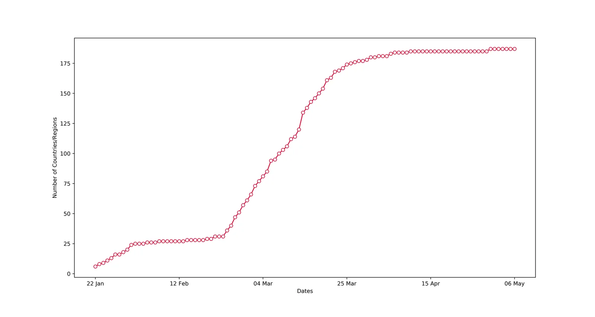

**2.Top 10 Countries With**

**a. Highest Number of Confirmed Cases and** **Fraction they cover for the Global Confirmed Cases**

```python
df_covid19.sort_values(by='Confirmed', ascending=False, inplace=True)
top_10_cases = df_covid19.head(10)
plt.figure(figsize=(10, 5))
plt.bar('Country_Region', 'Confirmed', data=top_10_cases, color='darkcyan')

plt.ylabel('Confirmed Cases')
plt.title("Top 10 Countries (Confirmed Cases)")

plt.xticks(rotation=30)
plt.savefig('Confirmed.png', dpi=500)
plt.show()
```

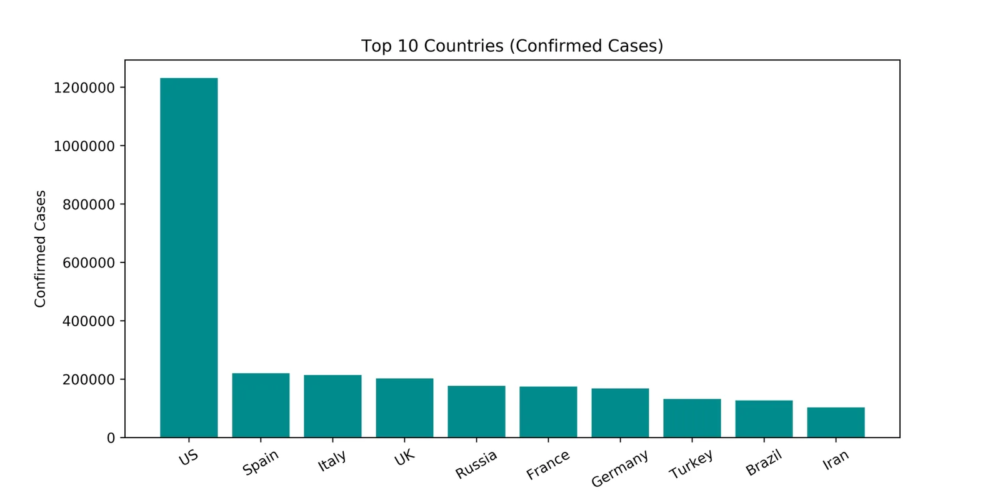

**Fraction Covered**

```python
df_covid19['Fraction_Confirmed'] = round((df_covid19['Confirmed']/df_covid19['Confirmed'].sum())*100, 2)
df_covid19.sort_values(by='Fraction_Confirmed', ascending=False, inplace=True)
fraction_confirmed = df_covid19.head(10)

plt.figure(figsize=(10, 10))
plt.pie(fraction_confirmed['Fraction_Confirmed'], labels=fraction_confirmed['Fraction_Confirmed'])
plt.legend(fraction_confirmed['Country_Region'], loc='center')
plt.savefig('Fraction_Confirmed.png', dpi=500)
plt.show()
```

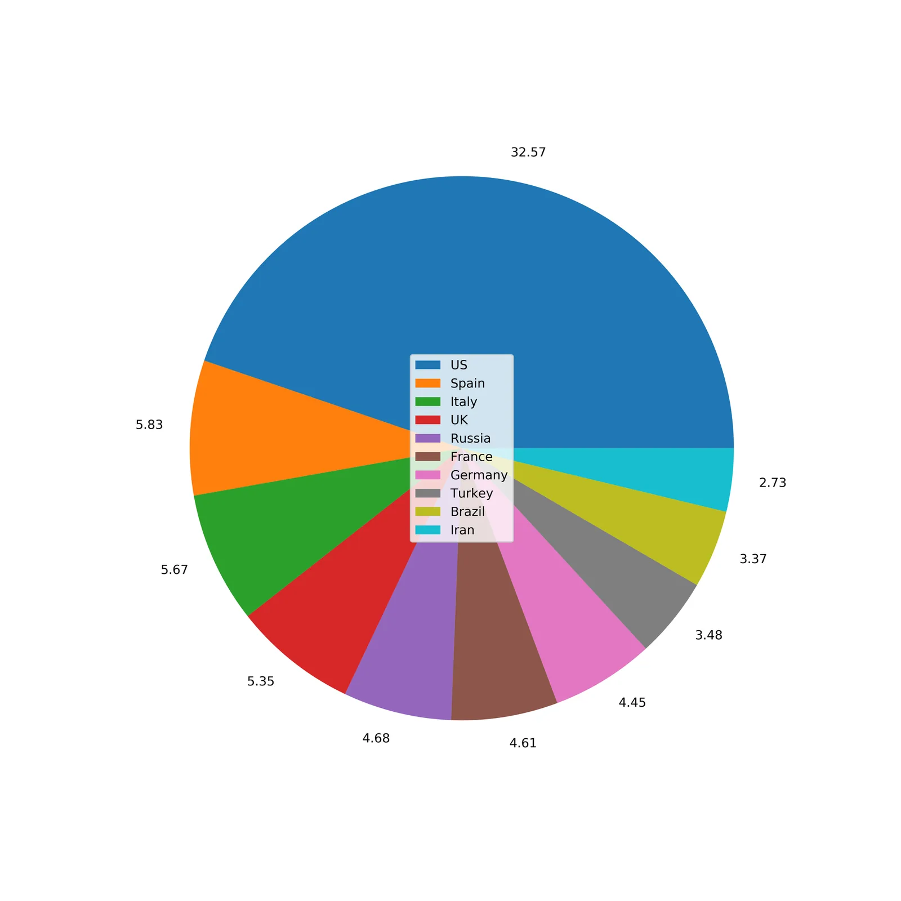

**b.** **Highest Number of Deaths Reported and Fraction they cover for the Global Deaths Reported**

```python
df_covid19.sort_values(by='Deaths', ascending=False, inplace=True)
top_10_deaths = df_covid19.head(10)

plt.figure(figsize=(10, 5))
plt.bar('Country_Region', 'Deaths', data=top_10_deaths, color='crimson')

plt.ylabel('Deaths')
plt.title("Top 10 Countries (Death Cases)")

plt.xticks(rotation=30)
plt.savefig('Deaths.png', dpi=500)
plt.show()
```

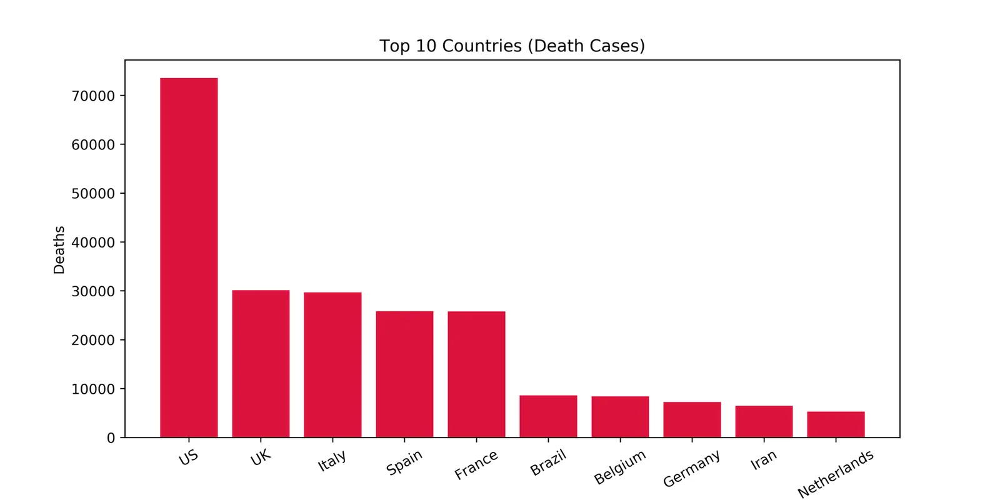

**Fraction Covered**

```python
df_covid19['Fraction_Deaths'] = round((df_covid19['Deaths']/df_covid19['Deaths'].sum())*100, 2)
df_covid19.sort_values(by='Fraction_Deaths', ascending=False, inplace=True)
fraction_deaths = df_covid19.head(10)

plt.figure(figsize=(10, 10))
plt.pie(fraction_deaths['Fraction_Deaths'], labels=fraction_deaths['Fraction_Deaths'])
plt.legend(fraction_deaths['Country_Region'], loc='center')
plt.savefig('Fraction_Deaths.png', dpi=500)
plt.show()
```

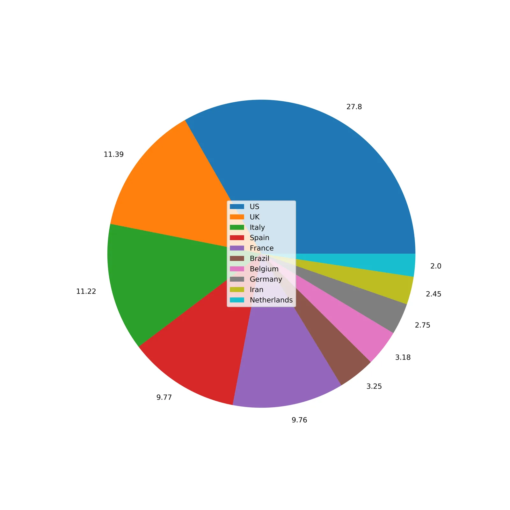

**c. Highest Number Of Pending Cases and Fraction they cover for the Global Active Cases**

```python
df_covid19.sort_values(by='Active', ascending=False, inplace=True)
top_10_active = df_covid19.head(10)

plt.figure(figsize=(10, 5))
plt.bar('Country_Region', 'Active', data=top_10_active, color='darkorange')

plt.ylabel('Active')
plt.title("Top 10 Countries (Active Cases)")

plt.xticks(rotation=30)
plt.savefig('Active.png', dpi=500)
plt.show()
```

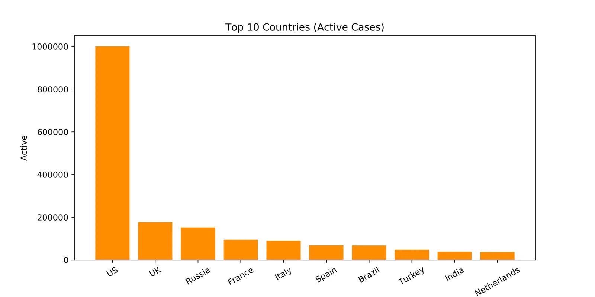

**Fraction Covered**

```python
df_covid19['Fraction_Active'] = round((df_covid19['Active']/df_covid19['Active'].sum())*100, 2)
df_covid19.sort_values(by='Fraction_Active', ascending=False, inplace=True)
fraction_active = df_covid19.head(10)

plt.figure(figsize=(10, 10))
plt.pie(fraction_active['Fraction_Active'], labels=fraction_active['Fraction_Active'])
plt.legend(fraction_active['Country_Region'], loc='center')
plt.savefig('Fraction_Active.png', dpi=500)
plt.show()
```

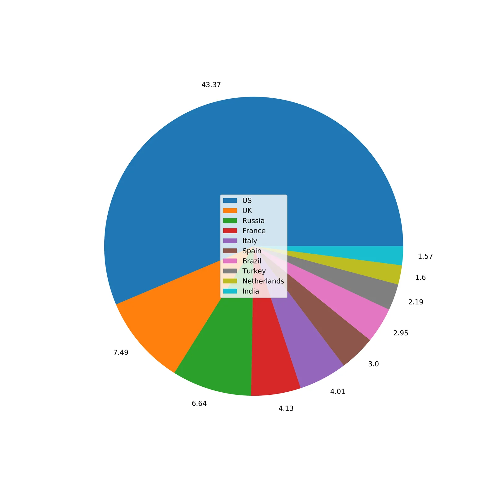

**d. Highest Number Of Recovered Cases** **and Fraction they cover for the Global Recovered Cases**

```python
df_covid19.sort_values(by='Recovered', ascending=False, inplace=True)
top_10_recovered = df_covid19.head(10)

plt.figure(figsize=(10, 5))
plt.bar('Country_Region', 'Recovered', data=top_10_recovered, color='limegreen')

plt.ylabel('Recovered')
plt.title("Top 10 Countries (Recovered Cases)")

plt.xticks(rotation=30)
plt.savefig('Recovered.png', dpi=500)
plt.show()
```

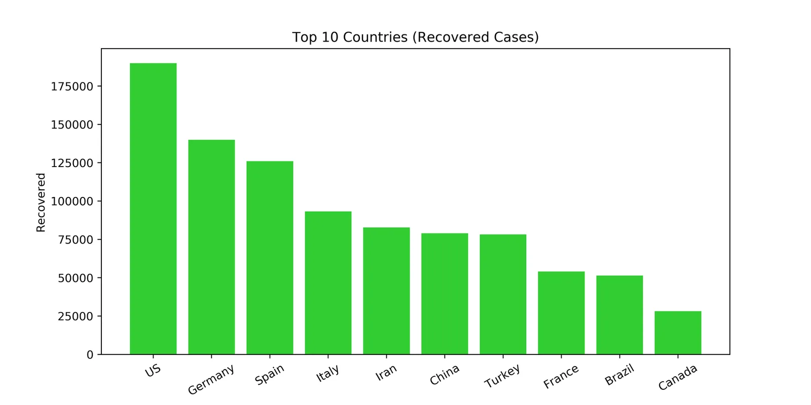

**Fraction Covered**

```python
df_covid19['Fraction_Recovered'] = round((df_covid19['Recovered']/df_covid19['Recovered'].sum())*100, 2)
df_covid19.sort_values(by='Fraction_Recovered', ascending=False, inplace=True)
fraction_recovered = df_covid19.head(10)

plt.figure(figsize=(10, 10))
plt.pie(fraction_recovered['Fraction_Recovered'], labels=fraction_recovered['Fraction_Recovered'])
plt.legend(fraction_recovered['Country_Region'], loc='center')
plt.savefig('Fraction_Recovered.png', dpi=500)
plt.show()
```

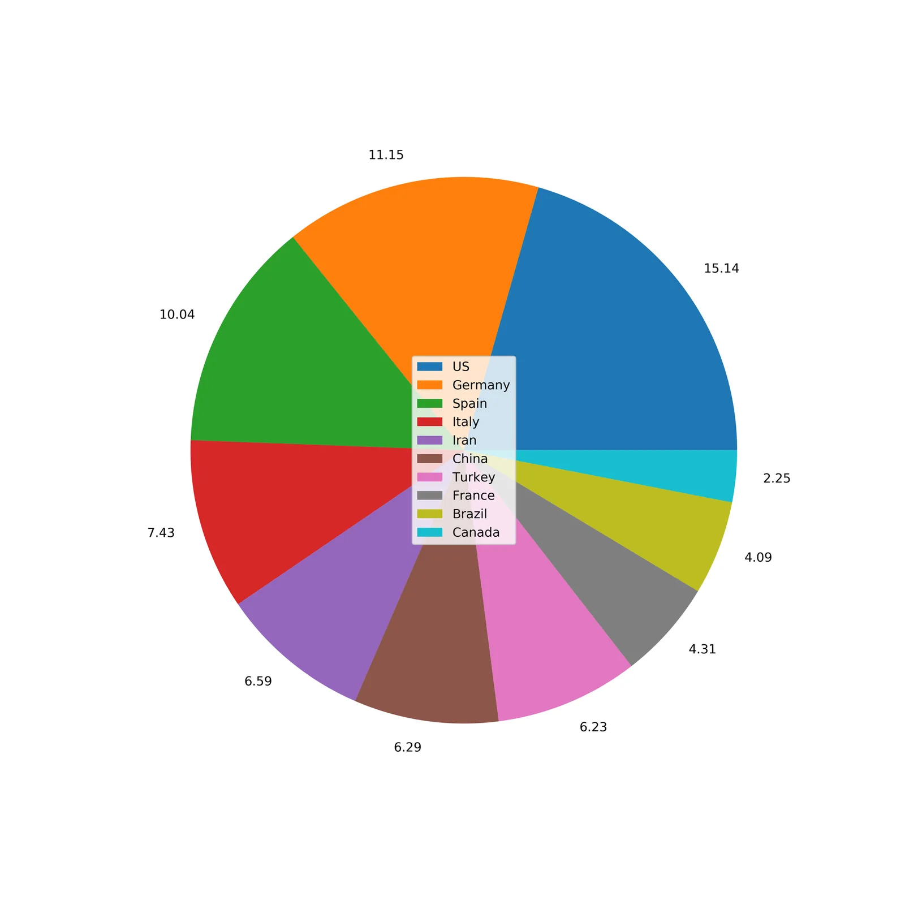

**e. Highest Recovery Rate For Closed Cases**

```python
top_10_recovered['Percentage Recovered'] = top_10_recovered['Recovered']/(top_10_recovered['Confirmed'] - top_10_recovered['Active']) * 100

top_10_recovered.sort_values(by='Percentage Recovered', ascending=False, inplace=True)

plt.figure(figsize=(10, 5))
plt.plot('Country_Region', 'Percentage Recovered', data=top_10_recovered, color='limegreen', marker='o')

plt.ylabel('Percentage Recovered')
plt.title("Top 10 Countries (% Recovered Out of Closed Cases)")

plt.xticks(rotation=30)
plt.savefig('Recovery_Rate.png', dpi=500)
plt.show()
```

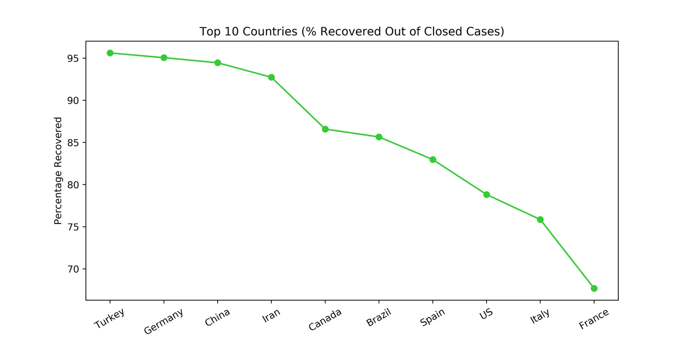

**f. Highest Death Rate For Closed Cases**

```python
top_10_deaths['Percentage Deaths'] = top_10_deaths['Deaths']/(top_10_deaths['Confirmed'] - top_10_deaths['Active']) * 100

top_10_deaths.sort_values(by='Percentage Deaths', ascending=False, inplace=True)

plt.figure(figsize=(10, 5))
plt.plot('Country_Region', 'Percentage Deaths', data=top_10_deaths, color='crimson', marker='o')

plt.ylabel('Percentage Deaths')
plt.title("Top 10 Countries (% Deaths Out of Closed Cases)")

plt.xticks(rotation=30)
plt.savefig('Death_Rate.png', dpi=500)
plt.show()
```

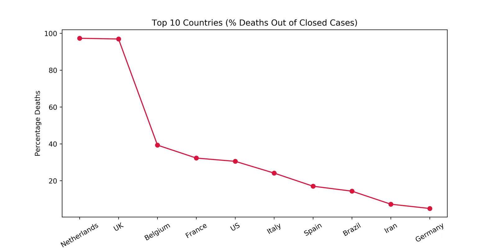

**3. Global Average of Confirmed Cases & Number of Countries Above Global Average**

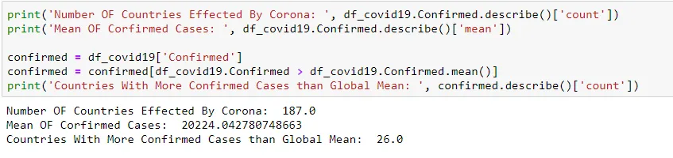

**4. Global Average of Active Cases & Number of Countries Above Global Average**

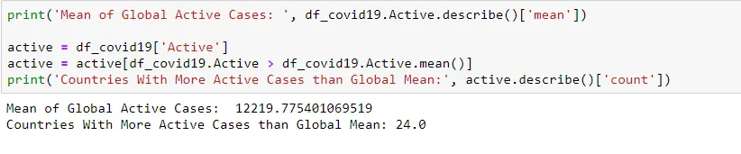

**5. Global Average of Death & Number of Countries Above Global Average**

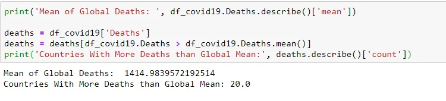

**6. Global Recovery Rate For Closed Cases & Number of Countries Above Global Rate**

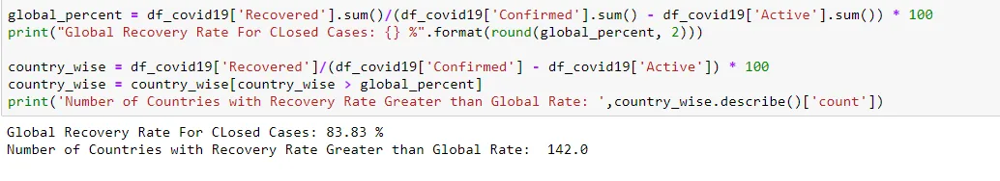

**7. Global Death Rate For Closed Cases & Number of Countries Above Global Rate**

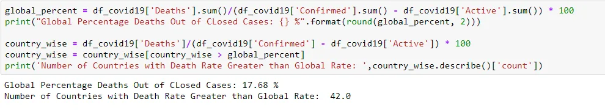

**STAY HOME, STAY SAFE**
