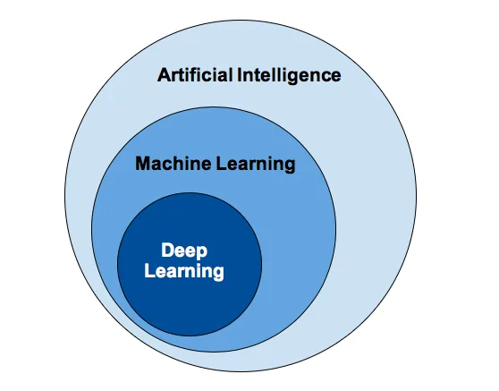

**Definition**: Machine Learning is a field of computer science that involves using statistical methods to create programs that either improve performance over time or detect patterns in massive amount of data that humans would be unlikely to find **~Arthur Samuel.**

There are several definitions that are exit for Machine Learning. One more definition for Machine Learning.

> "**Machine Learning is a collection of algorithms and techniques used to create computational systems that learn from data in order to make prediction and inferences."**

Looking at the past years,the world data is expected to double every two years with the cost of data storage. In order to extract the information from this exponentially increasing data, the need for better Machine learning techniques is at an all-time high.

Now-a-days Mostly industry and company is using Artificial Intelligence and Machine Learning in way or another. In case any company wanting to gauge the reach of their business and products,using Machine Learning techniques is the only scalable approach in the long term. The major use cases of Machine learning lies in analyzing BigData, predicting Models and Deep Insights

Machine Learning is perhaps one of the sexiest fields in the world right now,not just in silicon Valley. Machine Learning application are probably everywhere around Us i.e.,Amazon Echo and Google Home,Ads shown in Facebook,Video recommendations on Netflix and YouTube and also product recommendations on e-commerce platforms such as Flipkart and Amazon.

It is not surprising that demand for Data Science and Machine Learning engineers is more than ever before. In this field you to keep yourself up to date on the research and development.

Make sure it will create a new set of hot jobs in the next 6 Years.

- 
