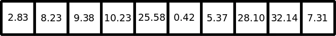
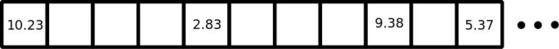

A **set** is an unordered collection of unique elements. It can store heterogeneous data and it is mutable. You can think of them like dictionaries, but keys only, no values. But what does it mean to be unordered? The simplest explanation is simply to look at an example. A set can be created in two ways: we can create a set via the set function or enclosing our data with curly brackets {}:

```python
>>> example_set = {'Dylan', 26, 167.6, True}
>>> print(example_set)
{True, 26, 'Dylan', 167.6}
```

Even though we entered the data in one order, the set printed out in a different order. Even more significantly, we cannot index or slice a set. However, we can still add and delete items from a set.

```python
>>> print(example_set)
{True, 26, 'Dylan', 167.6}
>>> print(example_set.pop())
True
>>> print(example_set)
{26, 'Dylan', 167.6}
```

```python
>>> example_set.add('True')
>>> print(example_set)
{167.6, 'True', 'Dylan', 26}
>>> example_set.update([58.1, 'brown'])
>>> print(example_set)
{58.1, 167.6, 'True', 'brown', 'Dylan', 26}
```

The add method of a set works similarly to the append method of a list. The update method of a set works similarly to the extend method of a list.

***Why is set useful?***
It seems strange that we might want an *unordered* data structure. We can't access or modify the data through indexing. How does giving up order benefit us? The answer is that it gives us flexibility about how the data is stored in memory, and that flexibility can make data retrieval much faster.

Imagine we have ten boxes and ten piles of money. We put the ten piles of money in the ten boxes. Now say we want to find the box that has $5.37 in it. We don't know which box this is, so we start with the first box and check. If it isn't in the first box, we move on to the second box. We keep checking boxes until we find it. This might take awhile.



Now imagine we have the same ten piles of money, but we have 31 boxes. Instead of putting each pile of money into the boxes in order, instead put each pile into a box based on the amount of money in the pile. First we multiply the amount of money by 100, and then take modulus division by 31. This gives the number of the box we should put the pile of money in.

```python
>>> def hash_function(x):
...     return int(x*100 % 31)
>>> piles = [2.83, 8.23, 9.38, 10.23, 25.58, 0.42, 5.37, 28.10, 32.14, 7.31]
>>> [hash_function(pile) for pile in piles]
[4, 17, 8, 0, 16, 11, 10, 20, 21, 18]
```

Now say we want to find the box with $5.37 in it. We don't have to search through box after box. We can compute:

```python
>>> print(int(5.37 * 100 % 31))
10
```



###### Box number 10 contains the $5.37 pile.

This technique of assigning boxes (i.e. memory) based on the object it contains is called **hashing**. It makes searching for data very fast (as we've illustrated), but at the cost of increase memory allocation (we needed more boxes). It also means that we cannot assign an order to the objects as they are stored in memory.

Hashing also puts two major restrictions on the set. First of all, objects in a set must be immutable. If an object were to change, its position in memory would no longer correspond with its **hash**. Secondly, the objects in a set must be unique. Identical objects end up with the same hash. Since we can't store multiple objects in the same chunk of memory, we simply discard any duplicates.

This second restriction means we can use a set to easily determine the unique objects in a list or tuple.

```python
>>> print(set([23, 609, 348, 10, 5, 23, 340, 82]))
{609, 5, 10, 82, 340, 23, 348}
>>> print(set(('a', 'b', 'q', 'c', 'c', 'd', 'r', 'a')))
{'r', 'q', 'b', 'd', 'c', 'a'}
```

Because searching for data is very simple in a set, they are also very useful for making comparisons between collections of data.

```python
>>> student_a_courses = {'history', 'english', 'biology', 'theater'}
>>> student_b_courses = {'biology', 'english', 'mathematics', 'computer science'}

>>> print(student_a_courses.intersection(student_b_courses))
{'english', 'biology'}
>>> print(student_a_courses.union(student_b_courses))
{'biology', 'theater', 'english', 'computer science', 'history', 'mathematics'}
>>> print(student_a_courses.difference(student_b_courses))
{'theater', 'history'}
>>> print(student_b_courses.difference(student_a_courses))
{'mathematics', 'computer science'}
>>> print(student_a_courses.symmetric_difference(student_b_courses))
{'theater', 'computer science', 'history', 'mathematics'}
```
