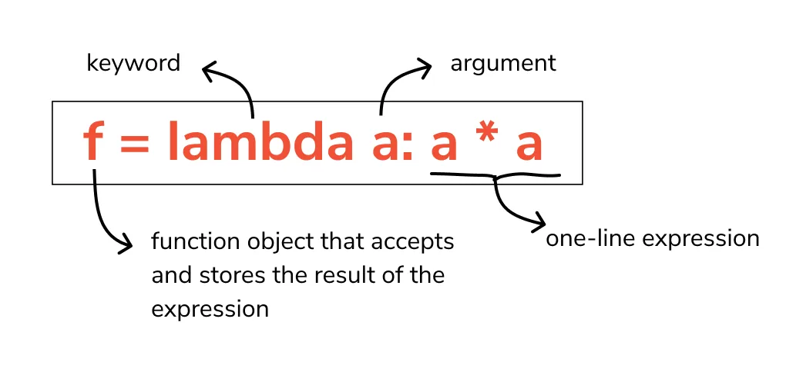

**What are Lambda Functions?**

In Python, we use the lambda keyword to declare an anonymous function, which is why we refer to them as "lambda functions". An anonymous function refers to a function declared with no name. Although syntactically they look different, lambda functions behave in the same way as regular functions that are declared using the def keyword. The following are the characteristics of Python lambda functions:

- A lambda function can take any number of arguments, but they contain only a single expression. An expression is a piece of code executed by the lambda function, which may or may not return any value.
- Lambda functions can be used to return function objects.
- Syntactically, lambda functions are restricted to only a single expression.

In this article, we will discuss Python's lambda functions in detail, as well as show examples of how to use them.

**Creating a Lambda Function**

We use the following syntax to declare a lambda function:

```python
lambda argument(s): expression
```

As stated above, we can have any number of arguments but only a single expression. The lambda operator cannot have any statements and it returns a function object that we can assign to any variable.



Example

```python
remainder = lambda num: num % 2
print(remainder(5))
```

Output

```python
1
```

In this code the lambda num: num % 2 is the lambda function. The num is the argument while num % 2 is the expression that is evaluated and the result of the expression is returned. The expression gets the modulus of the input parameter by 2. Providing 5 as the parameter, which is divided by 2, we get a remainder of 1.

You should notice that the lambda function in the above script has not been assigned any name. It simply returns a function object which is assigned to the identifier remainder. However, despite being anonymous, it was possible for us to call it in the same way that we call it a normal function. The statement:

```python
lambda num: num % 2
```

Is similar to the following:

```python
def remainder(num):return num % 2
```

Here is another example of a lambda function:

```python
product = lambda x, y : x * y
print(product(2, 3))
```

Output

```python
6
```

The lambda function defined above returns the product of the values of the two arguments.

Lambda functions can take any number of arguments:

Example

Multiply argument a with argument b and return the result:

```python
x = lambda a, b : a * b
print(x(5, 6))
```

Example

Summarize arguments a, b, and c and return the result:

```python
x = lambda a, b, c : a + b + c
print(x(5, 6, 2))
```

**Why Use Lambda Functions?**

Lambda functions are used when you need a function for a short period of time. This is commonly used when you want to pass a function as an argument to higher-order functions, that is, functions that take other functions as their arguments. The power of lambda is better shown when you use them as an anonymous function inside another function.

Say you have a function definition that takes one argument, and that argument will be multiplied with an unknown number:

```python
def testfunc(num):return lambda x : x * num
```

In the above example, we have a function that takes one argument, and the argument is to be multiplied by a number that is unknown. Let us demonstrate how to use the above function:

```python
def testfunc(num):return lambda x : x * num
result1 = testfunc(10)
print(result1(9))
```

Output

```python
90
```

**The filter() Function**

The Python's filter() function takes a lambda function together with a list as the arguments. It has the following syntax:

```python
filter(object, iterable)
```

The object here should be a lambda function that returns a boolean value. The object will be called for every item in the iterable to do the evaluation. The result is either a True or a False for every item. Note that the function can only take one iterable as the input.

A lambda function, along with the list to be evaluated, is passed to the filter() function. The filter() function returns a list of those elements that return True when evaluated by the lambda function. Consider the example given below:

```python
numbers_list = [2, 6, 8, 10, 11, 4, 12, 7, 13, 17, 0, 3, 21]
filtered_list = list(filter(lambda num: (num > 7), numbers_list))
print(filtered_list)
```

Output

```python
[8, 10, 11, 12, 13, 17, 21]
```

In the above example, we have created a list named numbers_list with a list of integers. We have created a lambda function to check for the integers that are greater than 7. This lambda function has been passed to the filter() function as the argument and the results from this filtering have been saved into a new list named filtered_list.

**The map() Function**

The map() function is another built-in function that takes a function object and a list. The syntax of the map function is as follows:

```python
map(object, iterable_1, iterable_2, ...)
```

The iterable to the map() function can be a dictionary, a list, etc. The map() function basically maps every item in the input iterable to the corresponding item in the output iterable, according to the logic defined by the lambda function. Consider the following example:

```python
numbers_list = [2, 6, 8, 10, 11, 4, 12, 7, 13, 17, 0, 3, 21]
mapped_list = list(map(lambda num: num % 2, numbers_list))
print(mapped_list)
```

Output

```python
[0, 0, 0, 0, 1, 0, 0, 1, 1, 1, 0, 1, 1]
```

In the script above, we have a list numbers_list, which consists of random numbers. We then call the map() function and pass it a lambda function as the argument. The lambda function calculates the remainder after dividing each number by 2. The result of the mapping is stored in a list named mapped_list. Finally, we print out the contents of the list.

**Conclusion**

In Python, a lambda function is a single-line function declared with no name, which can have any number of arguments, but it can only have one expression. Such a function is capable of behaving similarly to a regular function declared using the Python's def keyword. Often times a lambda function is passed as an argument to another function.
