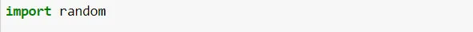
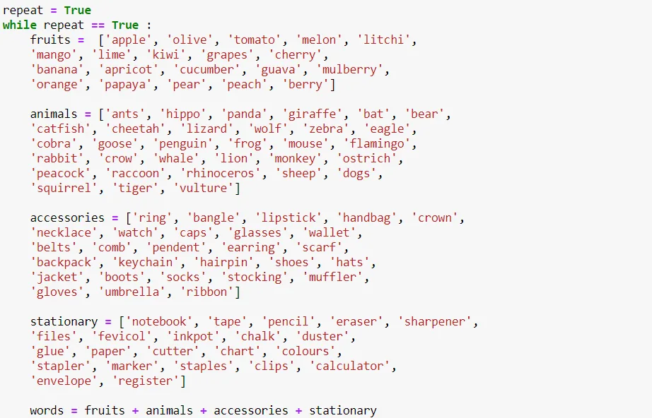
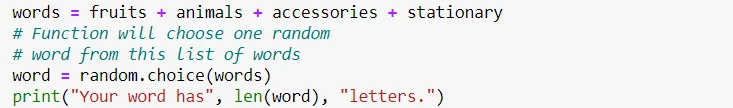
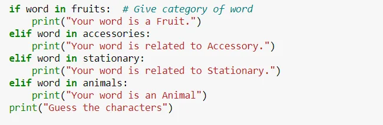
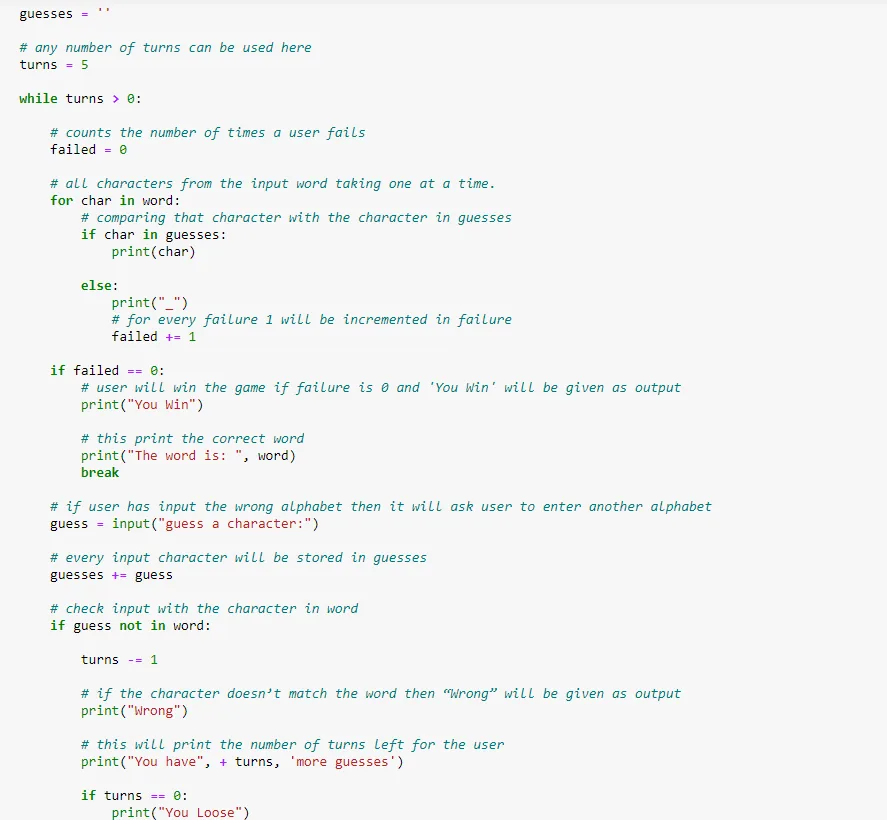
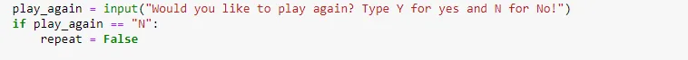
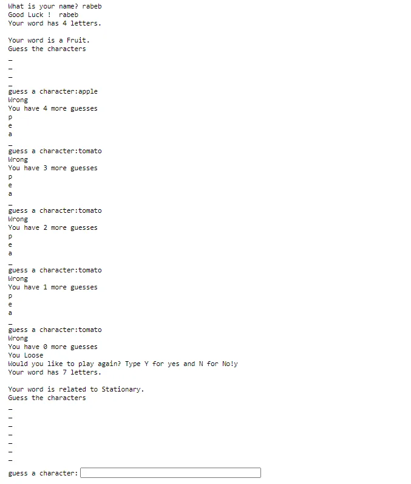

In this Post, we will learn how to create a simple word **guessing game using python**

**Rules of the Game**

The guessing team must try and guess the word the clue-giver is trying to explain. Any number of guesses are allowed. The turn ends when the guessing team correctly guesses the word or when the timer runs out.

**Let's Start Coding**

Step1 : Import the random module



Step2 : Define list of words in the Game



Here we use while loop to repeat the game and it is a choice taken by the player at the end of the game.

Step3: Choose one random word from list of words using Random



Step 4 : Specify the category of word chosed to facilate the game



Step 5 : After that, the guessing process begins as shown below

the player can play 5 times



Step 6 : Give choice to repeat the Game if the player lost



Test

This is a simple test where I lost to guess the word



**There is the complete Code below**

```python
import random

# library that we use in order to choose
# on random words from a list of words

name = input("What is your name? ")
# Here the user is asked to enter the name first

print("Good Luck ! ", name)

repeat = True
while repeat == True :
    fruits =  ['apple', 'olive', 'tomato', 'melon', 'litchi',
    'mango', 'lime', 'kiwi', 'grapes', 'cherry',
    'banana', 'apricot', 'cucumber', 'guava', 'mulberry',
    'orange', 'papaya', 'pear', 'peach', 'berry']

    animals = ['ants', 'hippo', 'panda', 'giraffe', 'bat', 'bear',
    'catfish', 'cheetah', 'lizard', 'wolf', 'zebra', 'eagle',
    'cobra', 'goose', 'penguin', 'frog', 'mouse', 'flamingo',
    'rabbit', 'crow', 'whale', 'lion', 'monkey', 'ostrich',
    'peacock', 'raccoon', 'rhinoceros', 'sheep', 'dogs',
    'squirrel', 'tiger', 'vulture']

    accessories = ['ring', 'bangle', 'lipstick', 'handbag', 'crown',
    'necklace', 'watch', 'caps', 'glasses', 'wallet',
    'belts', 'comb', 'pendent', 'earring', 'scarf',
    'backpack', 'keychain', 'hairpin', 'shoes', 'hats',
    'jacket', 'boots', 'socks', 'stocking', 'muffler',
    'gloves', 'umbrella', 'ribbon']

    stationary = ['notebook', 'tape', 'pencil', 'eraser', 'sharpener',
    'files', 'fevicol', 'inkpot', 'chalk', 'duster',
    'glue', 'paper', 'cutter', 'chart', 'colours',
    'stapler', 'marker', 'staples', 'clips', 'calculator',
    'envelope', 'register']

    words = fruits + animals + accessories + stationary
    # Function will choose one random word from this list of words
    word = random.choice(words)
    print("Your word has", len(word), "letters.")
    # Game would randomly choose words

    print()

    if word in fruits:  # Give category of word
        print("Your word is a Fruit.")
    elif word in accessories:
        print("Your word is related to Accessory.")
    elif word in stationary:
        print("Your word is related to Stationary.")
    elif word in animals:
        print("Your word is an Animal")
    print("Guess the characters")

    guesses = ''

    # any number of turns can be used here
    turns = 5

    while turns > 0:

        # counts the number of times a user fails
        failed = 0

        # all characters from the input word taking one at a time.
        for char in word:

            # comparing that character with the character in guesses
            if char in guesses:
                print(char)

            else:
                print("_")

                # for every failure 1 will be incremented in failure
                failed += 1

        if failed == 0:
            # user will win the game if failure is 0 and 'You Win' will be given as output
            print("You Win")

            # this print the correct word
            print("The word is: ", word)
            break

        # if user has input the wrong alphabet then it will ask user to enter another alphabet
        guess = input("guess a character:")

        # every input character will be stored in guesses
        guesses += guess

        # check input with the character in word
        if guess not in word:

            turns -= 1

            # if the character doesn’t match the word then “Wrong” will be given as output
            print("Wrong")

            # this will print the number of turns left for the user
            print("You have", + turns, 'more guesses')

            if turns == 0:
                print("You Loose")
                play_again = input("Would you like to play again? Type Y for yes and N for No!")
                if play_again == "N":
                    repeat = False
```

Thank you for reading!

You can find the complete source code here [Github](https://github.com/rabebbenothmen/Data-Insight2021/blob/main/Assignments/2-%20Word%20Guessing%20Game.ipynb)
