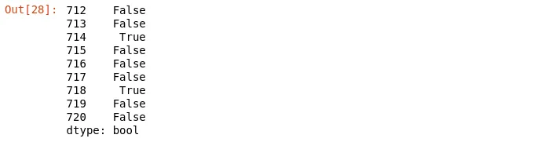
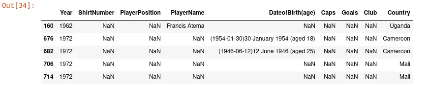
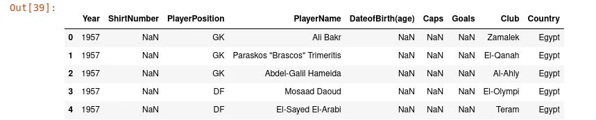
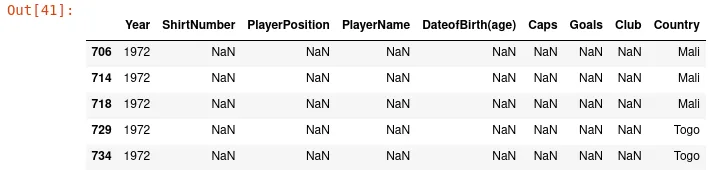

Real-world data are generally noisy and messy. In this case, we must process some cleaning operation on it before doing an analysis. Pandas give us a few methods to detect duplicated entries and remove them during the analysis process.

In article, we'll work with [Africa Cup of Nations](https://www.kaggle.com/mohammedessam97/africa-cup-of-nations) dataset upload on Kaggle by [Mohammad Essam](https://www.kaggle.com/mohammedessam97). This dataset is composed of three CSV files and we are going to import one of them and work with.

```python
import pandas as pd
df_players = pd.read_csv('Africa Cup of Nations Players.csv')
```

Throughout this article, we'll talk about **DataFrame.duplicated()** and **DataFrame.drop_duplicates().**

### 1. DataFrame.duplicated()

DataFrame.duplicated() is a pandas method that checks all the DataFrame and returns a boolean Series to express duplicate rows. With the aid of this method, we can count the number of duplicate and non-duplicate rows, filter datasets, and so on.

The general signature of df.duplicated() is:

```python
DataFrame.duplicated(subset=None, keep='first')
```

*where:*

- ***subset*** *can take a list of columns to use for duplicate rows identification*
- ***keep***  *indicate the position of occurrence to keep and which will not be marked as duplicate. The set of values that it can have is* ***first, last, and False.***

```python
df_players.duplicated()[712:721]
```



As shown in the above image, non-duplicate rows have the boolean **False** and duplicate ones have **True**.

We can find duplicate rows in our data base on **Year** and **PlayerName** columns.

```python
result = df_players.duplicated(subset=['Year','PlayerName'])
df_players[result].head()
```



You can specify any number of columns you want. By default, this method finds duplicate rows over all columns. In the previous example, we use the result of **df.duplicate()** which is boolean Series to filter the DataFrame and only get duplicated rows. Moreover, we can invert that result, and only get the non-duplicated rows always based on **Year** and **PlayerName** as follow:

```python
result = df_players.duplicated(subset=['Year','PlayerName'])
df_players[~result].head()
```



We use the **~** sign the invert the result of **df.duplicated().** To rephrase it, we transform boolean Series return by **df.duplicated()** changing **True** values to **False** and **False** to **True**. That's the role of ~ sign.

The parameter **keep** of **df.duplicated()** works in three manners.

- If we set it to **first** when the method searches duplicate rows, the first occurrence in the set of same duplicate rows is not marked as duplicated. It's the default behavior of this method.
- **last**  do the inverse of the **first**
- Set **keep** to **False** mark all occurrence of rows that is at least two as duplicated without conserving one of them.

```python
df_players[df_players.duplicated(keep=False)].head()
```



In this section, we try to give an overview of [**DataFrame.duplicated()**](https://pandas.pydata.org/docs/reference/api/pandas.DataFrame.duplicated.html) method. In the next section, we'll take about **DataFrame.drop_duplicates()**

### 2. DataFrame.drop_duplicates()

Now, we know how to detect duplicated rows in our data, and based on that, we can filter our dataset to have more accurate data. Besides df.duplicated(), pandas offer one method to directly remove duplicate rows without an extra step. This method under the wood firstly finds duplicate rows as we show with df.duplicates() before deleting this selection. His signature is:

```python
DataFrame.drop_duplicates(subset=None, keep='first', inplace=False, ignore_index=False)
```

where:

- **subset** is a list of columns to use to determine duplicate rows. By default, this method search duplicate rows with all columns.
- **keep** work as the same as in df.duplicated(). This parameter determines the occurrence of duplicate rows to keep in the set of same duplicate rows.
- **inplace**  indicate if we'll work directly in the same instance of dataframe or we'll create a copy to work with it and return the result dataframe.

```python
display('Before drop duplicates===>',df_players.shape)
display('After drop duplicates===>',df_players.drop_duplicates().shape)
```

```python
Output:
'Before drop duplicates===>'
(7534, 9)
'After drop duplicates===>'
(7514, 9)
```

If we compare the number of rows before **df.drop_duplicates()** and the number after **df.drop_duplicates(),** we observe the number of rows has decreased due to the fact there have been removed.

```python
df_players.drop_duplicates(subset=['Year','PlayerName']).shape
```

```python
Output:
(7489, 9)
```

With the previous code, we make a drop_duplicates() action based on **Year** and **PlayerName** columns. The duplicate rows are more in this case.

By default, **inplace** has a **False** value. When we set it to **True,**  the method return **NoneType** as a result of dropping operation.

```python
display(type(df_players.drop_duplicates(subset=['Year','PlayerName'])))
display(type(df_players.drop_duplicates(subset=['Year','PlayerName'], inplace=True)))
```

```python
Output:
pandas.core.frame.DataFrame
NoneType
```

When **inplace=False,** drop_duplicates() return a DataFrame and when it's **True,** drop_duplicates() return **NoneType.**  You can go into [pandas documentation](https://pandas.pydata.org/docs/reference/api/pandas.DataFrame.drop_duplicates.html) for this method to have more.

## Conclusion
In this article, we give you an overview of how to work with duplicate data with Pandas. We saw that pandas offer **duplicated()** method and **drop_duplicates()**  to deal with duplicate data. You can find the source code [here](https://github.com/tderick/datainsightonelineprogram/tree/main/pandas%20technique%20for%20datascience%20blog%203). This article is written in part of the data insight online program.

**Other links:** This article is one of the series of articles on pandas techniques for data manipulation. The following link opens directly the the other ones.

1.[Usage of apply function, plotting and iteration with Pandas](https://www.datainsightonline.com/post/usage-of-apply-function-plotting-and-iteration-with-pandas)

2.[Working with Missing Data in Pandas](https://www.datainsightonline.com/post/working-with-missing-data-in-pandas-dataframe)
