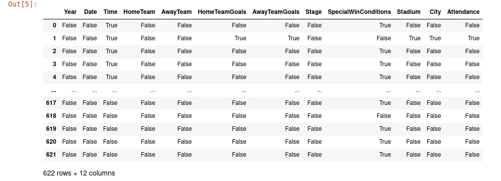
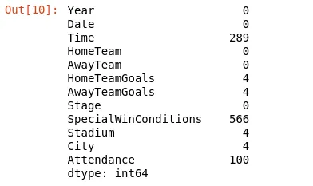
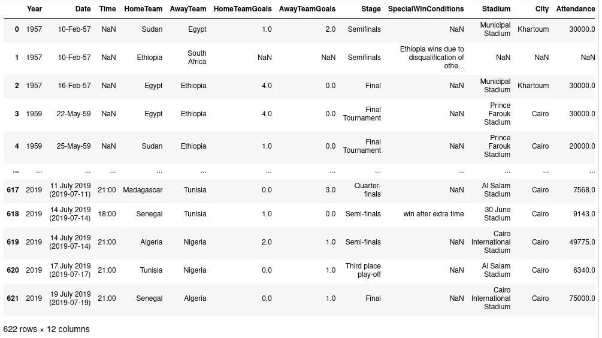
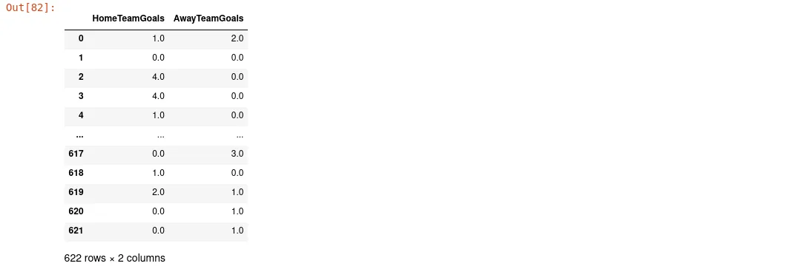
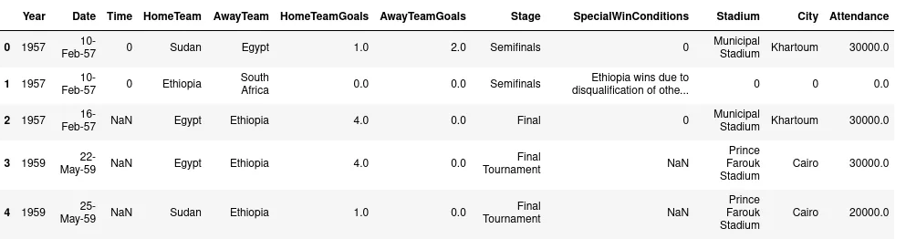

As pandas is a library for data manipulation, it offers various approaches to detect and handle missing data. Here, we can ask ourselves; **what's is missing data?**

As stated by Wikipedia,

> **Missing data**, or **missing values**, occur when no data value is stored for the variable in an observation

What does this signify for us? Simply, it says that when we have a data frame where cells are empty, we consider them as missing data. These missing data have several impacts in data analysis insofar they can cause bias in estimation parameters and reduce the quality of graphical representation.

For this article, we'll work with [Africa Cup of Nations](https://www.kaggle.com/mohammedessam97/africa-cup-of-nations) dataset upload on Kaggle by [Mohammad Essam](https://www.kaggle.com/mohammedessam97). This dataset is composed of three CSV files and we are going to import one of them like:

```python
import pandas as pd
df_african_cup_matches = pd.read_csv('Africa Cup of Nations Matches.csv')
```

Throughout this blog post, we will talk about **df.isna(), df.isnull(), df.notna(), df.notnull(), df.dropna(), df.fillna() and df.interpolate()**  with pandas DataFrame. if you're ready, let's jump in !

## 1. DataFrame.isna() and DataFrame.isnull()

isna() and isnull() are two pandas methods to detect missing values in DataFrame. isnull() is just an alias of isna(), thus all manipulations available for one of them are also the same for the other.

When we call isna()/isnull() on DataFrame, it returns us a DataFrame of boolean where all cells without data in the original DataFrame have a value True and the remainder the False value. These methods are called on DataFrame and don't have any parameters.

```python
df_african_cup_matches.isna()
```



Now, we know how to detect missing data with df.isna()/df.isnull() method but how we can use this boolean DataFrame? Indeed, with this boolean DataFrame, we can count the number of missing values to answer the question: **how many missing values are in our data?**

To do that, just type:

```python
df_african_cup_matches.isna().sum()
```



It's pretty easy like that. With the previous line of code, we have the details on missing data per column. For that in overall DataFrame, just type:

```python
df_african_cup_matches.isna().sum().sum()

Output: 971
```

Then we have the total number of missing values in our data.

At this point, we have two questions. **Why conserve df.isna() and df.isnull() as they do the same thing and have the same content in the pandas documentation? What is the real importance to conserve both?**

As you probably don't know, pandas DataFrame is based on R DataFrame and on R programming language, **na** and **null**  are both different. As pandas is built on top of **NumPy** which doesn't have **na**  or **null** values but **NaN** values, pandas use it to represent all missing values without distinction on **na** or **null.** It's the reason why both methods work the same.

## 2. DataFrame.notna() and DataFrame.notnull()

df.notna() and df.notnull() are considered as the boolean inverse of df.isna() and df.isnull() respectively. They don't take any parameter and return a boolean DataFrame indicating if the value is present or not. In this case, all cells with data take the boolean True and the remainder takes False. They work the same like df.isna()/df.isnull().

## 3. DataFrame.dropna()
In the process of cleansing data, we may want to remove all rows/columns containing missing values to prevent bias in our analysis. Pandas is well equipped for that and provides df.dropna() method to speed up this process. The signature of this method is:

```python
DataFrame.dropna(axis=0, how='any', thresh=None, subset=None, inplace=False)
```

where:

- **axis** tell pandas if we want to drop rows or columns which contain missing values. **0** represent rows and **1** represent columns.
- **how** take two values where **any** signify that rows/columns will be removed if they contains a least one NA value and **all** indicate rows/columns will be drop if all values are NA.
- **inplace**  indicate that the modification will be done on the copy of the DataFrame or not. By default, **inplace** is False and returns a result DataFrame. If we turn it to True, they return None and directly modify the DataFrame where we call **dropna()** method.

Let's do some example.

```python
print("===> Before Call df.dropna()")
display(df_african_cup_matches.shape)
print("===> After Call df.dropna()")
display(df_african_cup_matches.dropna().shape)
```

```python
Output:
===> Before Call df.dropna()
(622, 12)
===> After Call df.dropna()
(31, 12)
```

df.dropna() without any paramter drop all rows containing NaN values. Recall that default parameter are **axis=0, how='any', inplace=False.**

if we change **how**  to **all,** nothing will be drop because we don't have the entire row with missing values.

```python
print("===> Before Call df.dropna()")
display(df_african_cup_matches.shape)
print("===> After Call df.dropna()")
display(df_african_cup_matches.dropna(how='all').shape)
```

```python
Output:
===> Before Call df.dropna()
(622, 12)
===> After Call df.dropna()
(622, 12)
```

If we change **inplace** to **True,**  we can confirm that the result type is None.

```python
print("===> With inplace=False")
display(type(df_african_cup_matches.dropna()))
print("===> With inplace=True")
display(type(df_african_cup_matches.dropna(inplace=True)))
```

```python
Output:
===> With inplace=False
pandas.core.frame.DataFrame
===> With inplace=True
NoneType
```

Here, we have confirmation that when  **inplace=False, df.dropna()**  work on a copy of data and return result DataFrame, and when **inplace=True,**  it works directly on the same instance of DataFrame. You can find more manipulation on [documentation](https://pandas.pydata.org/docs/reference/api/pandas.DataFrame.dropna.html).

## 4. DataFrame.fillna()

In most situations, it would be a bad idea to delete rows/columns containing missing values as we did in the previous section. Instead of doing that, we can understand the context of missing data and replace them with a default value accordingly.



When we look at the picture above, we remark that we have missing data in the columns **Time, HomeTeamGoals, AwayTeamGoals, City and SpecialWinConditions.** All these columns have different types of data and you must understand your data to better choose the value to fill the missing data.

The signature of **df.fillna()** is as follow:

```python
DataFrame.fillna(value=None, method=None, axis=None, inplace=False, limit=None, downcast=None)
```

When we call **df_african_cup_matches.fillna(0),** pandas fill all missing values with the value **0.**  We can select columns where we want to fill missing values before calling fillna().

```python
df_african_cup_matches[['HomeTeamGoals','AwayTeamGoals']].fillna(0)
```



The parameter **limit**  of **df.fillna()** indicate the maximum number of consecutive NaN value to fill. for example,

```python
df_african_cup_matches.fillna(0,limit=2).head()
```



You observe that in column **Time,** only the first two consecutive NaN values have been filled with **0**. There are more and more customization and manipulation to do with fillna() method. You can navigate through [documentation](https://pandas.pydata.org/docs/reference/api/pandas.DataFrame.fillna.html#pandas.DataFrame.fillna) to see more examples.

## 5. DataFrame.interpolate()

df.Interpolate() is another technique to handle missing data. It is a technique used to estimate unknown data between two known data. To fill missing data, it has different interpolation methods such as **linear interpolation, polynomial interpolation, etc.**

The basis usage is:

```python
df_african_cup_matches.interpolate()
```

Without parameter, it used **linear** method which threat values as equally spaced. With this method, when we meet a NaN value, we take the value before him and the other one after him, we sum these two values and put the half in the cell containing NaN value. This method has a lot of parameters and you can go through [the documentation](https://pandas.pydata.org/docs/reference/api/pandas.DataFrame.interpolate.html) to see a further example and read about the different parameters.

## Conclusion
Throughout this article, we present seven methods offered by pandas to work with missing data. We saw **df.isna(), df.isnull(), df.notna(), df.notnull(), df.dropna(), df.fillna() and df.interpolate()** and give some example of usage. For each of them, you can go into the documentation for further explanation. You can find the source code of this blog post [here](https://github.com/tderick/datainsightonelineprogram/tree/main/pandas%20technique%20for%20datascience%20blog%202). Also, this article is written in part of the data insight online program.
