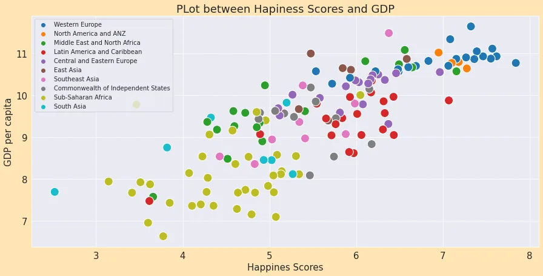
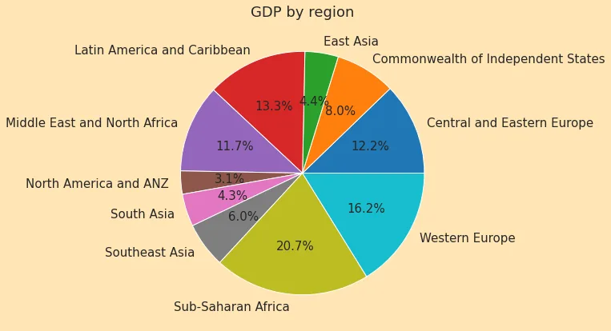
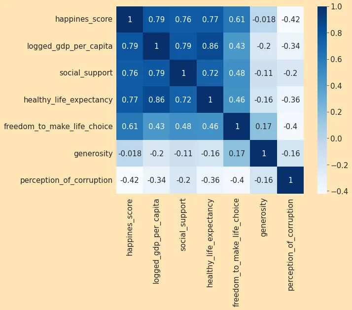
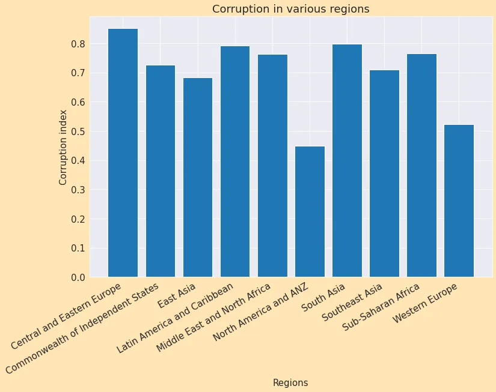
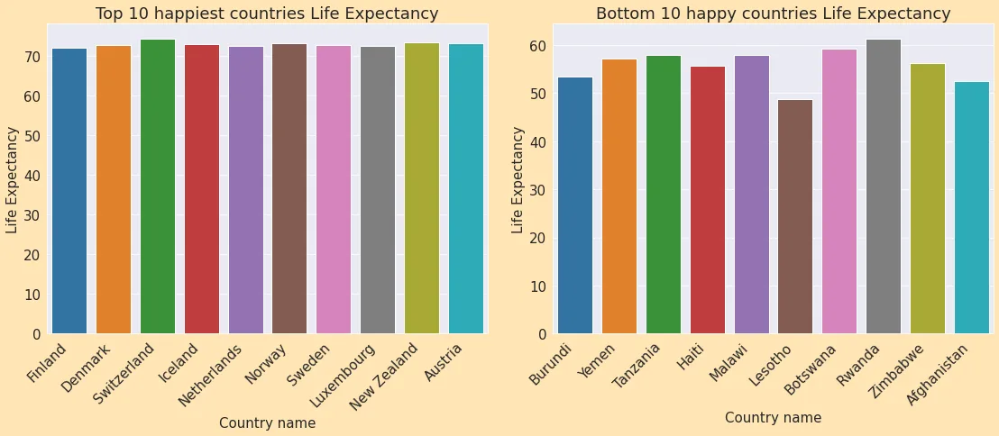
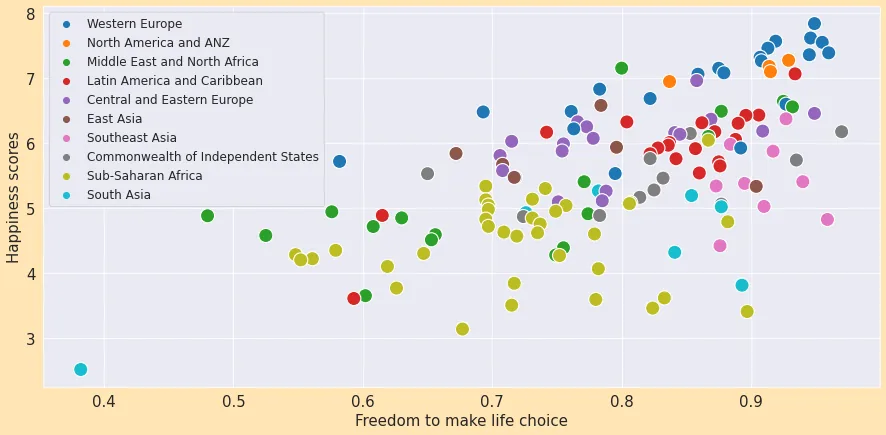
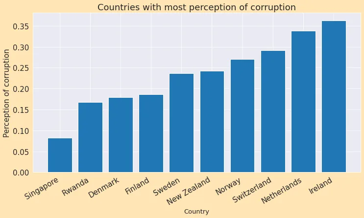
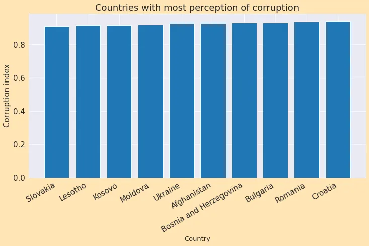
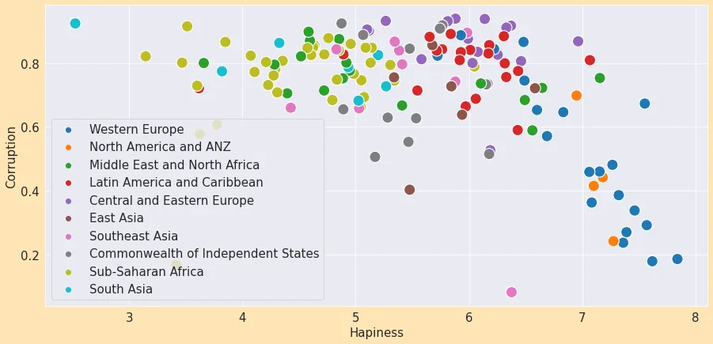

The happiness scores and rankings use data from the Gallup World Poll. The columns following the happiness score estimate the extent to which each of six factors – economic production, social support, life expectancy, freedom, absence of corruption, and generosity – contribute to making life evaluations higher in each country than they are in Dystopia, a hypothetical country that has values equal to the world’s lowest national averages for each of the six factors. They have no impact on the total score reported for each country, but they do explain why some countries rank higher than others.


Perform exploratory data analysis and answer specific questions with Happiness data 2021 from the United Nations. we will visualize data and see how the happiness of a country is related to factors such as GDP, Social Support, Corruption, Life Expectancy, etc.

```python
# import necessary library
import pandas as pd
import numpy as np
import matplotlib.pyplot as plt
import seaborn as sn
s%matplotlib inline
```

```python
# load dataset
data = pd.read_csv("/content/drive/MyDrive/World Happiness EDA/world-happiness-report-2021.csv")
data.head()
```

```python
# filter necessary columns for EDA
data_columns = ['Country name', 'Regional indicator', 'Ladder score', 'Logged GDP per capita', 'Social support', 'Healthy life expectancy', 'Freedom to make life choices', 'Generosity', 'Perceptions of corruption']

data = data[data_columns].copy()

# rename columns
happy_df = data.rename({"Country name" : "country_name","Regional indicator": "regional_indicator","Ladder score" : "happines_score","Logged GDP per capita" : "logged_gdp_per_capita","Social support" : "social_support","Healthy life expectancy" : "healthy_life_expectancy","Freedom to make life choices" : "freedom_to_make_life_choice","Generosity" : "generosity","Perceptions of corruption" : "perception_of_corruption"}, axis = 1)

# view happy_df data
happy_df.head()
```

```python
# Check missing value
happy_df.isnull().sum()
```

```python
# plot happiness score and gdp for different regionplt.rcParams['figure.figsize'] = (15, 7)
plt.title('PLot between Hapiness Scores and GDP')
sns.scatterplot(x = happy_df.happines_score, y=
                happy_df.logged_gdp_per_capita, hue =
                 happy_df.regional_indicator, s = 200)
plt.legend(loc = 'upper left', fontsize = 10)
plt.xlabel("Happines Scores")
plt.ylabel("GDP per capita")
plt.show()
```



The highest GDP and Highest Happiness Score region is **Western Europe**. **Sun-Saharan Africa** has a Low Happiness score and GDP also. For that, we can say that the Happiness score strongly depends on GDP per capita.

```python
# total countries
total_countries = happy_df.groupby("regional_indicator")
                                ['country_name'].count()
total_countries
```

Sub-Saharan Africa has 36 countries.

```python
# Which region has the highest contribution to the world GDP as per our data?
gdp_region = happy_df.groupby("regional_indicator")
                ["logged_gdp_per_capita"].sum()
gdp_region
```

```python
gdp_region.plot.pie(autopct = "%1.1f%%")
plt.title("GDP by region")
plt.ylabel(" ")
```



Sub-Saharan Africa contributes a world GDP of 20.7%. That's the highest. Because there are 36 countries. North America and ANZ have the lowest contribution(3.1%) because there are only four countries.

```python
# Correlation map
cor = happy_df.corr(method = 'pearson')
fig, ax = plt.subplots(figsize=(10, 7))
sns.heatmap(cor, square = True, annot = True,  cmap =
                                "Blues", ax=ax)
```



The darkest box represents a strong correlation and the light box represents a weak correlation. There is a very strong correlation between happiness score and GDP(0.79). Also between happiness score and social support(0.76). There is a very weak relationship.

```python
# corruption in different regions
corruption = happy_df.groupby('regional_indicator')
                [['perception_of_corruption']].mean()
corruption
```

Here we see that the highest Central and Eastern Europe has the highest perception of corruption(0.85) and North America and ANZ have the least(0.44).

```python
plt.rcParams['figure.figsize'] = (12, 8)
plt.title("Corruption in various regions")
plt.xlabel("Regions", fontsize=15)
plt.ylabel("Corruption index", fontsize=15)
plt.xticks(rotation = 30, ha = "right")
plt.bar(corruption.index,
                corruption.perception_of_corruption)
```



```python
# Find the life expectancy of top 10 happiest and bottom 10 least happy countries
top_10 = happy_df.head(10)
bottom_10 = happy_df.tail(10)
```

```python
fig, axes = plt.subplots(1, 2, figsize = (16, 6))
plt.tight_layout(pad=2)
xlabels = top_10.country_name
axes[0].set_title("Top 10 happiest countries Life
                                Expectancy")
axes[0].set_xticklabels(xlabels, rotation=45, ha="right")
sns.barplot(x = top_10.country_name, y = top_10.healthy_life_expectancy, ax = axes[0])
axes[0].set_xlabel("Country name")axes[0].set_ylabel("Life
                                Expectancy")

xlabels = bottom_10.country_name
axes[1].set_title("Bottom 10 least happy countries Life
                                 Expectancy")
axes[1].set_xticklabels(xlabels, rotation=45, ha="right")
sns.barplot(x = bottom_10.country_name, y =
 bottom_10.healthy_life_expectancy, ax = axes[1])
axes[1].set_xlabel("Country name")
axes[1].set_ylabel("Life Expectancy")
```



Here we see that the top 10 happiest countries' Life Expectancy is almost the same(Above 70 years). On the other hand bottom 10 least happy countries most of them have Life Expectancy below 60.

```python
# plt between freedom to make life choice and happiness scores
plt.rcParams['figure.figsize'] = (15, 7)
sns.scatterplot(x = happy_df.freedom_to_make_life_choice, y =
  happy_df.happines_score, hue = happy_df.regional_indicator,
  s=200)
plt.legend(loc = "upper left", fontsize = 12)
plt.xlabel("Freedom to make life choice")
plt.ylabel("Happiness scores")
```



The highest freedom and Highest Happiness Score region is Western Europe. The Middle East and North Africa have Low Happiness scores and freedom also.

A very interesting fact is Southeast Asia has a comparatively low happiness score but the freedom score is higher(more than point-8).

```python
# top 10 corrupted countries
country =
 happy_df.sort_values(by="perception_of_corruption").head(10)
plt.rcParams['figure.figsize'] = (12, 6)
plt.bar(country.country_name,
                     country.perception_of_corruption)
plt.title("Countries with most perception of corruption")
plt.xlabel("Country", fontsize=13)plt.ylabel("Corruption
                     index")
plt.xticks(rotation=30, ha="right")
```



Here we see that Ireland has the highest correction index and Singapore has the least.

```python
# bottom 10 corrupted countries
country =
 happy_df.sort_values(by="perception_of_corruption").tail(10)
plt.rcParams['figure.figsize'] = (12, 6)
plt.bar(country.country_name,
                country.perception_of_corruption)
plt.title("Countries with most perception of corruption")
plt.xlabel("Country", fontsize=13)
plt.ylabel("Corruption index")
plt.xticks(rotation=30, ha="right")
```



Here Almost all the countries have high corruption index(0.85).

```python
# corruption vs happiness
plt.rcParams['figure.figsize'] = (15, 7)
sns.scatterplot(x = happy_df.happines_score, y =
         happy_df.perception_of_corruption, hue =
         happy_df.regional_indicator, s=200)
plt.legend(loc = "lower left", fontsize = 15)
plt.xlabel("Hapiness")
plt.ylabel("Corruption")
```



Those regions have the lower corruption index, and the happiness score is high(Western Europe). Those regions have the highest corruption index, and the happiness score is low(Sub Saharan Africa).

[**GitHub Link**](https://github.com/abubinfahd/Data-Insight/blob/main/CAPSTONE%20Project/EDA/World_Happiness_report_2021_EDA.ipynb) [**KaggleDataset**](https://www.kaggle.com/datasets/ajaypalsinghlo/world-happiness-report-2021)
