Once upon a time, there was a data scientist who lived in a country called dystopia which is the saddest city in the world. This scientist decided to travel around the world in search of happiness and during his trips from 2005 to 2020 I found that there are 6 factors that determine the happiness of countries, which are:

1- GDP per capita
2- Family and life expectancy
3- Freedom
4- Generosity
5- Positive effect
6- Negative effect

He decided to use his analytical skills to compare countries and these factors,
and developed a model based on his conclusions. He found that the higher the productivity, the greater the happiness. Hence, he decided to return to his town and present to the king what he found and increase job opportunities in order to reduce corruption and increase the happiness rate in their country.

**The World Happiness Report**

is a landmark survey of the state of global happiness. The report continues to gain global recognition as governments, organizations, and civil society increasingly uses happiness indicators to inform their policy-making decisions. Leading experts across fields – economics, psychology, survey analysis, national statistics, health, public policy, and more – describe how measurements of well-being can be used effectively to assess the progress of nations. The reports review the state of happiness in the world today and show how the new science of happiness explains personal and national variations in happiness.

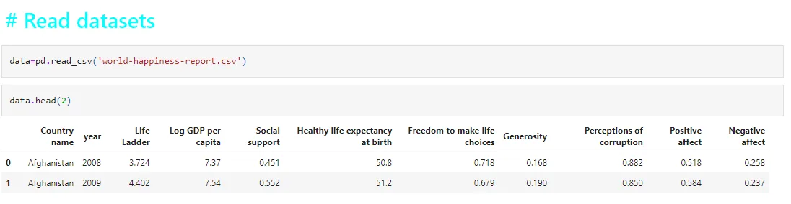

## dataset Description :

**1-Life Ladder:**
World Happiness Report defines the Happiness Index (or “Life ladder”) as follows: Please imagine a ladder, with steps numbered from 0 at the bottom to 10 at the top. The top of the ladder represents the best possible life for you and the bottom of the ladder represents the worst possible life for you

**2-Log GDP per capita:**
GDP per capita stands for Gross Domestic Product (GDP) per capita (per person). It is derived from a straightforward division of total GDP (see definition of GDP) by the population.

**3-Social support:**
Social support has been described as “support access to an individual through social ties to other individuals, groups, and the larger community

**4-Freedom to make life choices:**
Freedom of choice describes an individual's opportunity and autonomy to perform an action selected from at least two available options, unconstrained by external parties

**5-Perceptions of corruption:**
The Corruption Perceptions Index (CPI) is an index that ranks countries "by their perceived levels of public sector corruption, as determined by expert assessments and opinion surveys." The CPI generally defines corruption as an "abuse of entrusted power for private gain".

**6-Positive affect:**
Protecting your health: Happiness lowers your risk for cardiovascular disease, lowers your blood pressure, enables better sleep, improves your diet, allows you to maintain normal body weight through regular exercise, and reduces stress

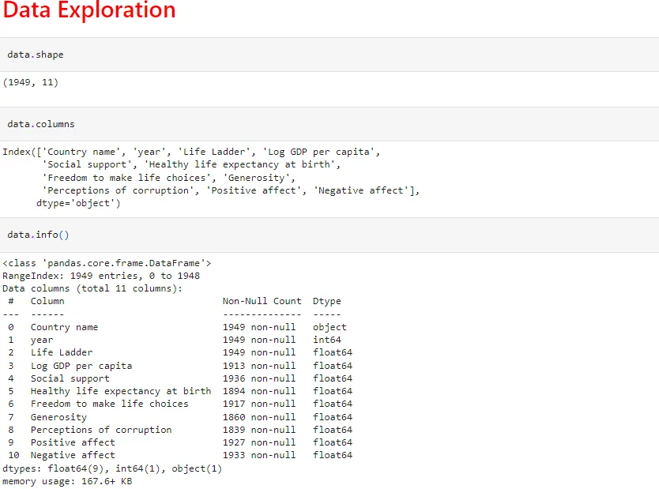

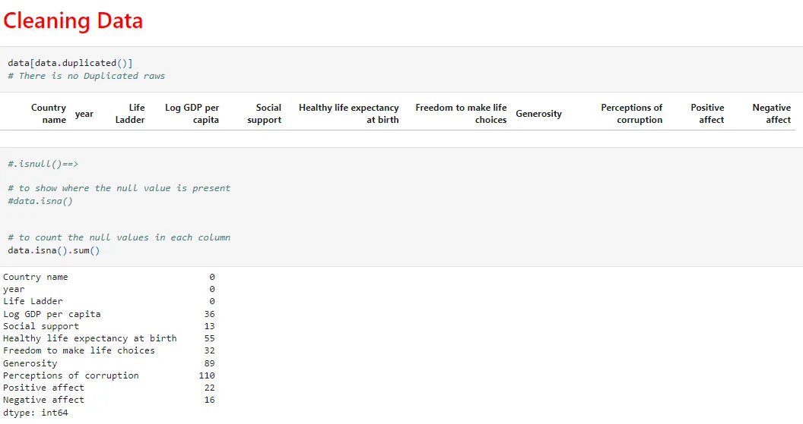

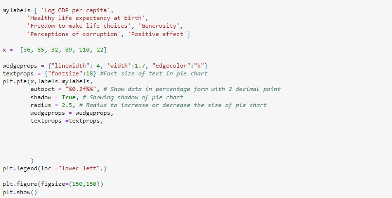

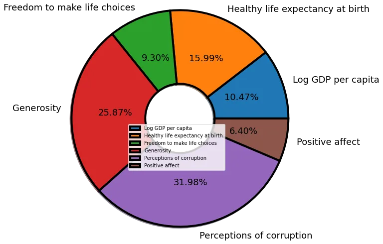

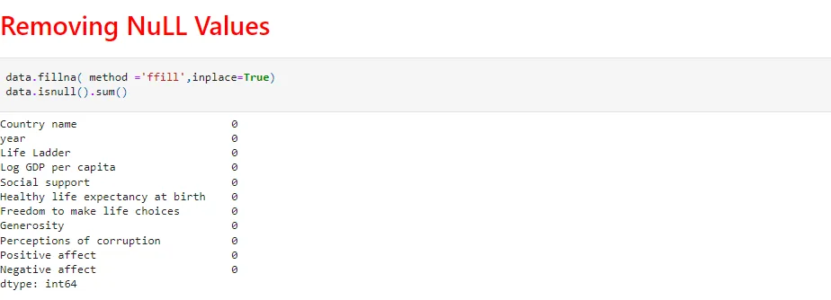

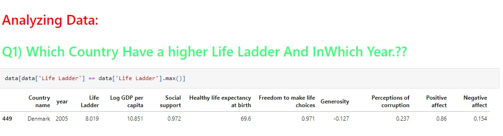

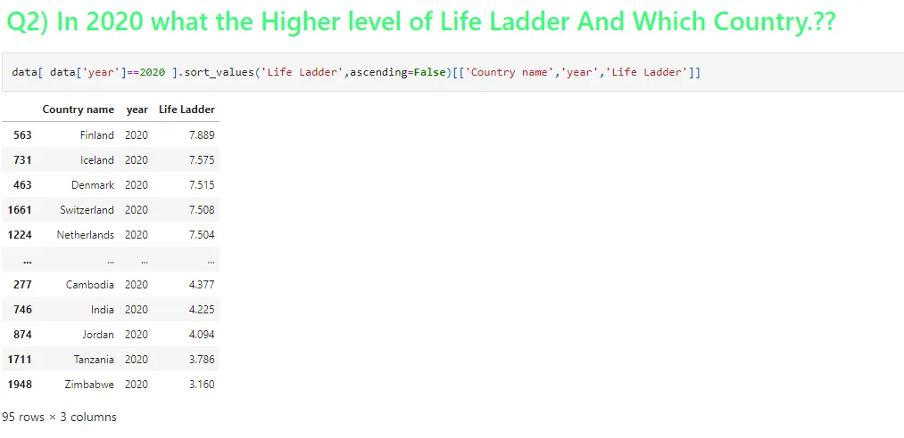

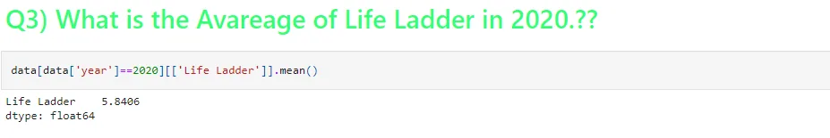

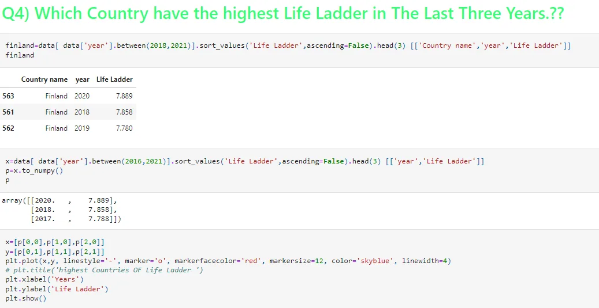

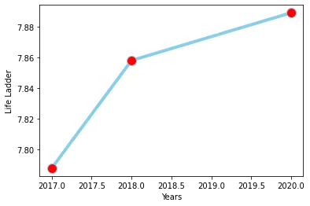

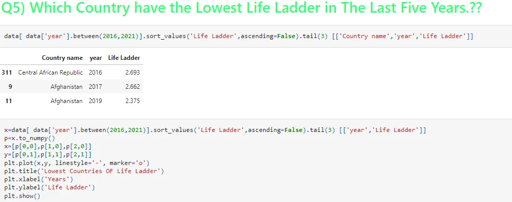

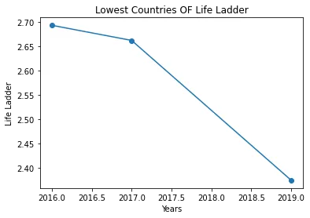

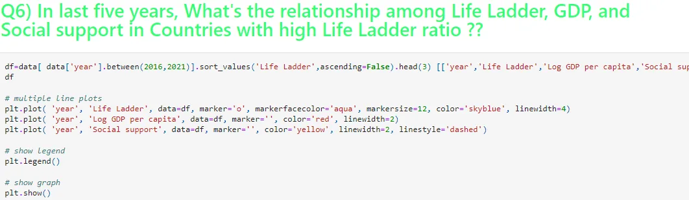

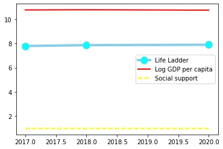


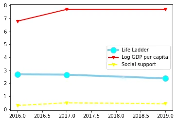

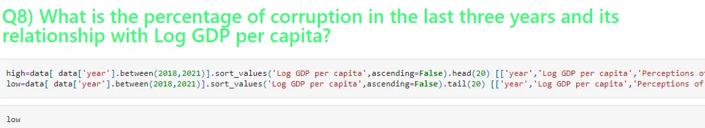

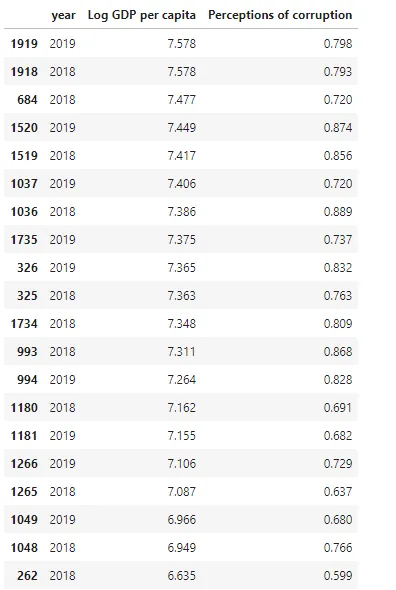

```python
plt.plot('Log GDP per capita', 'Perceptions of corruption', data=high, marker='', color='blue', linewidth=2)
plt.title('Relation Between Log GDP per capita and  Perceptions of corruption ')
plt.show()
```

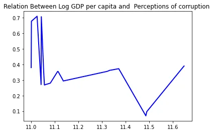

```python
plt.plot('Log GDP per capita', 'Perceptions of corruption', data=low, marker='', color='red', linewidth=2)
plt.title('Relation Between Log GDP per capita and  Perceptions of corruption ')
plt.show()
```

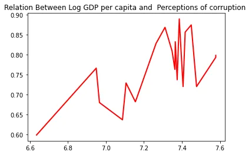

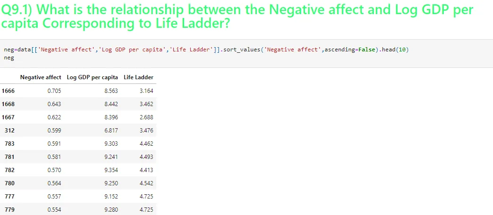

```python
plt.scatter(x=neg['Negative affect'],y=neg['Life Ladder'], color = '#88c999')
plt.scatter(x=neg['Negative affect'],y=neg['Log GDP per capita'], color = 'hotpink')
plt.show()
```

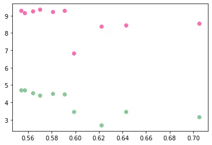

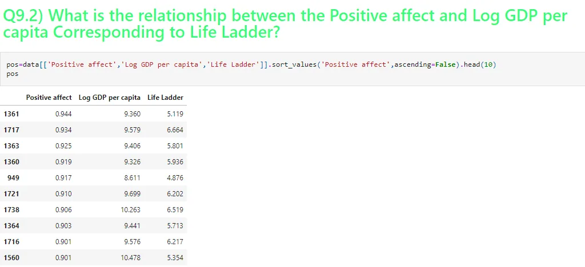

```python
plt.scatter(x=pos['Positive affect'],y=pos['Life Ladder'], color = '#88c999')
plt.scatter(x=pos['Positive affect'],y=pos['Log GDP per capita'], color = 'hotpink')
plt.show()
```

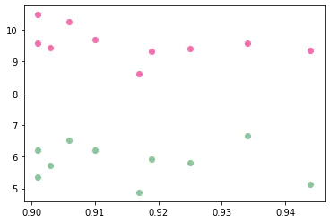

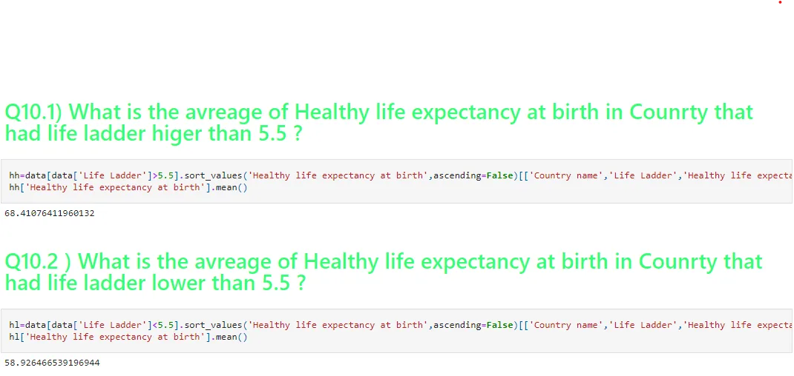

```python
plt.plot('Healthy life expectancy at birth' ,'Life Ladder', data=hl.head(20), marker='o', color='red', linewidth=2)
plt.plot( 'Healthy life expectancy at birth' ,'Life Ladder', data=hh.head(20), marker='o', markerfacecolor='aqua', markersize=12, color='skyblue', linewidth=2)
plt.show()
```

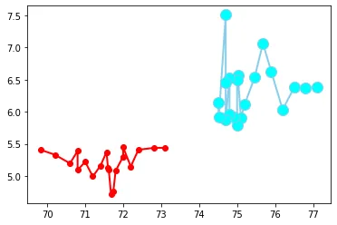

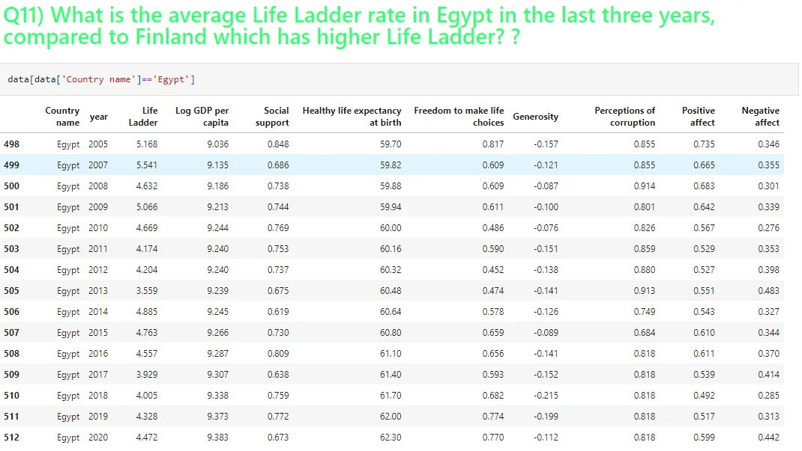


```python
plt.bar(finland['Life Ladder'], finland['year'], color ='maroon',width = 0.1)
plt.bar(usa['Life Ladder'], usa['year'], color ='grey',width = 0.1)
plt.title("Life Ladder in Finland  & USA Last Three Years")
plt.show()
```


## Prediction

We will use Lasso Regression:
But What is Lasso Regression? Lasso regression is a type of linear regression that uses shrinkage. Shrinkage is where data values are shrunk towards a central point, like the mean. The lasso procedure encourages simple, sparse models (i.e. models with fewer parameters). This particular type of regression is well-suited for models showing high levels of multicollinearity or when you want to automate certain parts of model selection, like variable selection/parameter elimination.

```python
import seaborn as snsfrom sklearn.linear_model import Lasso, LinearRegression
from sklearn.model_selection import train_test_split
from sklearn.metrics import r2_score
```

```python
# here life ladder could be considered as the indicator of happiness, so we will look at the correlation heatmap and determine the strongest correlation between all of those columns and get the most strongest one and make it as a predictor for our ML model.
# so from the following heatmap we could see that the (log GDP and healthy life expectancy at birth) has a strong correlation with Life ladder

plt.figure(figsize=(15,15))
sns.heatmap(data.corr(), annot=True, linewidths=3, linecolor='black', vmin=-1, vmax=1, center=0, cmap='BrBG')
```

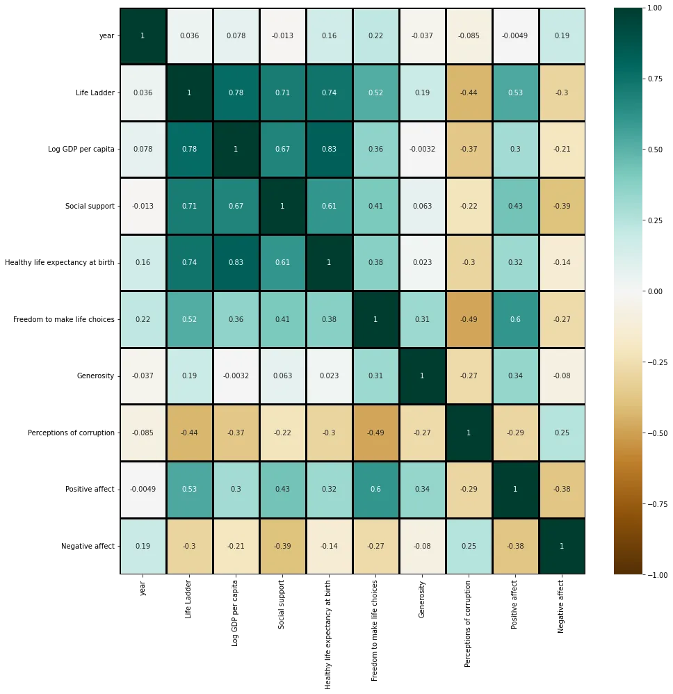

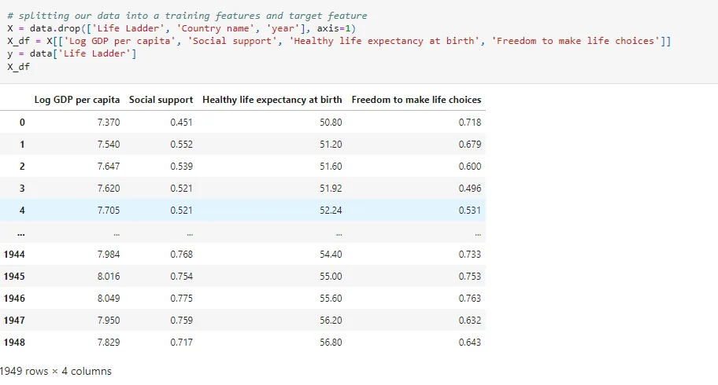

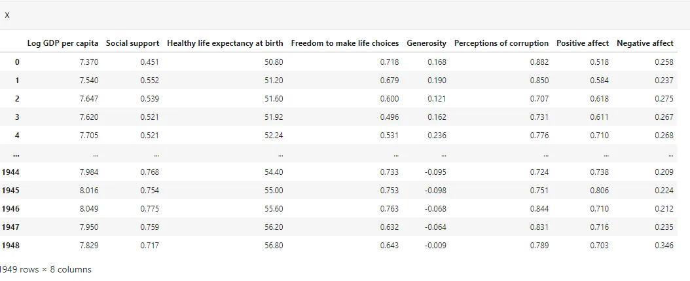

```python
y
```

```python
0       3.724
1       4.402
2       4.758
3       3.832
4       3.783
        ...
1944    3.735
1945    3.638
1946    3.616
1947    2.694
1948    3.160
Name: Life Ladder, Length: 1949, dtype: float64
```

```python
X_train, y_train = X_df, y
model = Lasso(alpha=0.2)
training_model = model.fit(X_train, y_train)
```

```python
# this plot is kinda of feature selection technique using the coefficients of theis model parameters and it shows that the most important two features are Log GDP and Health life expectancy

reg_coef = training_model.coef_
features = X_df.columns
_ = plt.plot(range(len(features)), reg_coef)
_ = plt.xticks(range(len(features)), features, rotation=40)
_ = plt.ylabel("coefficients significance")plt.show()
```

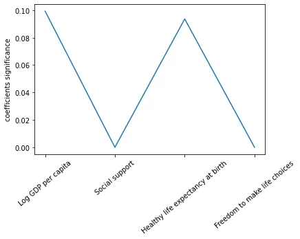

```python
gdp = X['Log GDP per capita']
hx  = X['Healthy life expectancy at birth']

# plotting only 200 samples for clear observing

plt.scatter(gdp[:200], y[:200])
plt.xlabel("Life ladder or healthy score")plt.ylabel("Log GPD")
plt.show
```

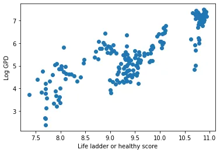

```python
plt.scatter(hx[:200], y[:200])
plt.xlabel("Life ladder or healthy score")
plt.ylabel("Healthy life expectancy at birth")
plt.show
```

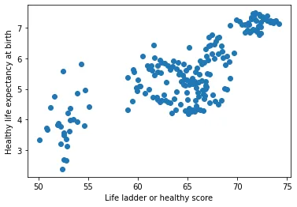

```python
test = np.array([8.0, 0.8, 90.0, 0.85]).reshape(1,-1)
print(f"predicted happiness score(life ladder) with a country that has the previous values for 8.0 gdp, 0.8 social support, 90.0 Healthy life expectancy and 0.85 freedom for life choices is {round(training_model.predict(test)[0],2)}")
```

```python
predicted happiness score(life ladder) with a country that has the previous values for 8.0 gdp, 0.8 social support, 90.0 Healthy life expectancy and 0.85 freedom for life choices is 7.83
```

That's it, I hope this article was worth reading and helped you acquire new knowledge no matter how small.

Feel free to check up on the [notebook](https://github.com/MariamAlsaedy/World-Happines). You can find the results of code samples in this post.
