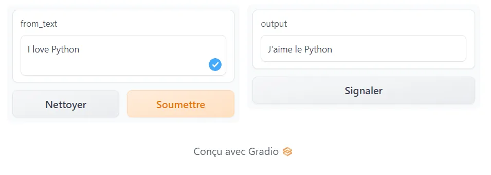

This article shows very simply how to create simple applications with Python. In this article, which is made up of two parts, we will first create an application that automatically generates an individual's BMI body mass index by asking them to fill in their height and weight. Then in the second part of this article we will create an application that automatically translates any text into French using the Gradio and Python library.

### First party: BMI Apps

BMI is calculated based on the Height and Weight of an individu by a formula:

**BMI = weight / (height/100)\*\*2**

To determine the BMI you need to enter your height and weight and the Apps will use the BMI formula to calculate your BMI.

And it will automatically classify individuals based on the BMI classification below.

The BMI is classified in 4 different classes:

- BMI <= 18.4 => Under Weight
- 18.4 < BMI <= 24.9 => Normal Weight
- 18.4 < BMI <= 24.9 => Normal Weight
- 25 < BMI <= 29.9 => Over Weight
- BMI >= 30 => Obesity

The Obesity is divided in 3 sub classes:

- 30 < BMI <= 34.9 => Obesity (Class 1)
- 35 < BMI <= 39.9 => Obesity (Class 2)
- BMI >= 40 => Obesity (Class 3)

BMI will be:

Here is the code that generate and clissify the individual based on the informations about his height and weight entered.

For an individual with height = 180 and Weight = 65, he will be a Healthy.

### Part two: Text translator using Gradio and Python

In this second party, we are going to create an App that translate automatically the user entered text in French wich is my language using Gradio and Python.

We need first install required packages and import them.

And now we can create our translator pipeline using Gradio.

We create a function that transform the user's text in french.

Now we can design our Apps using the Gradio interface function.

And when the Apps is designed we can lunch it in the browser by usigne:

Finally the Apps will look like this.

Thank you for reading

Sources:

- BMI apps here
- Gradio apps here
- Gradio library here
