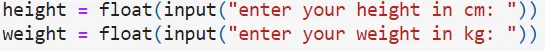
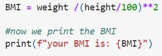
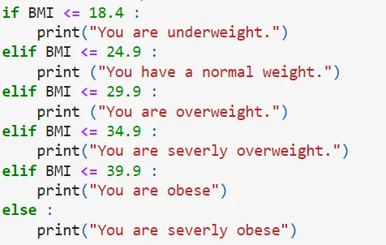
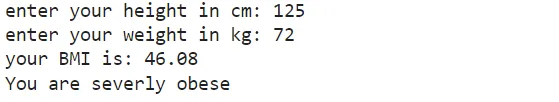

Body mass index is a measurement related to body weight and height. BMI is sometimes used to measure total body fat and whether a person has a healthy weight. Excess body fat increases the risk of certain diseases, including heart disease and some cancers. Also called body mass index.

First, we start with asking the user to introduce his height and weight. To do this we use the input() function. We convert the string input to float so we can do the calculations.

Next, we calculate the BMI and show the result. The formula for the BMI is **BMI = kg/m2** where kg is a person's weight in kilograms and m2 is their height in meters squared. We divided the height by 100 to convert it into meters.

Here we used f-strings to directly place the variable within the print statement.

Now, we interpret the health status based on our calculated output.

**Output**

We are done. To find the code click [here](https://github.com/AliMourtaza/BMI-Calculation/blob/main/BMI.ipynb).
