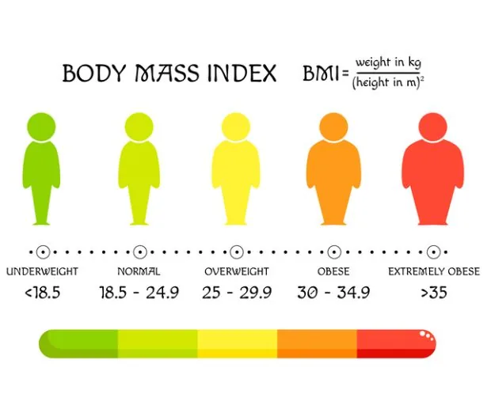
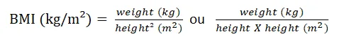

## Definition
The body mass index (BMI) is a quantity that makes it possible to know if our weight is adapted to our height (ideal or normal weight). It is calculated using a simple equation. It corresponds to the weight divided by the square of the height :



The result obtained allows to estimate the corpulence and possibly the overweight or obesity in adults, men or women between 18 and 65 years. It is the most useful indicator of the health risks associated with being overweight or underweight. Based on the BMC value obtained, individuals are classified into the following categories:

· Underweight < 18.5

· Normal weight 18.50 - 24.99

· Overweight ≥ 25.00

· Obese ≥ 30.00

To facilitate the calculation of BMI and make it available to the public, a simple application can be written with python with three steps :

- Ask to enter weight and height measures.

Give some instructions for the input of weight and height measures by specifying their units and to put the values in decimal numbers (example: height = 1.98 kg).

```python
#Body Mass Index (BMI) calculation
#Please enter your weight and height here below
weight = float(input("Enter your weight in kg: "))
height = float(input("Enter your height in meters: "))
```

By entering the formula in python the calculation will be automatic. To print the result we can add the function "round" to specify the number of numbers after the decimal point and preferably "two" for the BMI.

```python
#Do the calculation
BMI = weight/height**2
#Display the result
Print ("your BMI is : ", round (BMI, 2))
```

- Interpreting the results

Based on the classification of the individuals in the categories listed above in relation to the BMI value, we can use the "if, else and elif" functions:

```python
#Interpretation of the result
If BMI < 18.5 :
print ("You are underweight for your height, a medical consultation is necessary to receive recommendations tailored to your situation. ")
elif BMI > 18.5 and BMI < 25 :
print ("Congratulations ! Your weight is normal, continue to have a healthy living and a balanced nutrition. ")
elif BMI >= 25 and BMI < 30 :
print ("You are overweight, you need to watch your weight and adapt a balanced nutrition").
elif BMI >= 30 and BMI < 35 :
print ("You are obese, ask your doctor or dietician for advice.")
elif :
print ("Your situation corresponds to severe or massive obesity, the risk of being exposed to various health problems is high.  ")
```

Thus, the result of the BMI calculation will be associated with the appropriate interpretation in order to allow the person to take the necessary precautions for his health
