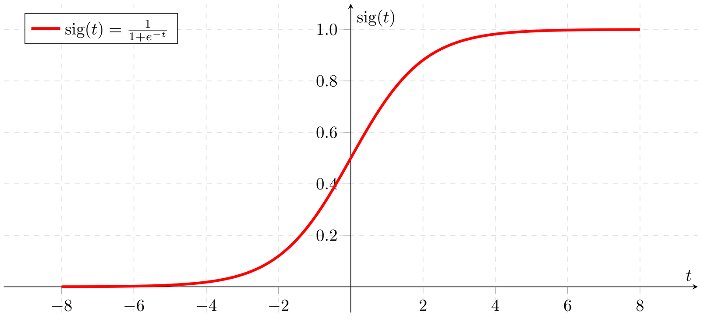
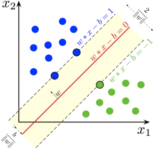
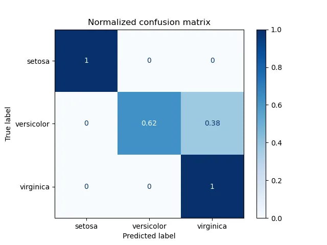
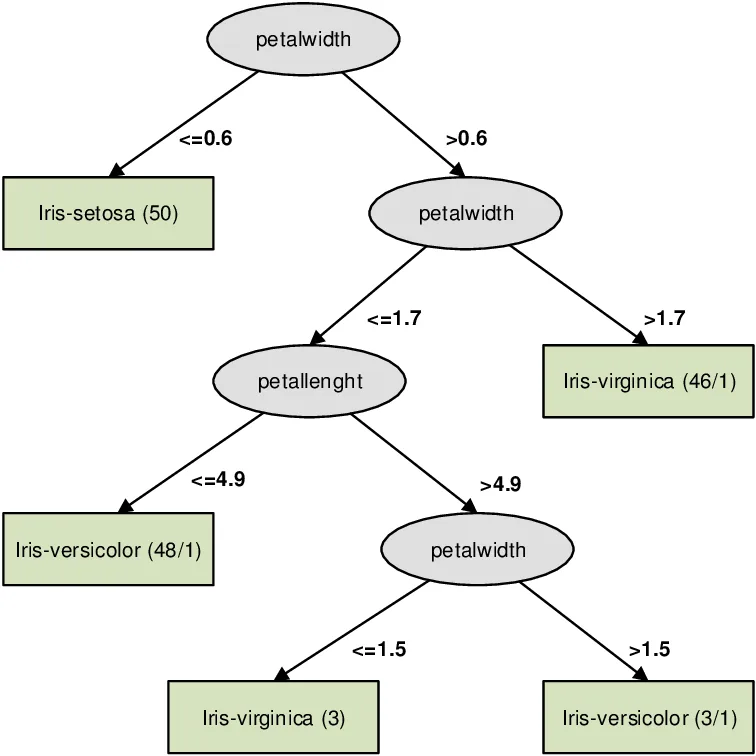

In the last blog, we discovered the important concept of machines managing to learn patterns and relationships between features in the dataset. Continuing down the same concept, in this blog, we'll be introduced to the linear and tree-based classification and regression models.

### Linear models: Logistic Regression and SVM

#### I- Logistic Regression

Logistic regression models are statistical models that study the relationship between a set of features and a target variable. It works fairly similar to the linear regression we mentioned in the last blog but there is a key difference. The output is used **in a classification context.** Instead of having the normal linear relationship which is uncapped. The output is limited between 0 and 1 via a **sigmoid** function.



As you can see, the output converges to 1 when the input tends towards a larger positive value and converges to zero when the output gets smaller in the negative direction. This way the output can be used to classify a positive outcome (1) or a negative outcome (0).

Let's see what a sample code using logistic regression looks like.

Note: For the classification examples the **Iris dataset will be used and we'll go through the train_test_split approach mentioned in the earlier** [**blog linked here**](https://www.datainsightonline.com/post/welcome-to-your-bite-sized-machine-learning-concepts-station)**for evaluation purposes.**

One additional step we add in this code is the **StandardScaler** transformation. This transformation aims to achieve a **mean value of the** **numeric** **data of** **0** and a **standard deviation of 1**. In the case of many machine learning models, this might be a nice step to add **to avoid the effect** of **outlier values** on the training step.

In this code sample, we'll include the data loading and scaling steps. but for the next samples, always assume that **X_train_transform and X_test_transform** refer to the portions of the Iris data set that went through the standard scaler pipeline.

```python
iris = datasets.load_iris()
print(iris.keys())
X = iris.data
y = iris.target
X_train, X_test, y_train, y_test = train_test_split(X, y, stratify = y,test_size = 0.25, random_state = 0) ##Keep class proportions via the stratify term
scaler = StandardScaler().fit(X_train) #Fit a scaler for
X_train_transform = scaler.transform(X_train)
X_test_transform = scaler.transform(X_test)
logreg = LogisticRegression() #Create logistic regression model
logreg.fit(X_train_transform,y_train) #Train model
y_preds = logreg.predict(X_test_transform) #Predict values with model
print('Accuracy of test_set : {:2f}%'.format(accuracy_score(y_test,y_preds)* 100))

##OUTPUT##
Accuracy of test_set : 97.368421%
```

Let's decode some of the new steps here:

To properly transform the data we first fit the scaler to the training data. It'll figure out the **mean which it'll subtract from the data** and the **standard deviation that it'll divide it by**.

The rest is as seen in the earlier blog:

- We **train** the logistic regression model
- We **predict** the classes of the data in the test set that it never saw
- We lastly **evaluate** its accuracy. Of course, in our case, we can say the model performed fairly well on the dataset given the 97% accuracy.

Now, let's take note of a few more things. The sigmoid transformation allows not only the capping of the output values but actually having the output as probabilities of a certain instance being a certain class. Instead of using the typical **predict** function, we use the **predict_proba** function.

```python
y_proba = logreg.predict_proba(X_test_transform)
(y_proba[:3] * 100).astype(int)
##output##
array([[97,  2,  0],
       [94,  5,  0],
       [98,  1,  0]])
```

The 3 first samples of the test set are in the first class (this class of course depends on the dataset).

Finally, we can explore the effect of one important parameter in the training phase which is the **Regularization** term. It is a penalty that is applied in the loss function to avoid overfitting without losing much on the training accuracy. In the case of logistic regression, it's the **C_value parameter** when instantiating the algorithm that can be used for this.

```python
##Regularization
for C_value in [0.001, 0.01, 0.1, 1, 10, 100, 1000]:
    # Create LogisticRegression object and fit
    lr = LogisticRegression(C=C_value)
    lr.fit(X_train_transform,y_train)
    y_preds = lr.predict(X_test_transform)
    print('Accuracy at C = {} : {:2f}%'.format(C_value,accuracy_score(y_test,y_preds)* 100))

    ##OUTPUT##
Accuracy at C = 0.001 : 73.684211%
Accuracy at C = 0.01 : 78.947368%
Accuracy at C = 0.1 : 81.578947%
Accuracy at C = 1 : 97.368421%
Accuracy at C = 10 : 100.000000%
Accuracy at C = 100 : 100.000000%
Accuracy at C = 1000 : 100.000000%
```

As we can see, changing the C_value at the instantiation of the LogisticRegression model (**it's set as 1 by default**) can lead to different accuracy results. Remember one thing, Every data set is different, because it worked for this one it doesn't mean it would work for another. In ML and DL **experimentation is always key.**

#### II-SVM

The Support Vector Machine algorithm is a supervised learning algorithm that works on linear separation of the datasets based on target values that we specify (check image below). The separation aims to maximize the margin that splits the two classes. **in 2D data, the separator is a line, in 3D data a separator is a plane, in 4D or more data the separator is a hyperplane.**



The **support vectors** are the lines/planes that cross the instances that split the data (**the points with black contours** in the image above). The separator line/plane is the **middle line w\*x - b = 0** of the area separating the classes. Please note that in real-life examples, datasets aren't linearly separable so the algorithm will optimize the separator plane that minimizes misclassifications.

Let's check what a code using SVM looks like:

```python
from sklearn.svm import SVC
SVM = SVC()
SVM.fit(X_train_transform, y_train)
y_preds_SVM = SVM.predict(X_test_transform)
print('Accuracy of test_set : {:2f}%'.format(accuracy_score(y_test,y_preds_SVM)* 100))
from sklearn.metrics import confusion_matrix
cm = confusion_matrix(y_test, y_preds_SVM)
print(cm)

##OUTPUT##
Accuracy of test_set : 97.368421%
[[13  0  0]
 [ 0 13  0]
 [ 0  1 11]]
```

The coding pipeline is the same as usual: **Fit, Predict, Evaluate.**

While we're at it, let's explore the concept of a confusion matrix. This matrix shows us how well is. The **rows match the actual classes** while the **columns match the predictions of the model.** The goal is to maximize the diagonal values because they correspond to the correct classifications of the model. One notable difference is in this image compared to our output the values are **normalized**. **They simply are divided by the number of items in a specific class.**



Rechecking the output accuracy and the confusion matrix in our code output shows that the model performed fairly well.

### Tree-based models: Decision Trees and Random Forests

#### I- Decision Trees

I believe in the saying that "a picture is worth 1000 words". So, I leave it up to you to intuitively figure out what a decision tree does.



As we see in the image above, based on the 4 features we have, the algorithm will try and split the dataset based on their **values and how well they split the dataset.** The "how well" part is measured with an **information gain metric.** Without using complex terms such as **entropy which in this case the model tries to minimize, information gain is maximized when a split is highly skewed towards one class (check the last splits in the image above, you'll see that the data samples left are always leaning towards one single class).**

**In a decision tree we have the following components:**

**The root:** This is the main feature that was chosen the split the dataset(**the first gray circled feature**).

**Nodes:** These are features that continue splitting the dataset along the decision tree(**the lower gray circled features**)

**Leafs:** These are the final outcome after crawling down a decision tree (**the green squares citing the class**)

Let's what a sample code looks like using Decision Trees(this time we'll include some **hyperparameters from the** get-go**)**:

```python
from sklearn.tree import DecisionTreeClassifier
for d in range(1,6):
    dt = DecisionTreeClassifier(max_depth=d,min_samples_split = 0.03)
    dt.fit(X_train,y_train)
    y_preds_dt = dt.predict(X_test)
    print('Accuracy at depth = {} : {:2f}%'.format(d,accuracy_score(y_test,y_preds_dt)* 100))

    ##output##
Accuracy at depth = 1 : 65.789474%
Accuracy at depth = 2 : 94.736842%
Accuracy at depth = 3 : 94.736842%
Accuracy at depth = 4 : 97.368421%
Accuracy at depth = 5 : 97.368421%
```

Things go as usual: **Fit, predict, evaluate.**

The **hyperparameters** in our case are two:

**max_depth:** this is the **maximum** number of levels(depth-wise) a decision tree can go.

**min_samples_split**: The **minimum** number of samples required to split an internal node.

[Check the notebook here](https://github.com/zqngetsu96/DataInsight_Assignments_and_projects/blob/main/Bi-weekly-blog-codes/Linear%20and%20tree%20based%20algorithms.ipynb) if you want to check how decision trees can be used for **Regression** on a diabetes dataset.

Algorithms have a lot of hyperparameters, and adjusting them (known as **hyperparameter tuning**) can be a pain. Let's learn a few more things about our next algorithm and also show a **super-easy way to tune hyperparameters**.

#### II- Random Forests

Before talking about the algorithm, we should learn a bit about **ensemble learning**. This is a really powerful concept that has one simple principle: **Strength in unity**. **What's better than one model? two models! what's better than 3? 4! (Of course, it always depends on the case!).** This works by producing many **weak predictor models** that use **bootstrapped** subsets of the features in the datasets to create **better than average (random)** models that end up being quite accurate when used together.

Ensemble learning can be achieved by two methods:

> **Boosting** is an ensemble technique to create a collection of predictors. models are learned **sequentially** with early learners fitting simple models to the data and then analyzing data for errors.

> **Bagging (Bootstrap Aggregation) is used when our goal is to reduce the variance of a decision tree. Here idea is to create several subsets of data from training sample chosen randomly with replacement. Now, each collection of subset data is used to train their decision trees.**

(Definitions from Boosting and Bagging are extracted from this [post](https://towardsdatascience.com/decision-tree-ensembles-bagging-and-boosting-266a8ba60fd9))

Now, back to random forests: It is mainly based on bagging but with one extra step: it **also samples randomly the features** for the weak learners.

So a random tree in the ensemble could only have 10 samples and 1 feature to process.

Given the usual **Fit, Predict, Evaluate** we've already seen many times, I added this time the grid searching part where we have an automated search object called **GridSearchCV** which takes in a grid of parameters and their possible values and investigates their performance through training different instances of the estimator we want (which in this case is a **RandomForestClassifer**).

**note:** [The notebook](https://github.com/zqngetsu96/DataInsight_Assignments_and_projects/blob/main/Bi-weekly-blog-codes/Linear%20and%20tree%20based%20algorithms.ipynb) in GitHub contains both codes with and without the grid search step.

Let's see what this looks like in code:

```python
params = {'n_estimators':[30,50,100],
         'criterion':['entropy','gini']}
rf_c_CV = RandomForestClassifier()
grid_cv = GridSearchCV(estimator=rf_c_CV,param_grid=params,cv=5,scoring="accuracy")
grid_cv.fit(X_train_transform,y_train)
print(grid_cv.best_score_ * 100)
print(grid_cv.best_params_)
best_model = grid_cv.best_estimator_
print('Accuracy of test_set : {:2f}%'.format(accuracy_score(y_test,best_model.predict(X_test_transform))* 100))

##OUTPUTS##
94.66403162055336
{'criterion': 'entropy', 'n_estimators': 50}
Accuracy of test_set : 97.368421%
```

The grid search follows these steps:

- For each possible combination of parameters:
- Train model
- Evaluate based on the **scoring metric (via cross validation)**
- If best model so far, update the state of the object [**best_estimator_, best_score_, best_params_**]

In this code sample, the parameters' grid was fairly small. But, you can put in as many parameters as you want which comes at a cost: **Training time**. Given that it's a multi-dimensional grid, the more features and values per feature we add to the grid, the search space can explode exponentially.

If you feel that you're a lucky individual, you can use a **randomized search grid** instead which will stop after a set of iterations whether the fitting is finished or not. The concept is simple, it'll try out a **set number of the possible combinations which are generated randomly** from the search space. In this case, **if the search space is big**, **the likelihood of getting a good model is not worth betting on**.

I hope this article was worth reading.

The codes and imported packages for this blog can be found in the [GitHub notebook here :)](https://github.com/zqngetsu96/DataInsight_Assignments_and_projects/blob/main/Bi-weekly-blog-codes/Linear%20and%20tree%20based%20algorithms.ipynb)
