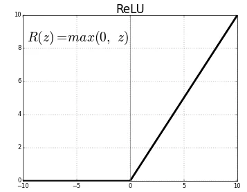
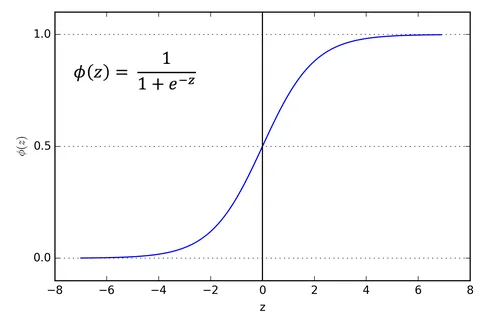
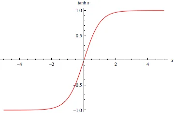
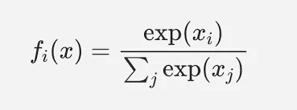
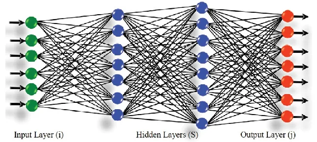
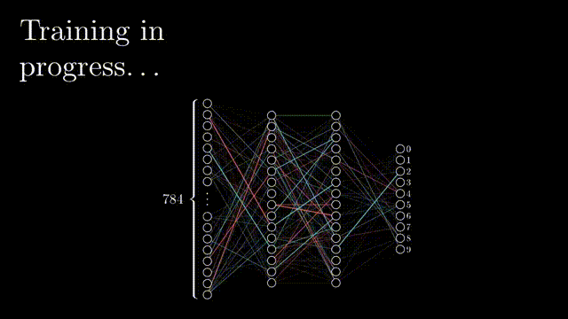
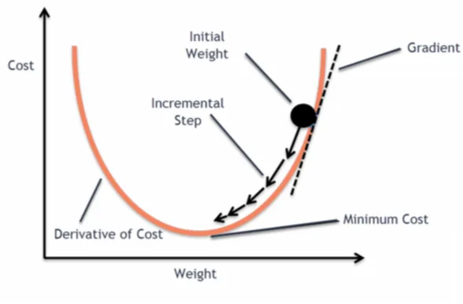
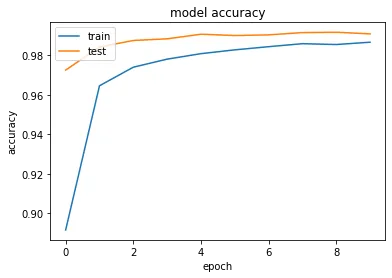
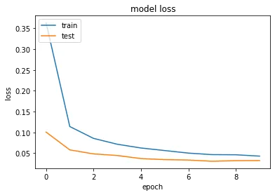

Machine learning can get you a long way. But, in many cases, the data becomes too complex to capture with machine learning models.

Let's consider image and text data. An image is a set of pixels ranging from 0-255 in values and text after preprocessing can become vectors of numeric values capturing the frequency of words and n-grams. In the case of images, we still lose on the spatial information front. In the case of text, we lose on the long relationships between words. These lackings can be fixed with deep neural networks (CNN for example for images and LSTM for example for text data).

The mentioned architectures fall within the **Deep learning** subset of AI. I think by now, we fully get how the "**learning**" part works so let's focus on the "**deep**" part. It refers to **"deep neural networks"** based on creating multiple **layers** of **neurons** for the information to go through and have features extracted from it. The **deeper** a network is, it will manage to capture **more complex relationships and patterns** (to a certain extent)from the data.

Throughout this post (and the next one), we'll be using **Tensorflow** and **Keras**.

#### What are Tensorflow and Keras?

> [TensorFlow](https://www.tensorflow.org/) is an end-to-end open source platform for machine learning. It has a comprehensive, flexible ecosystem of [tools](https://www.tensorflow.org/resources/tools), [libraries](https://www.tensorflow.org/resources/libraries-extensions), and [community](https://www.tensorflow.org/community) resources that lets researchers push the state-of-the-art in ML and developers easily build and deploy ML-powered applications.

> TensorFlow was originally developed by researchers and engineers working on the Google Brain team within Google's Machine Intelligence Research organization to conduct machine learning and deep neural networks research. The system is general enough to be applicable in a wide variety of other domains, as well.

[(Source: GitHub repo of TF)](https://github.com/tensorflow/tensorflow)

As the definition states, Tensorflow is an API that enables the creation and easy building of applications/models. However, Tensorflow is a low-level API that is not very user-friendly. And, that gave birth to **Keras.**

> Keras is an API designed for human beings, not machines. Keras follows best practices for reducing cognitive load: it offers consistent & simple APIs, it minimizes the number of user actions required for common use cases, and it provides clear & actionable error messages. It also has extensive documentation and developer guides.

[(source: keras.io)](https://keras.io)

That definition couldn't have been any better: "**Designed for human beings**". That is exactly the main premise of Keras. It heavily boosts the learning curve of anyone interested in building their models. It is a high-level API that sits on top of Tensorflow and makes use of its functions. If you're interested in learning about deep learning. **Keras** is by far the best starting point.

For the demonstrations in this post, we'll be using the Iris Flower dataset for the MLP part and MNIST for the Convolution part. Later posts will include LSTM models.

#### Let's learn some stuff about deep learning:

#### I- Layers

A layer is a set of units. Now, what a unit might be? The simplest way to describe is as a function. These units can be known as **neurons** or perceptions**.** They take an input, apply **weight** to it and a **bias**, and pass it through **activation** to give an output.

An example of this would be:

```python
	z= x*w + b
	h = activation(z)
	#in the case of multiple inputs
	z = sum(x*w) + b
	h = activation(z)
	#where x is a vector of input features and w is a vector of weights applied to each feature.
```

The last thing to uncover here is the "**activation**" part. Just like the human brain, we set a "threshold" of **stimuli** that decides whether or not a certain neuron **activates (that means the output would be not 0 and generally >0).**

An activation function will take the value of the neuro and decide if it's stimulating enough to produce a signal from that said neuron.

There are some popular activations that we can talk about.

**ReLU(Rectified Linear Unit):** it gives the output based on a simple condition. If the output is **greater than zero then emit it as is**, else the output will be 0.

```python
h = max(z,0)
```



**Sigmoid:** This function is more lenient towards negative values. but still, converges towards 0 for largely negative values while it converges towards 1 for largely positive numbers.

```python
h = 1 / (1 + exp(-z))
```



**Tanh (Hyperbolic, tangent):** In a similar functioning to sigmoid, the main difference to note is that for largely negative values, the function will converge to -1 instead of 0.

```python
h = (exp(z) - exp(-z)) / (exp(z) + exp(-z))
```



**The softmax activation:** The softmax operation is probabilistic distribution and simply assigns the highest value to the largest neuron and so on. The main thing to note is that it's a normalized output that sums up to 1 indicating the probability of each output.

its formula is as follows:



if the feature "i" has a high value compared to other features, then necessarily the other outputs will be close to 0 while the output "i" will be closer to 1.

The name of output being **h** is not a coincidence. The outputs of intermediate layers in deep learning models are called **hidden** outputs.

The figure below shows a sample MLP network with **2 hidden layers**.

In this model, there are **6 features as inputs**, and **7 target classes/outputs**.



Why would I add multiple layers you ask? 2 reasons:

1. 1st, extract as much information as you want. Every layer you add is a chance to extract more information regarding the relationships between hidden outputs.
2. 2nd, you'll be able to create **nonlinear decision spaces** thanks to activation functions.

Keep in mind though, that too many layers might end up hurting your model instead. (**Hint:** look up the problem of **vanishing gradients**).

#### II- How to create a model

##### 1- How do I build the model?

Keras allows for 3 ways to build a model. For now, we'll focus on the two main ones. The **Sequential API** and the **Functional API**.

The **Sequential API** functions as the name imply, We create the layers in a sequence. an input layer, a sequence of hidden layers, and an output layer.

First, let's learn a bit about some of the layers we can use for our deep learning models.

**The Dense layer**: If you refer to the figure of the sample model used above, the model is made out of hidden and output Dense layers. It's also known as the "**fully connected"** layer. Given its name, it's fairly safe to assume how it works. Every input is connected to all the neurons in the layer and assigned a weight value.

**The convolutional layer:** When it comes to other data types, such as images (matrices). Some features need to be preserved. One of these features is the spacial information of each input feature and how it relates to its neighboring features. A kernel with a set of weights (the yellow square in the GIF below) will crawl through the image and extract features from the input via the **convolution** operation. The convolution operation is simply the sum of the dot product of the kernel and the input region it's currently hovering over.

Let's build a sample MLP model with the **Sequential API**.

```python
model = Sequential()
model.add(Dense(32, input_shape=(4,), activation='relu'))
model.add(Dense(32, activation='relu'))
model.add(Dense(32, activation='relu'))
model.add(Dense(3, activation='softmax')) #final layer.
model.summary()
```

The steps are as follows:

1. Declare the sequential model
2. Add the first layer which must have the "input_shape" attribute to tell the model how many features to expect.
3. Add the subsequent layers.
4. Add the final layer which has the appropriate activation function for the needed task (in this example: softmax is used for multiclass classification)

Now let's create the same model with the **Functional API.**

rThe functional API is moe in the sense of using the layer itself as a function.

```python
  x = Layer_i(layer_j)
```

Basically, the output of each layer is fed as an argument of the next layer.

```python
input = Input((4,))
x = Dense(32, activation='relu')(input)
x = Dense(32, activation='relu')(x)
x = Dense(32, activation='relu')(x)
output = Dense(3, activation='softmax')(x)

model = Model(inputs=[input],outputs=[output])
model.summary()
```

The steps are as follows:

1. Create an input layer
2. Create the subsequent layers which take the previous layer as input
3. Create the final output layer
4. Create a model via the Model instantiation method which takes **a list** of inputs and **a list** of outputs.

##### 2- How is a model trained?

Deep learning models learn through the same trial and error cycle as machine learning models. The model will be fed a sample on which it will make a prediction. Then, it'll **backpropagate** through its weights to correct them **based on their contribution** to the **error.**

In other words, the weights that make the predictions worse will be corrected more severely.

Backpropagate? what is that? Basically, after the inference stage, we calculate the error function. Once that's done, we calculate the **derivative of the loss function** with respect to each weight. The output will indicate the contribution(slope) of each weight's contribution to the loss function's value. To get a sort of visualization of what happens, check the gif below. It's been extracted from this AMAZING playlist of [3blue1brown](https://www.youtube.com/c/3blue1brown). They have an amazing set of [videos](https://www.youtube.com/playlist?list=PLZHQObOWTQDNU6R1_67000Dx_ZCJB-3pi) regarding neural with mind-blowing visualizations.



The update to the weights happens through what we call **Gradient descent.** The gradients refer to the calculated derivatives. To update the weight w, we do the following operation. (Of course, in the actual case, it's done through matrix operations for better performance).

```python
w = w - µ*d_wL
```

**µ** refers to the learning rate. We encountered this in previous posts. It's a hyper parameter that decides the severity of the weight updates. **A too-small learning rate will end up taking too long to converge while a large value will end up in a closed loop where it would converge**.

**d_wL** refers to the gradient of the loss function with respect to the weight to be updated.

Just like in machine learning, **the goal is always to minimize the loss of function**. Here is a visualization of how gradient descent takes place. The incremental step is the result of the update. Once the loss function hits a minimum, the gradients will be close to null and that's where the training would stop.



Here's the cherry on the cake, while this is good to know. Keras takes care of this via the **compile** and **fit** methods.

When compiling the model, you indicate to Keras the loss function you're using, and the metric you focus on (either an error metric or the accuracy metric). Then you simply indicate some parameters for the training such as the **batch size**, the number of **epochs** (how many times it runs through the data), the **validation set**,and **callbacks.**

Let's focus on the main two parameters: **the callbacks and batch size**. The callbacks are called after each **step of training (epoch)**. They can be used for many things such as saving a checkpoint, changing the learning, or **early stopping the training to prevent over-fitting if the validation metric stops improving while the training continues to improve**.

In our example will be using the early stopping call back. It takes two main parameters: the **patience** parameter which indicates how many epochs to wait before halting the training and the **min_delta** which indicates the lower limit of a change in the metric.

The batch size indicates the number of samples to feed to the network prior to the update step. The loss function will average out across the batch and then backpropagate to the network. This helps improve the network's accuracy faster.

Let's put what we saw into practice. We'll be using the MNIST dataset for this code sample and a **convolutional neural network** that excels in dealing with images. MNIST is a digits' images dataset ranging from 0 to 9. each image has a resolution of 28 by 28 pixels.

```python
(x_train, y_train), (x_test, y_test) = keras.datasets.mnist.load_data()
x_train = x_train.astype("float32") / 255 #normalize the pixels' values to 0-1 range
x_test = x_test.astype("float32") / 255
x_train = np.expand_dims(x_train, -1) #The input shape for Conv2D is (H,W,1) or (H,W,N) in general N=3
x_test = np.expand_dims(x_test, -1)
print(x_train.shape)
y_train = to_categorical(y_train, 10) #We change our labels to One hot encoding format with 10 classes (10 digits 0-9)
y_test = to_categorical(y_test, 10)
```

After the preprocessing steps of the MNIST dataset, we create our model using the Sequential API.

```python
model = Sequential()
model.add(Conv2D(32, kernel_size=(3, 3), input_shape=(28,28,1),activation="relu"))
model.add(MaxPooling2D(pool_size=(2, 2))) #Maxpooling down samples the received input by a factor of two while selecting the pixels with the maximum values in each patch.
model.add(Conv2D(64, kernel_size=(3, 3), activation="relu"))
model.add(MaxPooling2D(pool_size=(2, 2)))
model.add(Flatten())
model.add(Dropout(0.5))
model.add(Dense(10, activation="softmax"))
model.summary()
e_s = EarlyStopping(min_delta = 0.0005, patience = 2) #Early stopping call back

model.compile(loss="categorical_crossentropy", optimizer="adam", metrics=["accuracy"])
history = model.fit(x_train, y_train, batch_size=128, epochs=30, callbacks=[e_s],validation_split=0.1)
```

After the training, we visualize the results [(check the code in the notebook](https://github.com/zqngetsu96/DataInsight_Assignments_and_projects/blob/main/Bi-weekly-blog-codes/Tensorflow_Keras.ipynb) for the visualization step).





Let's take note of how the model is only trained for 10 epochs even though we indicated to **fit method** that we want it to train for 30. That's thanks to the early stopping method which stopped the training given that the validation accuracy stopped improving.

Let's **evaluate our model** on the test set which it never saw.

```python
performance = model.evaluate(x_test,y_test)
print("The test loss is %.2f" % performance[0])
print("The test accuracy is %.2f" % (performance[1]*100) + "%")
##OUPUT##
313/313 [==============================] - 1s 3ms/step - loss: 0.0287 - accuracy: 0.9900

The test loss is 0.03
The test accuracy is 99.00%
```

The training seems to have worked without overfitting. Now, let's just remember that this was done on a really simple dataset. It's been catered for these testing purposes.

I hope this post was worth reading and that it helped you learn new things.

For the code samples and their outputs, feel free to check the [notebook](https://github.com/zqngetsu96/DataInsight_Assignments_and_projects/blob/main/Bi-weekly-blog-codes/Tensorflow_Keras.ipynb). (Upload on Google Colab and use their GPUs for free for faster training.)
