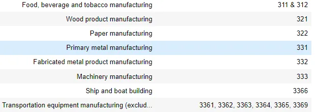
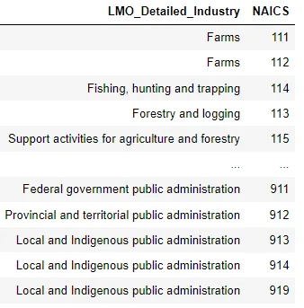
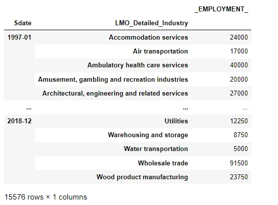
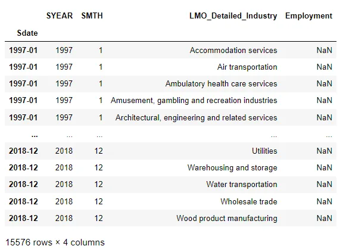
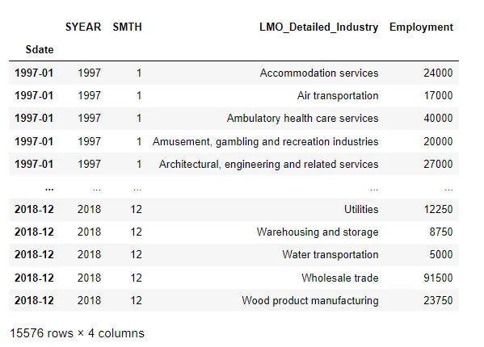
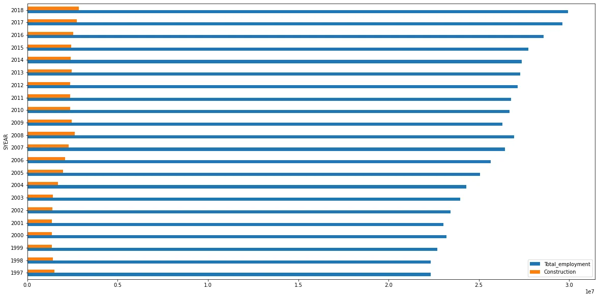
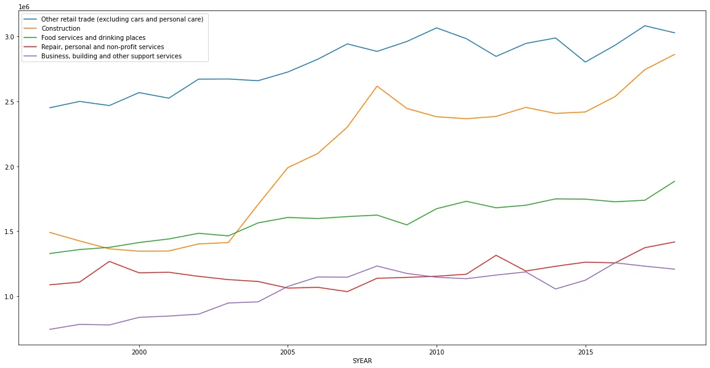
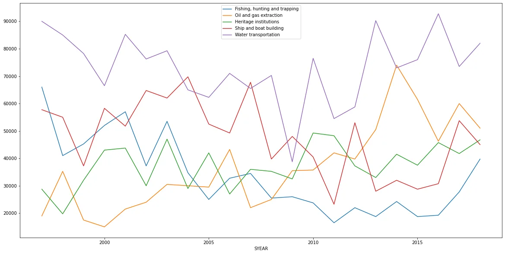
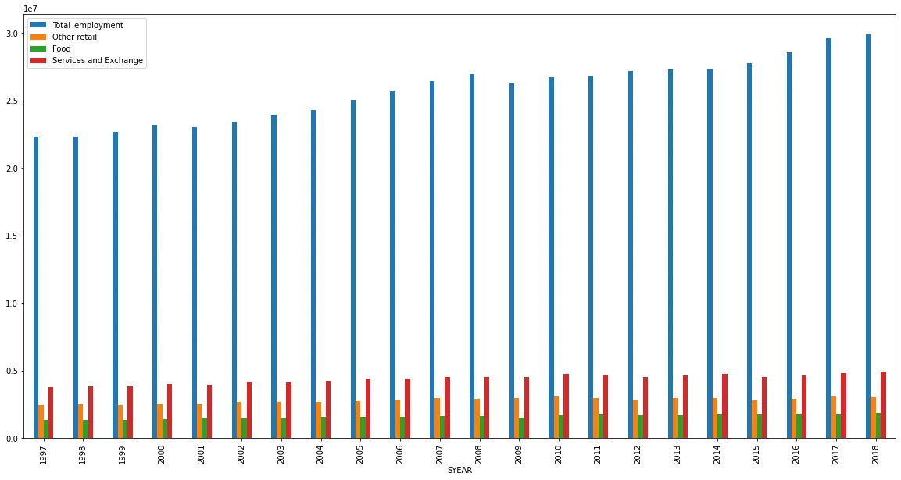
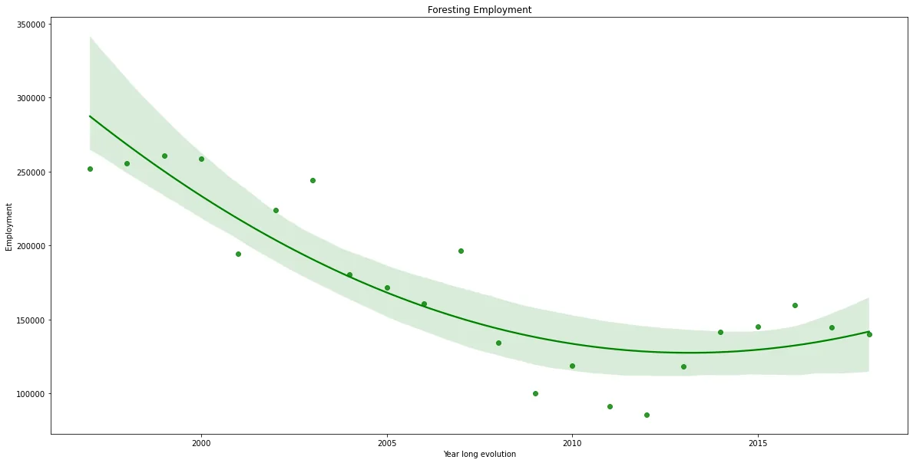

Hey there fresh analyst, the department has a new job for you. It's time to show the skills you learned and the experiences you gathered.

Wait, "what's your job?":Simply put, **A data analyst gathers, cleans, and studies data sets to help solve problems.** (come on, you got to show that you can keep up rookie.)

So, the department just received the data that they want you to work on. It's employment data from different industries that are labeled via the **NAICS** (North American Industries Classification System). The system is designed to offer definitions of common industries in Canada, Mexico and the USA.

**The ID system of NAICS works in a hierarchical way**:

Sector: 2 digits ID

Subsector: 3 digits ID

Industry Group: 4 digits ID

**LMO Detailed Industries by NAICS:** An excel file for mapping the RTRA data to the desired data. The first column of this file has a list of 59 industries that are frequently used. The second column has their NAICS definitions. **This file has the relevant industries that we will be using in our analysis.**

**The data we're working on:** 15 CSV files beginning with RTRA. These files contain employment data by industry at different levels of aggregation which are surveyed each month starting from 1997 to 2019. But, given the assignment requirement we will be stopping at 2018.

### I- The data loading and cleaning:

First of all, we start by loading our files into 3 separate lists based on their NAICS ID length (2, 3 and, 4)

```python
files_2 = glob.glob('data/*2NAICS*.csv')
files_3 = glob.glob('data/*3NAICS*.csv')
files_4 = glob.glob('data/*4NAICS*.csv')
```

Then, we will define a function that will take care of the following:

1. Load the files
2. Clean up the NAICS codes and separate them from the industry names (the 4 digits RTRA files have a different structure without any names so we take that into account with a bool variable)
3. Merge the data with LMO industries(we'll explain how this dataframe was managed later)
4. Setup a datetime index and cleanup the unnecessary columns from previous steps.

```python
def create_data_based_on_digits(files, four_digits = False):
""""
The function will create a dataframe with the NAICS hiearchy level
Args:          -----------------------------------------
files: list of csv files
four_digits: bool that checks if its the files containing 4 digits IDs or not.
Returns:          ----------------------------------------          final_data: Pandas dataframe
"""
##LOAD THE DATA
employment = pd.read_csv(files[0])
for f in files[1:]:
    df = pd.read_csv(f)employment =                                 employment.append(df,ignore_index=True)
    print('First time loading the files')
    display(employment)
```

As you can see, first we load one of the files to create our dataframe which then we can append to the rest of the data from the other files.

```python
if not four_digits:
        ##CLEAN UP THE NAICS NAME AND CODE COLUMN BY SEPERATING THEM
        naics = employment.NAICS.astype(str)
        naics = naics.astype(str).str.split('[').values
        nc , codes = list(),list()
        for n in naics:
            try:
                nc.append(n[0]) #store the name
                codes.append(n[1].strip(']').replace('-',',')) #store the code
            except:
                #Other label in 3 digits files
                codes.append('99999') #make sure then lengths match
        employment['NAICS_CODE'] = codes
        employment['NAICS'] = nc
        #display(employment[employment['NAICS'] == 'Other']) #DEBUG FOR 3 DIGITS FILES

        #MERGE THE DATA TO GET THE RTRA DATA WE DESIRE FROM THE RELEVENT INDUSTRIES FILES
        final_data = employment.merge(industries,left_on='NAICS_CODE',right_on='NAICS',how='left')
        final_data = final_data.drop(['NAICS_x','NAICS_y'],axis=1)
        final_data.dropna(inplace=True)
        print('Cleaning the NAICS column and merging the data')
    else:
        employment['NAICS'] = employment.NAICS.astype(str)
        #MERGE THE DATA TO GET THE RTRA DATA WE DESIRE FROM THE RELEVENT INDUSTRIES FILES
        final_data = employment.merge(industries,left_on='NAICS',right_on='NAICS',how='left')
        print('merging the data')
```

This step is where we first **cleanup the NAICS column if needed and separate the code from the industry name**. This step is necessary so that we can easily map the codes from LMO_industries file to our RTRA data.

```python
final_data['Sdate'] = final_data.SMTH.astype(str) + ' ' + final_data.SYEAR.astype(str)
    final_data['Sdate'] = pd.to_datetime(final_data['Sdate']).dt.strftime('%Y-%m')
    final_data.set_index('Sdate',inplace=True)
    if four_digits:
        final_data = final_data.rename(columns={'NAICS':'NAICS_CODE'})
    final_data = final_data.drop(['SYEAR','SMTH'],axis=1)
    final_data = final_data.dropna()

    print('Fixing the Date index and dropping unecessary rows (having missing values)')
    display(final_data)
```

The final step is setting up our "Year-month" index as it will facilitate the operations and visualizations down the road. Trust me you don't want to work with strings as your date index or something similar. Make the effort now to clean up and your life will be much easier later on. Also, you get the free win of visualizations sorting automatically your data.

```python
employment2 = create_data_based_on_digits(files_2,False)
employment3 = create_data_based_on_digits(files_3,False)
employment4 = create_data_based_on_digits(files_4,True) #four digits file doesn't have the industry names only codes
#stack the dataframes vertically
employment = employment2.append(employment3)
employment = employment.append(employment4)
#filter the data in the date range we're interested in
employment = employment[(employment.index >= '1997-01') & (employment.index <= '2018-12')]
display(employment)
```

Now that we created our data by stacking the dataframes from different files and filtered for our date range of interest. Let's take one step back to see how we handled the LMO_industries file.

When we load the file we are met with this: You can see the issue, first there are multiple values per row and more importantly, they have mixed separators (, &). There is no way we can properly map our data without losses if we keep it this way.



We perform some magic with our code to first remove the '&' separators and make sure to create as many values as codes in the file.

```python
industries['NAICS']=industries['NAICS'].astype(str).str.replace('&',',')
indust = []
naics = []
for i,row in industries.iterrows():
    x = row['NAICS'].split(',')
    for val in x:
        val = val.strip()
        indust.append(row['LMO_Detailed_Industry'])
        naics.append(val)
x = {'LMO_Detailed_Industry':indust,'NAICS':naics}
industries = pd.DataFrame(x)
display(industries)
```

now are dataframe looks like this: One code per line, and the names match as well. **This will allow for the final group-by step that is required to aggregate the codes properly.**



Now that our data is properly merged in the loading step. Let's what our data frame looks like after the group-by industry step.

```python
employment = employment.groupby(['Sdate','LMO_Detailed_Industry']).agg({'_EMPLOYMENT_':sum})
```

**Result:**



As far as am concerned there doesn't seem to be an issue with this (fingers crossed!)

One final step before going to the analysis part. We have a template excel file which we merge with our data to check if we're going the right way or now. (it's been processed to have the same datetime index)



Wait, that number of rows, if we go back to check our result from the group by operation, they perfectly match. Is this a coincidence? I think not! (Hopefully it isn't)

Let's do some final merging magic to pass the data to our template.

```python
out = output.merge(employment,
left_on=['Sdate','LMO_Detailed_Industry'],
right_on=['Sdate','LMO_Detailed_Industry'], how='left')
out = out.drop(['Employment'],axis=1).rename(columns={'_EMPLOYMENT_':'Employment'})
display(out)
```

If you look at the dataframe below, we now have the Timeseries of employment changes through time in the relevant industries. and it never hurts to be safe so we might as well save the file.

```python
out.to_excel('data_output.xlsx')
```



### II- Visualizing the data and answering some questions

Data is good and all when collected and cleaned (hopefully properly) but, it is worthless unless it helps extract information and answer questions the corporation has in mind.

The first question we'll be tackling is the following: **How did the construction industry evolve through time and how did it compare to the overall employment?**

They say a picture is worth a thousand words. So let's visualize this through this code:

```python
total_emp = out.groupby('SYEAR').agg({'Employment':sum})
total_emp['Construction'] = out[out.LMO_Detailed_Industry == 'Construction'].groupby('SYEAR').agg({'Employment':sum})
total_emp = total_emp.rename(columns={'Employment':'Total_employment'})
total_emp.plot(use_index= True, y=["Total_employment", "Construction"], kind="barh") #Horizontal bars
```

We get the following plot:



Although they seem quite correlated as they share the same direction. It's surprisingly evident that the slopes of change are drastically different. This could lead to suggest although quite necessary, the construction industry's employment only increased through population increase only. Employment overall increased at a fairly high rate (compared to construction).

This helped pop up a new question: **which industries held the top 5 employment rates and how did they evolve through time?**. We'll consider the top 5 industries the one that have the highest average employment numbers through 1997-2018 period. **They could be the reason for difference in the slopes we've witnessed earlier.**

**Let's write some code that'll do magic as always.**

```python
total_emp = out.groupby(['LMO_Detailed_Industry']).agg({'Employment':np.mean}).sort_values(by='Employment',ascending=False)[:5] #FIND TOP 5 AVG EMP
top5 = total_emp.reset_index()['LMO_Detailed_Industry'].to_list()

total_emp =  out.groupby('SYEAR').agg({'Employment':sum})
for indust in top5:
    total_emp[indust] = out[out.LMO_Detailed_Industry == indust].groupby('SYEAR').agg({'Employment':sum})
total_emp.head()
```



If this graph taught me anything, it would certainly be to never draw conclusions fast. That's how data science/analytics should always be! Beware of drawing conclusions too fast. This graph clearly shows although the domination of **Other retail trades** is quite apparent, the industry that experienced the biggest leap was actually **Construction**.

Also, Kudos if you noticed how the slopes are surprisingly similar of the **Food(Green)** industry and **Other retail trades(Blue)**!

We'll come back to this remark later on. But for now, let's see **how the bottom 5 industries faired up through time.**

The code is really similar to the last snippet, we change sort in **ascending order**.



Compared to the TOP 5 industries(which are always in demand and have a clear trend that follows population growth), these industries seem to stagnate. They don't really show any trend except for **Oil and gas extraction.** And I highly doubt it would break out of the bottom 5 given that it heavily relies on machinery not employment.

**But the general theme of the Bottom 5 industries is that they are not always in demand and show some seasonal changes (Like fishing for example).**

Let's go back to the **Food and retail. Let's see how they compare to the overall employment. Given their popularity and growing demand, will they share the same slope as overall employment?**

We'll do the same as the construction snippet but make sure we include both industries (and combine them).

```python
total_emp = out.groupby('SYEAR').agg({'Employment':sum})
total_emp['Other retail'] = out[out.LMO_Detailed_Industry == 'Other retail trade (excluding cars and personal care) '].groupby('SYEAR').agg({'Employment':sum})
total_emp['Food'] = out[out.LMO_Detailed_Industry == 'Food services and drinking places'].groupby('SYEAR').agg({'Employment':sum})
total_emp['Services and Exchange'] = total_emp['Other retail'] + total_emp['Food']
total_emp = total_emp.rename(columns={'Employment':'Total_employment'})
total_emp.plot(use_index= True, y=total_emp.columns, kind="bar") #Horizontal bars
#total_emp
```

Result:



Again, we can clearly see that even though they share the trend lines, the slope is fairly different.

**Through the last graphs it's probably safe to say the trend of the Retail and food sectors is mostly driven by general increasing demand due to population growth.**

**Let's switch the interest to the environment**, **how is foresting evolving employment-wise?**

The code is similar to the construction plotting code. We just eliminate the overall Employment to see a clearer plot. and we add in a regression line using seaborn to get a clearer view of the trend and use a green color to reflect that it is foresting

```python
total_emp = out.groupby('SYEAR').agg({'Employment':sum})
total_emp['foresting'] = out[out.LMO_Detailed_Industry == 'Forestry and logging'].groupby('SYEAR').agg({'Employment':sum})
total_emp = total_emp.rename(columns={'Employment':'Total_employment'})

ax = sns.regplot(x=total_emp.index, y="foresting",order=2, data=total_emp,color='g')
ax.set_title('Foresting Employment')
ax.set_ylabel('Employment')
ax.set_xlabel('Year long evolution')
```

Result:



I was really happy to see the clear **decline in the 1997-2012 period** but then I started going back to my worried state seeing **the increase that took place right after.** The only silver lining I see as a glimmer of hope is that the last 3 years in the plot show a clear decline in the employment. **So hopefully, that means the field is seeing less demand and not due to machinery taking over.**

Well, that is all folks! To check more outputs (I always avoid putting as many outputs as I can to keep the article digestible), feel free to view the notebook via this [link in Github.](https://github.com/zqngetsu96/DataInsight_Assignments_and_projects/blob/main/NAICS/NAICS.ipynb)

I hope this article was worth reading and that you could learn a new information through it!
