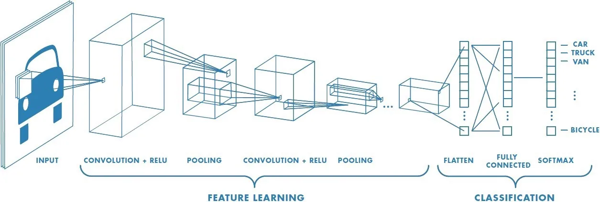
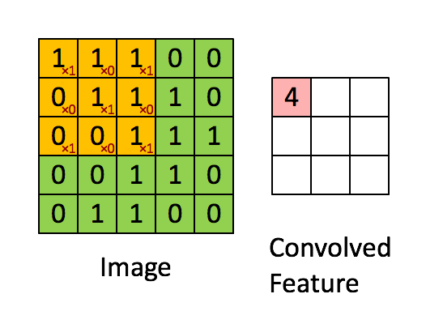
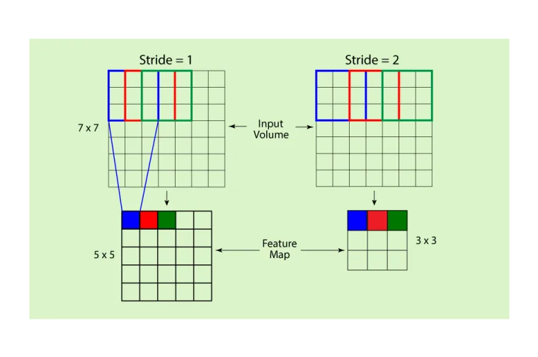
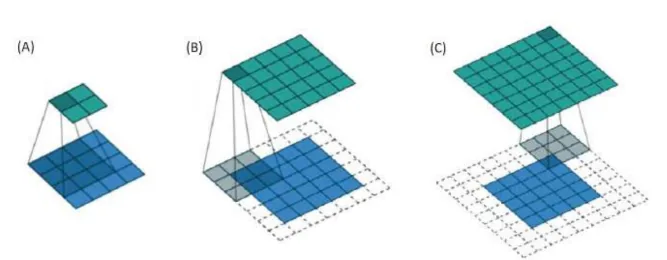
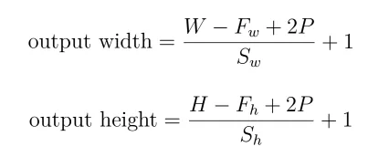
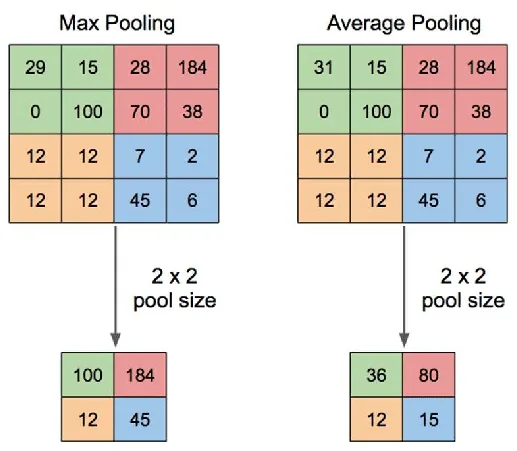
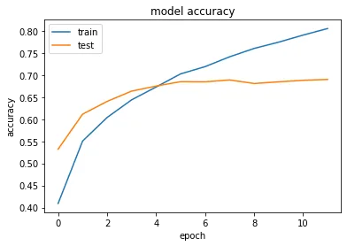
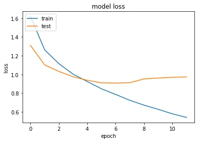

Hello there readers, it's been a while. Today we're jumping into an exploratory post covering the basics of vision AI models: CNNs. The concept was born and developed between 1989 and 1998 as a solution for recognizing handwritten digits. Of course, as time went by, the architecture evolved to be able to do so much more than just recognize digits.

The concept just like ANNs aimed to replicate how humans processed visual signals. ANNs mimicked the interaction circuits between neurons, and CNNs simulate the feature extraction that takes place once we receive the light emitted from objects. We extract **features** that allow us to recognize objects: lines, circles, edges, colors, etc. These features, later on as they travel deeper regions into our visual cortex, build up to become **patterns** or in the case of CNNs they become high-level **features:** faces, clothes, car shapes, animal anatomy, etc.



###### [(Image source)](https://towardsdatascience.com/a-comprehensive-guide-to-convolutional-neural-networks-the-eli5-way-3bd2b1164a53)

So, what are the building blocks of a CNN network? What you'll get to see in almost 99% of the architectures (no matter how deep they are) are the following: **Convolution(Conv) layers, pooling layers, and a fully connected block.** Depending on the complexity of the architecture, you might witness new blocks which are made from fundamental layers such Conv layers and pooling layers while they introduce new variations (like **residual connections**). Fear not, as long as you learn the basic layers, the rest will be just a cherry on the top that you'll eventually learn as you tackle more advanced vision tasks.

### Let's learn about the convolution layer:

As its name states, the main operation of the layer is convolution over filters (also known as **kernels**) **hovering through the data to extract relevant features**. Usually, CNNs are used on two-dimensional input data but they can also be used on one-dimensional data (uni-variate time series) or three(and more) dimensional data.



The convolution layer has 3 parameters:

- **Size:** The kernel’s size is usually much smaller than the input data to allow **parameter sharing** and have a reasonable number of parameters in the case of large images and **avoid exponential increases** in required memory. This is thanks to **parameter sharing which allows the kernel to go through the whole image without any changes**. A common size for a kernel is between 3 × 3 and 11 × 11 depending on the size of the initial input.
- **Stride:** The **step size of the filter when traversing the input**. In the case of an image, the stride is defined by the **number of pixels by which the kernel shifts**. The effects and movements of striding kernels are demonstrated in the picture below this list.



###### [(image source)](https://developersbreach.com/convolution-neural-network-deep-learning/)

- **padding:** In some cases, **pixels on the edges of the input data don’t offer the same contribution to the activations as the pixels inside the image which are implicated many times in the output feature map** (depending on the stride) even though these pixels can carry information as important as the image’s inner content. **To fix this issue, padding allows the addition of pixels to the sides of the image**. There are 3 different types of padding as shown in the picture below.

**same or zero padding:** Same neighbor pixel values (or zeros respectively) are added to the edges of the image to implicate the edge pixels more into the output feature map. Having the same/zero padding will result in an output feature map that has the same size as the input feature.

**valid padding:** No padding adding to the image.

**full padding:** Rows and columns are added to the image to ensure that every pixel can be at the center of the kernel once (in the case of stride=1).



###### [(image source)](https://stackoverflow.com/questions/37674306/what-is-the-difference-between-same-and-valid-padding-in-tf-nn-max-pool-of-t)

Each parameter mentioned above has its own effect on the output’s size. For example, **using a stride of 2 will result in the reduction of the input to half its size**. The output feature map’s size at each layer is calculated via the following formula:



The presented variables in the formula are:

- **W:** Input data’s Width (in pixels)
- **H:** Input data’s Height (in pixels)
- **Fh (Fw resp.):** Filter’s height (width respectively)
- **P:** Padding size
- **Sh (Sw resp.)**: The stride height-wise (width-wise respectively)

### Now the second main layer, Pooling:

CNNs contain pooling layers which serve as the main way to isolate the most important features and size reduction. There are two types of pooling layers as illustrated below:

- **Max Pooling:** While hovering over the image, the kernel will output the maximum pixel value it encounters.
- **Average Pooling:** In this case, the kernel will output the average of the pixels covered by the kernel.



###### [(image source)](https://www.researchgate.net/figure/Illustration-of-Max-Pooling-and-Average-Pooling-Figure-2-above-shows-an-example-of-max_fig2_333593451)

Finally, we use **ANN(MLP) blocks** to connect the high-level features extracted from our vision blocks. You can discover this part along with other helpful concepts in this [post](https://www.datainsightonline.com/post/you-have-really-good-data-but-it-s-too-complex-for-machine-learning-models-deep-learning-is-for-you).

Let's build a CNN that can recognize basic objects using the **CIFAR-10** dataset.

The [dataset](http://www.cs.toronto.edu/~kriz/cifar.html) contains the following properties:

- The CIFAR-10 dataset consists of **60000 32x32** color images.
- There are 10 classes depicting normal day-to-day objects(automobile, dog, bird, cat, etc.)
- There are 50000 training images and 10000 test images.

The dataset can be downloaded by the link provided above or you can download it through the **TensorFlow datasets library.**

First things first, we import our **libraries:** This includes Tensorflow and its APIs, NumPy, and matplotlib to display our training progress.

```python
import matplotlib.pyplot as plt
import numpy as np
import tensorflow as tf
from tensorflow.keras.models import Sequential
from tensorflow.keras.layers import Conv2D, Dropout, MaxPooling2D, Flatten, Dense
from tensorflow.keras.datasets.cifar10 import load_data as cif_load
```

The next step is to load and process our dataset. (Note: CIFAR-10 is one of the "already-processed" datasets which is already in ideal shapes for DL networks and doesn't really reflect real-life conditions)

```python
(X_train, y_train), (X_test, y_test) = cif_load()
## We scale pixel values to the range of [0-1]
X_train= X_train / 255.0
X_test = X_test / 255.0
## We one hot encode the labels (Transform form 1-10 to a binary vector 3 -> [0 0 1])
y_train = pd.get_dummies(y_train.reshape(-1)).values
y_test = pd.get_dummies(y_test.reshape(-1)).values
```

We one-hot encode the labels to avoid giving any classes more weight(importance) than others (10 > 1).

The next part comprises these steps:

1. Repeated blocks of convolution and pooling layers,
2. Fully connected layer,
3. Dropout layer (Deactivates neurons randomly to avoid overfitting),
4. Final classification layer

```python
model = Sequential([
    Conv2D(32, (3,3), input_shape=(32, 32, 3), padding="same", activation="relu"), ## 3x3 kernel with a stride of 1 and same padding
    Dropout(0.3),
    Conv2D(32, (3,3), padding="same", activation="relu"), ## 3x3 kernel with a stride of 1 and same padding
    MaxPooling2D(),
    Flatten(),
    Dense(512, activation="relu"), ## ANN block
    Dropout(0.5), ## Dropout to avoid overfitting
    Dense(10, activation="softmax") ## Classification layer
])
```

Finally, all we have to do is compile the model and train it. We also add an early stopping callback which checks at each stop if the accuracy **stagnated** or not. This saves us the waste of time and effort of **overtraining** the model (and have it only learn the training data).

```python
model.compile(optimizer="adam",
              loss="categorical_crossentropy",
              metrics=["accuracy"])
model.summary() #display model's architecture
EsCallback = tf.keras.callbacks.EarlyStopping(monitor='val_loss', patience=5) #We stop the training early if we end up stagnating

history = model.fit(X_train, y_train, validation_data=(X_test, y_test), callbacks=[EsCallback], epochs=20, batch_size=64)
```

After the training we can visualize the results through the **history** (it's a dictionary) variable:

```python
print(history.history.keys())
# summarize history for accuracy
plt.plot(history.history['accuracy'])
plt.plot(history.history['val_accuracy'])
plt.title('model accuracy')
plt.ylabel('accuracy')
plt.xlabel('epoch')
plt.legend(['train', 'test'], loc='upper left')
plt.show()
# summarize history for loss
plt.plot(history.history['loss'])
plt.plot(history.history['val_loss'])
plt.title('model loss')
plt.ylabel('loss')
plt.xlabel('epoch')
plt.legend(['train', 'test'], loc='upper left')
plt.show()
```

The results are as follows:





As we can see, the model stagnated for a while which resulted in an early stopping of the training. Before that, it managed to achieve an **accuracy of 69%. Over 10 classes, this is not bad at all.**

**The question is**: is this the best it can do? **Absolutely not!** This is a very simple architecture for demonstration purposes.

I hope this was worth reading and helped you learn something new!
There is another [post](https://www.datainsightonline.com/post/you-have-really-good-data-but-it-s-too-complex-for-machine-learning-models-deep-learning-is-for-you) with the basics of DL.

Feel free to check the notebook [here](https://github.com/zqngetsu96/DataInsight_Assignments_and_projects/blob/main/Capstone/Entry_level_CNNs.ipynb).
